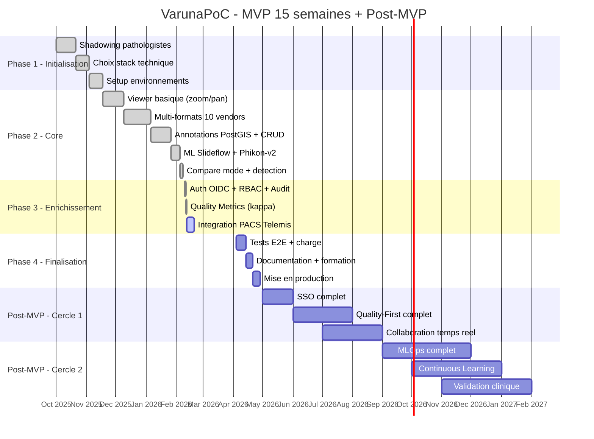
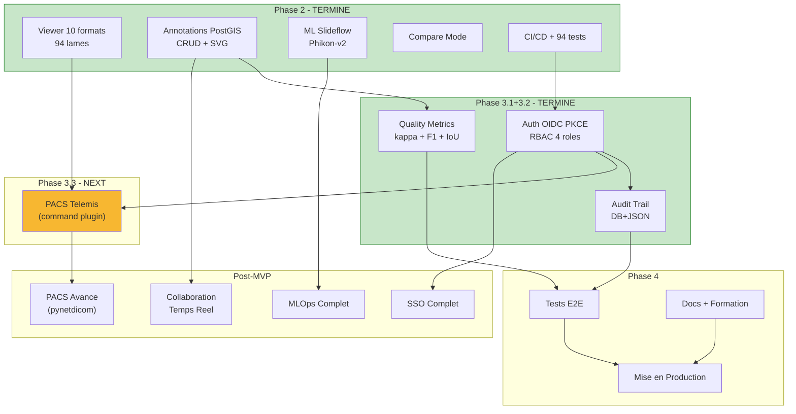

# VarunaPoC - Roadmap & Checklist

**Version:** 3.0
**Date:** 2026-02-08
**Statut:** Document vivant - Aligne avec PROPOSAL_VARUNA_v2.md

Ce document centralise la vision projet, les phases, et le suivi d'avancement.
Lie au cerveau d'orchestration (`.claude/BRAIN.md`).

**GitHub Project Board:** https://github.com/users/Yanstart/projects/6

**Documents strategiques:**
- `docs/PROPOSAL_VARUNA_v2.md` - Proposition projet v2 (marche, architecture, couts)
- `HOSPITAL_DEPLOYMENT_EVALUATION.md` - Evaluation deploiement hospitalier

---

## Table des Matieres

1. [Vue d'Ensemble](#vue-densemble)
2. [Gantt Chart Global](#gantt-chart-global)
3. [Phase 1 - Initialisation](#phase-1---initialisation-termine)
4. [Phase 2 - Core](#phase-2---core-termine)
5. [Phase 3 - Enrichissement](#phase-3---enrichissement-a-venir)
6. [Phase 4 - Finalisation](#phase-4---finalisation-a-venir)
7. [Post-MVP - Cercles](#post-mvp---cercles-concentriques)
8. [Dependances Critiques](#dependances-critiques)
9. [Risques & Mitigations](#risques--mitigations)
10. [Metriques](#metriques)
11. [Changelog](#changelog)

---

## Vue d'Ensemble

### Statut Global (Plan 15 semaines MVP)

| Phase | Nom | Semaines | Statut | Progress |
|-------|-----|----------|--------|----------|
| **1** | Initialisation | 1-3 | TERMINE | 100% |
| **2** | Core | 4-9 | TERMINE | 100% |
| **3.1** | Auth OIDC + RBAC + Audit | 10-11 | TERMINE | 100% |
| **3.2** | Quality Metrics (kappa) | 11-12 | TERMINE | 100% |
| **3.3** | Integration PACS Telemis | 12-13 | EN COURS | 0% |
| **4** | Finalisation | 14-15 | A VENIR | 0% |

### Direction Strategique

**Ce qui est FAIT:**
- [x] Web-first (vs desktop QuPath)
- [x] Monolithe modulaire (vs microservices Cytomine)
- [x] OpenSlide 4.0 (10 formats, 94 lames testees)
- [x] API-first (OpenAPI 3.0 auto-documentee)
- [x] Annotations PostGIS (CRUD, labels, stats, GeoJSON)
- [x] ML integration (Slideflow + Phikon-v2, CUDA)
- [x] Compare mode (multi-viewer synchronise)
- [x] CI/CD (GitHub Actions: lint, tests, Docker, security scans)
- [x] 94 tests automatises

**Ce qui est FAIT (Phase 3):**
- [x] Auth OIDC PKCE + RBAC 4 roles + JWT RS256/ES256 + audit trail
- [x] Quality metrics annotations (Cohen/Fleiss kappa, F1, confusion matrix, IoU, disagreement heatmap)
- [x] FHIR R4 stub (DiagnosticReport)
- [x] CI/CD all green (156 tests, 8/8 CI jobs)

**Ce qui doit EVOLUER (Phase 3.3+):**
- [ ] Integration PACS (Telemis command plugin)
- [ ] Tests E2E
- [ ] Documentation formation

### 3 Angles Morts Differenciateurs

| Angle Mort | Description | Statut |
|------------|-------------|--------|
| **Quality-First Annotations** | Metriques IAA, detection outliers, versioning Git-like | AVANCE (CRUD + stats + kappa + F1 + confusion + IoU + disagreement FAIT, outliers/adjudication Post-MVP) |
| **Continuous Learning MLOps** | Drift monitoring, feedback loops, CI/CD modeles | PARTIEL (inference fait, monitoring Post-MVP) |
| **Radical Simplicity** | Zero-config, onboarding 3 min, <100ms latence | AVANCE (tiles <15ms, auth OIDC, PACS en cours) |

---

## Gantt Chart Global

---

## Phase 1 - Initialisation (TERMINE)

**Objectif:** Shadowing, choix techniques, setup
**Semaines:** 1-3
**Progress:** `[####################] 100%`

- [x] Observation ethnographique pathologistes (shadowing)
- [x] Ateliers co-conception avec utilisateurs cles
- [x] Choix stack technique (FastAPI, OpenSlide, OpenSeadragon, PostGIS)
- [x] Setup environnements (dev, Docker, CI/CD)
- [x] Structure projet (backend/, frontend/, docs/)
- [x] Cerveau orchestration (.claude/BRAIN.md)

---

## Phase 2 - Core (TERMINE)

**Objectif:** Viewer complet, annotations, ML, compare mode
**Semaines:** 4-9
**Progress:** `[####################] 100%`

### 2.1 Viewer WSI (TERMINE)

- [x] Tile streaming DZI (< 15ms keep-alive)
- [x] Navigation fluide (zoom progressif multi-resolution)
- [x] Overview/thumbnail generation
- [x] Mini-map navigator
- [x] Plein ecran, navigation clavier
- [x] LRU cache slides (max 5)
- [x] Routes synchrones (def pas async def) pour threadpool OpenSlide

### 2.2 Multi-Format Support (TERMINE)

- [x] FormatDetector (10+ formats)
- [x] `_try_open_slide()` pour detecter fichiers corrompus
- [x] Aperio SVS, Hamamatsu NDPI, 3DHistech MRXS
- [x] Leica SCN, Ventana BIF, Philips TIFF, Trestle
- [x] Sakura SVSLIDE, Zeiss CZI, DICOM WSI
- [x] Generic TIFF pyramidal
- [x] 94 lames testees, 3 corrompues rejetees
- [x] Routes safety net (OpenSlideError -> 422)

### 2.3 Annotations (TERMINE)

- [x] PostgreSQL + PostGIS (port 5433, SRID=0)
- [x] Alembic migrations
- [x] CRUD complet (create, read, update, delete)
- [x] Labels avec couleurs
- [x] Export GeoJSON
- [x] Stats endpoint (total, by_label, by_type, confidence_distribution)
- [x] Frontend SVG overlay (AnnotationLayer)
- [x] 5 outils dessin (DrawingTools: rectangle, polygon, point, circle, freehand)
- [x] LayerManager (visibilite, opacite)
- [x] AnnotationStore (client state, CRUD, loadStats, computeLocalStats)

### 2.4 ML Integration (TERMINE)

- [x] Slideflow + Phikon-v2 (CUDA GPU)
- [x] Heatmap generation (attention map 64x64, ~2.5 min)
- [x] Detection automatique regions tissulaires (heatmap -> scipy ndimage -> skimage -> shapely -> GeoJSON)
- [x] Classification tissue/background avec uncertainty quantification
- [x] Tag extractor + tag router
- [x] Frontend MLPanel + HeatmapOverlay (canvas, cached image)
- [x] DetectionPanel (label selector, confidence distribution)
- [x] CountingPanel (stats temps reel)

### 2.5 Compare Mode (TERMINE)

- [x] CompareLayout (grid multi-viewer 2x1, 2x2)
- [x] ViewerPanel (full components: annotations, drawing, detection, counting)
- [x] Synchronisation pan/zoom
- [x] AnnotationStore context switch (setSlide on panel activation)

### 2.6 Infrastructure (TERMINE)

- [x] 94 tests pytest (unit, detection, format_detector)
- [x] CI/CD GitHub Actions (lint, tests, Docker build, Trivy, Bandit, CodeQL, Gitleaks)
- [x] Pre-commit hooks (detect-secrets)
- [x] Docker multi-container
- [x] Prometheus metrics (optionnel)
- [x] EventBus unsubscribe pattern (fix memory leaks)

---

## Phase 3.1 - Auth OIDC + RBAC + Audit (TERMINE)

**Objectif:** Authentification, audit trail, securite runtime
**Date:** 2026-02-11
**Progress:** `[####################] 100%`

- [x] **P3-A01** OIDC PKCE authentication (Keycloak dev, Azure AD prod-ready)
- [x] **P3-A02** 4 roles claims-based (LECTURE_SEULE, INFIRMIER, MEDECIN, ADMIN_TECHNIQUE)
- [x] **P3-A03** JWT validation RS256/ES256 avec JWKS cache TTL 1h
- [x] **P3-A04** `require_role()` FastAPI dependency + backward compatible (AUTH_ENABLED=false)
- [x] **P3-A05** Frontend AuthService PKCE, LoginPage, UserMenu, role-based UI
- [x] **P3-A06** Audit trail dual DB+JSON (INFO/WARNING/CRITICAL)
- [x] **P3-A07** Break-glass emergency sessions (30min, CRITICAL audit)
- [x] **P3-A08** Session roaming cross-workstation (PostgreSQL)
- [x] **P3-A09** FHIR R4 stub (DiagnosticReport builder)
- [x] **P3-A10** Alembic migration 002 (auth + audit tables)

### Commits
- `56cb8a7` feat(phase3): Add OIDC PKCE auth, RBAC, audit trail, and system patterns doc

---

## Phase 3.2 - Quality Metrics (TERMINE)

**Objectif:** Metriques qualite inter-annotateur (kappa)
**Date:** 2026-02-12
**Progress:** `[####################] 100%`

- [x] **P3-Q01** Cohen's kappa pairwise agreement (IoU spatial matching PostGIS)
- [x] **P3-Q02** Fleiss' kappa multi-rater agreement (grid-based matching)
- [x] **P3-Q03** Confusion matrix, F1/Precision/Recall per label
- [x] **P3-Q04** IoU distribution statistics
- [x] **P3-Q05** Disagreement heatmap (GeoJSON overlay)
- [x] **P3-Q06** QualityPanel frontend (annotator selector, kappa badge, confusion matrix, F1 table, IoU histogram)
- [x] **P3-Q07** Cache table `quality_reports` (JSONB, TTL 5min)
- [x] **P3-Q08** 7 API endpoints `/api/quality/{slide_id}/...`
- [x] **P3-Q09** 31 unit tests + 7 integration tests
- [x] **P3-Q10** Alembic migration 003 (quality_reports table)

### Commits
- `ec3303a` feat(quality): Add inter-annotator agreement metrics (Phase 4)
- `52a293f` fix(lint): Resolve all ESLint errors and Bandit false positives

---

## Phase 3.3 - Integration PACS Telemis (EN COURS)

**Objectif:** Lancement viewer depuis PACS via command plugin
**Progress:** `[....................] 0%`

- [ ] **P3-P01** Backend: endpoint `/api/slides/by-accession/{accession_id}` (resolution accession -> slide)
- [ ] **P3-P02** Frontend: route `/slide/{id}` avec extraction ID depuis URL
- [ ] **P3-P03** Backend: contexte patient automatique (slide_id -> patient context)
- [ ] **P3-P04** Plugin config `.cfg` template dans le repo
- [ ] **P3-P05** Tests avec environnement Telemis

---

## Phase 4 - Finalisation (A VENIR)

**Objectif:** Tests E2E, documentation, mise en production
**Semaines:** 14-15
**Progress:** `[....................] 0%`

### 4.1 Tests

- [ ] **P4-T01** Tests E2E (Playwright ou Selenium)
- [ ] **P4-T02** Tests de charge (10 utilisateurs, 50 lames)
- [ ] **P4-T03** Tests integration annotation CRUD (fix async loop Windows)

### 4.2 Documentation & Formation

- [ ] **P4-D01** Manuel utilisateur complet
- [ ] **P4-D02** Sessions formation (2h par groupe de 5)
- [ ] **P4-D03** Guide installation production

### 4.3 Deploiement

- [ ] **P4-K01** Nginx HTTPS/TLS configuration
- [ ] **P4-K02** Docker Compose production
- [ ] **P4-K03** Monitoring Prometheus + Grafana
- [ ] **P4-K04** Periode accompagnement renforce (2 semaines)

---

## Post-MVP - Cercles Concentriques

### Cercle 1 - Consolidation Clinique (mois 4-8)

- [ ] SSO institutionnel (SAML 2.0/OAuth 2.0)
- [ ] Audit trail immutable (conformite RGPD Article 32)
- [ ] Quality-First complet (outlier detection, adjudication, versioning Git-like)
- [ ] Collaboration temps reel (WebSocket, co-visualisation)
- [ ] Chiffrement au repos (PostgreSQL transparent encryption)

### Cercle 2 - MLOps et IA Clinique (mois 8-14)

- [ ] Pipeline CI/CD modeles (retraining automatise, rollback)
- [ ] Monitoring drift (comparaison predictions vs validations experts)
- [ ] Feedback loops (corrections experts -> enrichissement datasets)
- [ ] Expansion foundation models (UNI, CONCH)
- [ ] Validation clinique formelle (ISO 13485, 3+ pathologistes)

### Cercle 3 - Extension Domaines (mois 14+)

- [ ] Cytologie et hematologie (memes formats, modeles specifiques)
- [ ] Microscopie fluorescence (multi-canal, quantification intensite)
- [ ] PACS avance (pynetdicom: C-FIND, C-MOVE, C-STORE)
- [ ] HL7 FHIR (DiagnosticReport)
- [ ] DICOM WSI export (Supplement 145)
- [ ] EHDS compliance (echeance mars 2031)

---

## Dependances Critiques

**Chemin critique:** ~~Auth RBAC~~ FAIT -> ~~Audit Trail~~ FAIT -> PACS Telemis -> Tests E2E -> Production

---

## Risques & Mitigations

| ID | Risque | Impact | Prob. | Mitigation | Statut |
|----|--------|--------|-------|------------|--------|
| R1 | ~~Auth non deployee~~ | ~~CRITIQUE~~ | ~~HIGH~~ | OIDC PKCE + RBAC + audit trail | RESOLU (Phase 3.1) |
| R2 | Bus factor = 1 | CRITIQUE | HIGH | Open source, 156 tests, CI/CD, stack standard | ATTENUATION |
| R3 | Adoption limitee | CRITIQUE | MOYEN | Co-conception pathologistes, Radical Simplicity | ATTENUATION |
| R4 | Compliance RGPD | ELEVE | MOYEN | Auth + audit FAIT, de-identification Post-MVP | PARTIEL |
| R5 | Performance annotations | MOYEN | FAIBLE | PostgreSQL PostGIS indices | OK |
| R6 | Incompatibilite PACS | MOYEN | MOYEN | Mode fallback (repertoire partage) | NON TESTE |
| R7 | ML drift post-deploiement | MOYEN | MOYEN | Monitoring Post-MVP Cercle 2 | PLANIFIE |

---

## Metriques

### Phase 2 Resultats (Mesures Reelles)

| Metrique | Valeur | Source |
|----------|--------|--------|
| Tile load (keep-alive) | 0-13ms | Tests reels |
| 28 tiles premier chargement | ~2.1s | Tests reels |
| Formats supportes | 10 | FormatDetector |
| Lames testees | 94 | test_format_detector.py |
| Tests backend | 156 pass, 21 skip | pytest |
| ML heatmap | ~2.5 min (CUDA) | Slideflow Phikon-v2 |
| Detection regions | 3 (72-88% conf.) | threshold=0.3 |

### KPIs Cibles (Phase 3-4)

| Metrique | Cible | Actuel |
|----------|-------|--------|
| Auth implementation | 100% | 100% (OIDC PKCE, RBAC 4 roles) |
| Audit trail coverage | 100% routes | 80% (auth + annotation routes) |
| Test coverage backend | > 80% | ~80% (156 tests) |
| Tests E2E | > 0 | 0 |
| Security score CI/CD | Pass | Pass (Trivy, Bandit, CodeQL) |

---

## Changelog

### v4.0 (2026-02-12)
- Phase 3.1 (Auth OIDC + RBAC + Audit): marque 100% TERMINE
- Phase 3.2 (Quality Metrics): marque 100% TERMINE
- Phase 3.3 (PACS Telemis): EN COURS
- Mise a jour dependency graph, Gantt, KPIs, risques
- Tests backend: 156 pass, 21 skip (up from 94 pass, 3 skip)
- CI/CD: 8/8 jobs all green

### v3.0 (2026-02-08)
- **Realignement complet** avec PROPOSAL_VARUNA_v2.md (plan 15 semaines)
- Phase 1: marque 100% TERMINE
- Phase 2: marque 100% TERMINE (annotations, ML, compare, detection, counting)
- Phase 3: redefinie (Auth RBAC, audit trail, quality metrics, PACS)
- Phase 4: redefinie (Tests E2E, documentation, production)
- Ajout Post-MVP Cercles Concentriques (aligne avec Proposal)
- Mise a jour Gantt avec dates reelles
- Mise a jour metriques avec mesures reelles
- Suppression phases 3-5 anciennes (obsoletes)

### v2.1 (2026-02-04)
- Ajout Cornerstone3D + VTK.js, Slideflow Compatibility
- Ajout Collaboration Simplifiee, Radical Simplicity
- Ajout section "Angles Morts Differenciateurs"

### v2.0 (2026-02-04)
- Fusion avec ANALYSE_DIRECTION_PROJET.md
- Format checklist detaille par phase

### v1.0 (2026-02-04)
- Creation initiale

---

## Liens

| Document | Path | Description |
|----------|------|-------------|
| Proposal v2 | `docs/PROPOSAL_VARUNA_v2.md` | Vision, marche, architecture, couts |
| Hospital Eval | `HOSPITAL_DEPLOYMENT_EVALUATION.md` | Evaluation deploiement hospitalier |
| Cerveau | `.claude/BRAIN.md` | Orchestration, processus |
| Decisions | `.claude/memory/DECISIONS.md` | ADRs |
| Learnings | `.claude/memory/LEARNINGS.md` | Erreurs capitalisees |
| Project State | `.claude/memory/PROJECT_STATE.md` | Etat courant |
| Architecture | `docs/ARCHITECTURE.md` | Architecture technique |

---

**Derniere mise a jour:** 2026-02-12
**Prochaine review:** Fin Phase 3.3 (PACS)
**Responsable:** Admin
