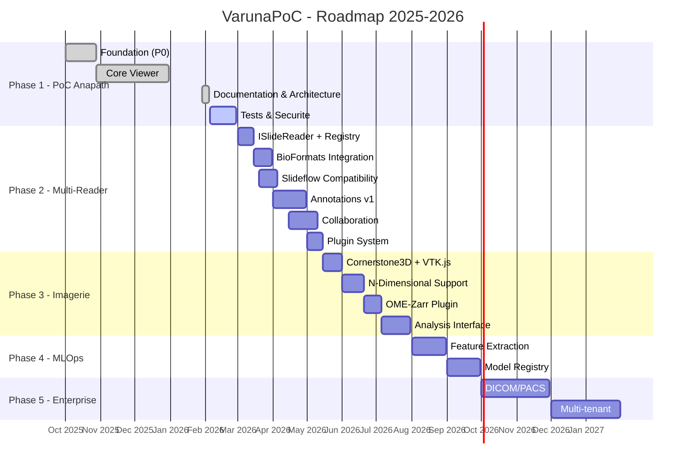
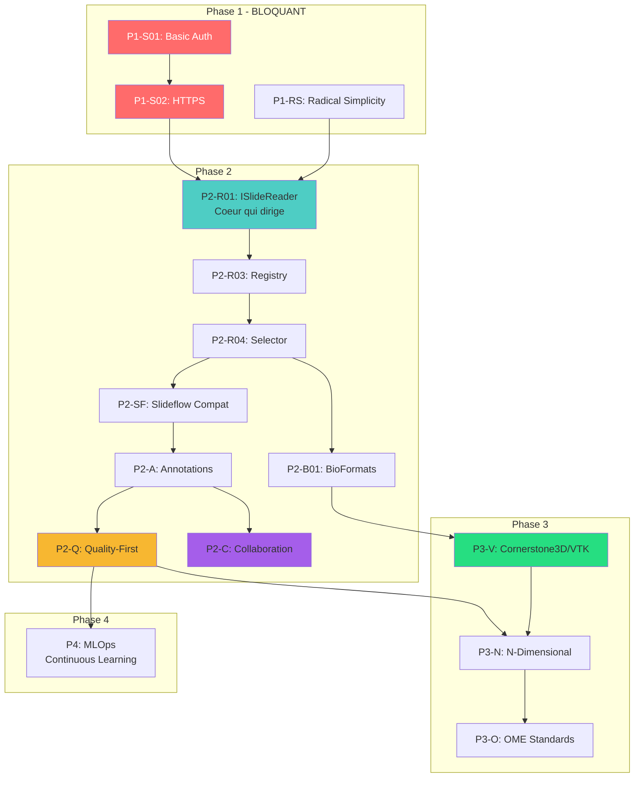

# VarunaPoC - Roadmap & Checklist

**Version:** 2.1
**Date:** 2026-02-04
**Statut:** Document vivant - Mise a jour continue

Ce document centralise la vision projet, les phases, et le suivi d'avancement.
Lie au cerveau d'orchestration (`.claude/BRAIN.md`).

**GitHub Project Board:** https://github.com/users/Yanstart/projects/6

**Source:** Fusion de `docs/ANALYSE_DIRECTION_PROJET.md` (vision) + suivi operationnel

---

## Table des Matieres

1. [Vue d'Ensemble](#vue-densemble)
2. [Gantt Chart Global](#gantt-chart-global)
3. [Phase 1 - PoC Anapath](#phase-1---poc-anapath-actuel)
4. [Phase 2 - Multi-Reader & Annotations](#phase-2---multi-reader--annotations)
5. [Phase 3 - Imagerie Generale](#phase-3---imagerie-generale)
6. [Phase 4 - MLOps & Foundation Models](#phase-4---mlops--foundation-models)
7. [Phase 5 - Enterprise & Federation](#phase-5---enterprise--federation)
8. [Dependances Critiques](#dependances-critiques)
9. [Risques & Mitigations](#risques--mitigations)
10. [Metriques](#metriques)
11. [Changelog](#changelog)

---

## Vue d'Ensemble

### Statut Global

| Phase | Nom | Statut | Progress |
|-------|-----|--------|----------|
| **1** | PoC Anapath | EN COURS | 80% |
| **2** | Multi-Reader & Annotations | PLANIFIE | 0% |
| **3** | Imagerie Generale | PLANIFIE | 0% |
| **4** | MLOps & Foundation Models | FUTUR | 0% |
| **5** | Enterprise & Federation | FUTUR | 0% |

### Direction Strategique

**Ce qui est CORRECT:**
- [x] Web-first (vs desktop QuPath)
- [x] Monolithe (vs microservices Cytomine)
- [x] OpenSlide wheels (vs compiled deps DSA)
- [x] API-first (extensibilite)

**Ce qui doit EVOLUER:**
- [ ] Reader abstraction (ISlideReader interface = "coeur qui dirige")
- [ ] Plugin system (extensibilite)
- [ ] Multi-reader (OpenSlide + Bio-Formats fallback)
- [ ] N-dimensionnel (Z, T, C pour microscopie)
- [ ] Viewer 3D (Cornerstone3D + VTK.js en complement d'OpenSeadragon)

### Angles Morts Differenciateurs (Notre Avantage Competitif)

| Angle Mort | Description | Statut |
|------------|-------------|--------|
| **Quality-First Annotations** | Metriques IAA, detection outliers, versioning Git-like | Phase 2 |
| **Continuous Learning MLOps** | Drift monitoring, feedback loops, CI/CD modeles | Phase 4 |
| **Radical Simplicity** | Zero-config, onboarding 3 min, <100ms latence | PARTIEL |
| **Collaboration Automatisee** | Mieux que Cytomine mais plus simple (notre secret: automatisation) | Phase 2 |

### Compatibilite Slideflow (ML Integration)

| Besoin Slideflow | VarunaPoC Actuel | Statut | Tache |
|------------------|------------------|--------|-------|
| Lecture WSI | OpenSlide via API | OK | - |
| Extraction tiles | `/api/slides/{id}/tile/...` | OK | - |
| Metadonnees | `/api/slides/{id}/info` | OK | - |
| MPP (microns/pixel) | Partiel (depend format) | A AMELIORER | P2-S01 |
| Batch extraction | Non optimise | A CREER | P2-S02 |
| Normalisation couleur | Non implemente | A CREER | P2-S03 |

---

## Gantt Chart Global



---

## Phase 1 - PoC Anapath (ACTUEL)

**Objectif:** Viewer WSI fonctionnel pour anatomopathologie
**Deadline:** Fin fevrier 2026
**Progress:** `[################....] 80%`

### 1.1 Foundation (TERMINE)

- [x] Structure projet (backend/, frontend/, docs/)
- [x] Stack technique (FastAPI + OpenSlide + Vite + OSD)
- [x] Format detector (12+ formats)
- [x] Tile serving endpoint
- [x] OpenSeadragon integration
- [x] Coordinate mapping (OSD ↔ OpenSlide)
- [x] LRU Cache slides (max 5)

### 1.2 UI/UX (TERMINE)

- [x] Navigation hierarchique (FolderBrowser)
- [x] Liste slides avec tuiles
- [x] Viewer single slide
- [x] Multi-viewer avec sync
- [x] EventBus (pub/sub decouplage)
- [x] ViewerFactory (presets)

### 1.3 Documentation (TERMINE)

- [x] Cerveau d'orchestration (BRAIN.md)
- [x] LEARNINGS.md (erreurs capitalisees)
- [x] DECISIONS.md (15 ADRs)
- [x] Etude solutions existantes
- [x] Analyse direction projet
- [x] Architecture Reader Selection System

### 1.4 Securite Git (TERMINE)

- [x] Git history cleanup (BFG)
- [x] Pre-commit hooks (detect-secrets)
- [x] .gitignore complet
- [x] Secrets baseline

### 1.5 Tests (EN COURS)

- [ ] **P1-T01** pytest setup backend
- [ ] **P1-T02** Tests format_detector.py
- [ ] **P1-T03** Tests tile_server.py
- [ ] **P1-T04** Tests slide_loader.py
- [ ] **P1-T05** Tests folder_browser.py
- [ ] **P1-T06** vitest setup frontend
- [ ] **P1-T07** Tests EventBus.js
- [ ] **P1-T08** Tests ViewerFactory.js
- [ ] **P1-T09** Tests integration API

### 1.6 Securite App (A FAIRE - CRITIQUE)

- [ ] **P1-S01** Basic Auth implementation (FastAPI)
- [ ] **P1-S02** HTTPS/TLS setup (reverse proxy)
- [ ] **P1-S03** CORS configuration production
- [ ] **P1-S04** Rate limiting
- [ ] **P1-S05** Input validation renforcee

### 1.7 Documentation Utilisateur (A FAIRE)

- [ ] **P1-D01** Manuel complet (docs/Manuel/)
- [ ] **P1-D02** Guide installation
- [ ] **P1-D03** FAQ enrichie

### 1.8 Radical Simplicity (Angle Mort #3 - Transversal)

> **Objectif:** Zero-config, onboarding 3 min, <100ms latence tile

**Metriques cibles:**
| Metrique | Cible | Actuel | Statut |
|----------|-------|--------|--------|
| Time to first slide | < 3 min | ~5 min | A AMELIORER |
| Tile latency P95 | < 100ms | ~80ms | OK |
| Config requise | Zero | .env + paths | A AMELIORER |
| Docker startup | < 30s | N/A | A CREER |

- [ ] **P1-RS01** Auto-detection repertoire Slides (zero config path)
- [ ] **P1-RS02** Docker one-liner (`docker run -v /slides:/slides varuna`)
- [ ] **P1-RS03** Health check endpoint avec diagnostic
- [ ] **P1-RS04** Wizard premiere utilisation (3 etapes max)
- [ ] **P1-RS05** Defaults intelligents (tout fonctionne out-of-box)
- [ ] **P1-RS06** Error messages actionables (pas de stack traces user)

---

## Phase 2 - Multi-Reader & Annotations

**Objectif:** Architecture modulaire + systeme d'annotations quality-first
**Deadline:** Mai 2026
**Progress:** `[....................] 0%`

### 2.1 Architecture Reader (PRIORITE HAUTE)

- [ ] **P2-R01** Interface ISlideReader (ABC)
- [ ] **P2-R02** ReaderCapability + ReaderMetadata
- [ ] **P2-R03** ReaderRegistry implementation
- [ ] **P2-R04** ReaderSelector + fallback chain
- [ ] **P2-R05** OpenSlideReader wrapper
- [ ] **P2-R06** Tests unitaires reader system

### 2.2 Bio-Formats Integration

- [ ] **P2-B01** BioFormatsReader skeleton
- [ ] **P2-B02** python-bioformats ou jpype setup
- [ ] **P2-B03** Support CZI (Zeiss)
- [ ] **P2-B04** Support ND2 (Nikon)
- [ ] **P2-B05** Support LIF (Leica)
- [ ] **P2-B06** Tests fallback OpenSlide → BioFormats

### 2.3 Plugin System

- [ ] **P2-P01** Plugin base class
- [ ] **P2-P02** PluginManager
- [ ] **P2-P03** Plugin loader (auto-discovery)
- [ ] **P2-P04** Plugin configuration (YAML)
- [ ] **P2-P05** Documentation API plugin
- [ ] **P2-P06** Plugin template/exemple

### 2.4 Annotations v1

- [ ] **P2-A01** PostgreSQL schema annotations
- [ ] **P2-A02** Backend CRUD annotations
- [ ] **P2-A03** Frontend Canvas overlay
- [ ] **P2-A04** Outils: rectangle, polygone, point
- [ ] **P2-A05** Versioning annotations (Git-like)
- [ ] **P2-A06** Export GeoJSON
- [ ] **P2-A07** Export OME-XML

### 2.5 Quality Metrics (Angle Mort #1: Quality-First)

- [ ] **P2-Q01** Inter-Annotator Agreement (IAA)
- [ ] **P2-Q02** Cohen's Kappa calculation
- [ ] **P2-Q03** Detection outliers annotations
- [ ] **P2-Q04** Dashboard qualite annotations
- [ ] **P2-Q05** Metriques temps annotation
- [ ] **P2-Q06** Feedback annotateurs (UX)

### 2.6 Slideflow Compatibility (ML-Ready API)

- [ ] **P2-SF01** Endpoint `/api/slides/{id}/mpp` (microns/pixel precis)
- [ ] **P2-SF02** Endpoint `/api/slides/{id}/tiles/batch` (extraction batch)
- [ ] **P2-SF03** Color normalization service (Macenko/Vahadane)
- [ ] **P2-SF04** Slideflow adapter Python (`VarunaWSI` class)
- [ ] **P2-SF05** Tests avec Slideflow reel
- [ ] **P2-SF06** Documentation integration Slideflow

### 2.7 Collaboration Simplifiee (Mieux que Cytomine)

> **Notre secret:** Automatisation > Complexite manuelle

- [ ] **P2-C01** Partage de lame par lien (token temporaire)
- [ ] **P2-C02** Annotations multi-utilisateurs (temps reel WebSocket)
- [ ] **P2-C03** Merge automatique annotations (conflits auto-resolus)
- [ ] **P2-C04** Notifications automatiques (annotation complete, review demandee)
- [ ] **P2-C05** Export collaboratif (package complet: lame + annotations + metadata)
- [ ] **P2-C06** Audit trail automatique (qui, quoi, quand)

---

## Phase 3 - Imagerie Generale

**Objectif:** Support microscopie N-dimensionnelle via plugins
**Deadline:** Juillet 2026
**Progress:** `[....................] 0%`

### 3.0 Viewer 3D Medical (Cornerstone3D + VTK.js)

> **Strategie:** Garder OpenSeadragon pour 2D WSI, ajouter Cornerstone3D/VTK.js pour 3D medical
> Cornerstone3D vient avec VTK.js - on l'utilise comme backbone 3D

- [ ] **P3-V01** Evaluation Cornerstone3D architecture
- [ ] **P3-V02** Integration VTK.js (vient avec Cornerstone3D)
- [ ] **P3-V03** Abstraction ViewerInterface (OSD + Cornerstone unified)
- [ ] **P3-V04** Volume rendering basique (CT/IRM si applicable)
- [ ] **P3-V05** Synchronisation 2D/3D views
- [ ] **P3-V06** Tests performance WebGL

### 3.1 Support N-Dimensionnel

- [ ] **P3-N01** ViewState dataclass (x, y, z, c, t)
- [ ] **P3-N02** NDViewController
- [ ] **P3-N03** Z-slider UI
- [ ] **P3-N04** Channel selector UI
- [ ] **P3-N05** Timepoint slider UI
- [ ] **P3-N06** Composite channel rendering

### 3.2 OME Standards

- [ ] **P3-O01** OME-TIFF reader plugin
- [ ] **P3-O02** OME-Zarr reader plugin
- [ ] **P3-O03** OME metadata extraction
- [ ] **P3-O04** Export OME-TIFF
- [ ] **P3-O05** Cloud storage OME-Zarr (S3)

### 3.3 Interface Analyse

- [ ] **P3-I01** ROI selection tools
- [ ] **P3-I02** Intensity measurements
- [ ] **P3-I03** Distance/area tools
- [ ] **P3-I04** Histogram visualization
- [ ] **P3-I05** Export measurements CSV

---

## Phase 4 - MLOps & Foundation Models

**Objectif:** Integration ML pour recherche (Angle Mort #2)
**Deadline:** Septembre 2026
**Progress:** `[....................] 0%`

### 4.1 Feature Extraction

- [ ] **P4-F01** UNI embeddings integration
- [ ] **P4-F02** Batch extraction pipeline
- [ ] **P4-F03** Embedding storage (vector DB)
- [ ] **P4-F04** Similarity search

### 4.2 Active Learning

- [ ] **P4-A01** Uncertainty sampling
- [ ] **P4-A02** Cas difficiles prioritization
- [ ] **P4-A03** Feedback collection UI
- [ ] **P4-A04** Model retraining trigger

### 4.3 Model Registry

- [ ] **P4-M01** MLflow integration
- [ ] **P4-M02** Model versioning
- [ ] **P4-M03** A/B testing framework
- [ ] **P4-M04** Drift monitoring

### 4.4 Tag Routing (existe deja)

- [ ] **P4-T01** Connecter tag_extractor.py
- [ ] **P4-T02** Connecter tag_router.py
- [ ] **P4-T03** Configuration routing YAML
- [ ] **P4-T04** Tests routing

---

## Phase 5 - Enterprise & Federation

**Objectif:** Production-ready, multi-site
**Deadline:** 2027
**Progress:** `[....................] 0%`

### 5.1 DICOM Integration

- [ ] **P5-D01** DICOM WSI export
- [ ] **P5-D02** DICOMweb endpoints
- [ ] **P5-D03** PACS integration (Telemis)
- [ ] **P5-D04** Worklist support

### 5.2 Performance & Scale

- [ ] **P5-P01** Redis cache (tiles + metadata)
- [ ] **P5-P02** Prometheus metrics
- [ ] **P5-P03** Grafana dashboards
- [ ] **P5-P04** Load testing (100+ users)
- [ ] **P5-P05** CDN pour tiles statiques

### 5.3 Multi-tenant

- [ ] **P5-M01** Tenant isolation
- [ ] **P5-M02** Role-based access (RBAC)
- [ ] **P5-M03** Audit logging
- [ ] **P5-M04** Data encryption at rest

### 5.4 Deployment

- [ ] **P5-K01** Docker Compose production
- [ ] **P5-K02** Kubernetes Helm charts
- [ ] **P5-K03** CI/CD pipeline (GitHub Actions)
- [ ] **P5-K04** Blue-green deployment

### 5.5 Federation (Angle Mort #2 suite)

- [ ] **P5-F01** Federated learning setup
- [ ] **P5-F02** HistoFL integration
- [ ] **P5-F03** Privacy-preserving inference

---

## Dependances Critiques



**Chemin critique:** Auth → HTTPS → ISlideReader (coeur) → Registry → Selector → Slideflow → Annotations → Quality-First

**Angles Morts (avantage competitif):**
- Quality-First (P2-Q) → MLOps (P4)
- Collaboration (P2-C) → Automatisation
- Radical Simplicity (P1-RS) → Zero-config

---

## Risques & Mitigations

| ID | Risque | Impact | Prob. | Mitigation | Owner |
|----|--------|--------|-------|------------|-------|
| R1 | Securite non deployee | CRITIQUE | HIGH | Priorite P1-S01/S02 | Backend |
| R2 | Bio-Formats JVM lent | MEDIUM | MEDIUM | Cache agressif, optional | Backend |
| R3 | Tests insuffisants | HIGH | MEDIUM | CI/CD obligatoire | Team |
| R4 | OpenSlide bugs formats | MEDIUM | LOW | Fallback Bio-Formats | Backend |
| R5 | Complexite architecture | LOW | LOW | Documentation ADR | Lead |
| R6 | Performance annotations | MEDIUM | MEDIUM | PostgreSQL indices | Backend |

---

## Metriques

### Phase 1 Progress

```
Tests:     [####................] 20%  (2/9 taches)
Securite:  [....................]  0%  (0/5 taches)
Docs:      [##################..]  90% (9/10 taches)

GLOBAL P1: [################....] 80%
```

### Velocity

| Semaine | Taches | Blockers |
|---------|--------|----------|
| W05 2026 | 8 | - |
| W06 2026 | - | En cours |

### KPIs Cibles

| Metrique | Cible | Actuel |
|----------|-------|--------|
| Tile latency P95 | < 100ms | ~80ms |
| Time to first tile | < 2s | ~1.5s |
| Test coverage | > 80% | ~20% |
| Security score | 8/10 | 0/10 |

---

## Quick Actions

### Cette semaine (W06)

1. [ ] **P1-T01** pytest setup - `backend/tests/`
2. [ ] **P1-S01** Basic Auth - `backend/auth/`
3. [ ] **P1-RS01** Auto-detection repertoire Slides
4. [ ] Review ROADMAP avec equipe
5. [ ] Creer GitHub Project Kanban

### Prochain sprint

1. [ ] Completer tests backend (P1-T02-05)
2. [ ] Completer securite (P1-S02-05)
3. [ ] Radical Simplicity (P1-RS02-06)
4. [ ] Setup CI/CD basique

### Preparation Phase 2

1. [ ] **P2-R01** Design final ISlideReader (le "coeur qui dirige")
2. [ ] Evaluer Cornerstone3D architecture
3. [ ] POC Slideflow integration

---

## Changelog

### v2.1 (2026-02-04)
- Ajout Cornerstone3D + VTK.js (P3-V01-06)
- Ajout Slideflow Compatibility (P2-SF01-06)
- Ajout Collaboration Simplifiee (P2-C01-06) - mieux que Cytomine
- Ajout Radical Simplicity (P1-RS01-06) - Angle Mort #3
- Ajout section "Angles Morts Differenciateurs"
- Ajout tableau compatibilite Slideflow
- Mise a jour Gantt avec nouvelles sections
- Nouvelles categories: RS, SF, C, V

### v2.0 (2026-02-04)
- Fusion avec ANALYSE_DIRECTION_PROJET.md
- Format checklist detaille par phase
- IDs uniques pour chaque tache (P[Phase]-[Category][Number])
- Section Quick Actions
- KPIs et metriques

### v1.0 (2026-02-04)
- Creation initiale

---

## Liens

| Document | Path | Description |
|----------|------|-------------|
| Cerveau | `.claude/BRAIN.md` | Orchestration, processus |
| Decisions | `.claude/memory/DECISIONS.md` | 15 ADRs |
| Learnings | `.claude/memory/LEARNINGS.md` | Erreurs capitalisees |
| Reader System | `docs/architecture/READER_SELECTION_SYSTEM.md` | Design technique |
| Direction | `docs/ANALYSE_DIRECTION_PROJET.md` | Vision strategique |
| Existants | `docs/ETUDE_SOLUTIONS_EXISTANTES.md` | Benchmark solutions |

---

## Instructions de Mise a Jour

### Marquer une tache complete

```markdown
- [x] **P1-T01** pytest setup backend  ← Ajouter [x] et date
```

### Ajouter une tache

```markdown
- [ ] **P[Phase]-[Cat][Num]** Description courte
```

**Categories:**
- T = Tests
- S = Securite
- D = Documentation
- RS = Radical Simplicity
- R = Reader
- B = Bio-Formats
- P = Plugin
- A = Annotations
- Q = Quality
- SF = Slideflow compatibility
- C = Collaboration
- V = Viewer 3D (Cornerstone/VTK)
- N = N-Dimensional
- O = OME
- I = Interface
- F = Feature/Federation
- M = Model/Multi-tenant
- K = Kubernetes

### Mettre a jour progress

Recalculer: `(taches completes / total taches) * 100`

---

**Derniere mise a jour:** 2026-02-04
**Prochaine review:** 2026-02-11 (Weekly)
**Responsable:** Admin
