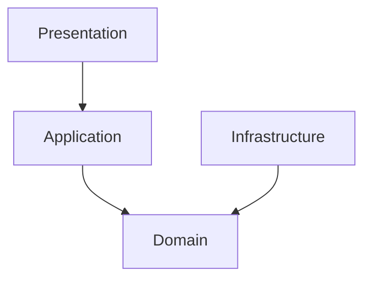

# BACKEND REFACTORING - Plan d'Action MLOps-Ready

**Date:** 2025-12-31
**Version:** 1.0
**Auteur:** Backend Tech Lead
**Objectif:** Préparer le backend VarunaPoC pour l'intégration MLOps (tags, feedback, modèles ML, PACS Telemis)

---

## Sommaire Exécutif

Le backend actuel VarunaPoC est **fonctionnel mais monolithique**. Pour accueillir l'architecture MLOps (système de tags, feedback pathologistes, intégration PACS, modèles ML), nous devons refactorer selon les principes **Clean Architecture / Hexagonal Architecture** pour garantir:

- **Modularité:** Isolation des modules (erreur dans tags ne casse pas tile serving)
- **Testabilité:** Unit tests par module sans dépendances externes
- **Maintenabilité:** Code clair, responsabilités bien définies
- **Extensibilité:** Ajout de nouvelles features (ML, PACS) sans refonte complète

**Principe directeur:** Pas de sur-ingénierie, mais architecture solide pour Phase 2+.

---

## 1. Analyse de l'Architecture Actuelle

### 1.1 Structure Actuelle

```
backend/
├── main.py                     # Point d'entrée FastAPI + CORS + monitoring
├── config_openslide.py         # Configuration DLL Windows
├── monitoring.py               # Prometheus metrics (optionnel)
│
├── routes/
│   └── slides.py              # Tous les endpoints (navigation + visualization)
│
├── services/
│   ├── folder_browser.py      # Navigation hiérarchique
│   ├── slide_scanner.py       # Scan récursif + cache ID->Path
│   ├── format_detector.py     # Détection multi-format OpenSlide
│   ├── slide_loader.py        # Extraction métadonnées + overview
│   └── tile_server.py         # Streaming tuiles DZI
│
└── utils/
    └── (vide actuellement)
```

### 1.2 Problèmes Architecturaux Identifiés

#### 1.2.1 Couplage Serré

**Problème:**
- `folder_browser.py` importe directement `format_detector.py`
- `slide_scanner.py` importe `folder_browser.generate_slide_id()`
- `slides.py` importe tous les services directement
- Pas d'interfaces/abstractions → impossible de mocker pour tests

**Impact:**
- Modification de `format_detector` nécessite retests de `folder_browser`
- Impossible de remplacer OpenSlide par un mock pour tests unitaires
- Dépendances circulaires potentielles

#### 1.2.2 Responsabilités Mélangées

**Problème:**
- `folder_browser.py` fait: validation sécurité + navigation + détection format + génération ID
- `slide_scanner.py` fait: scan + cache + ID generation (duplique logique de `folder_browser`)
- `tile_server.py` gère cache ET extraction de tuiles ET métadonnées DZI

**Impact:**
- Difficile de tester chaque responsabilité isolément
- Duplication de code (génération ID dans 2 fichiers)
- Violation du Single Responsibility Principle

#### 1.2.3 Configuration Non Centralisée

**Problème:**
- `SLIDES_ROOT` défini dans `folder_browser.py` avec logique complexe
- `CORS_ORIGINS` dans `main.py` avec fallback env
- Pas de validation de configuration au démarrage
- Chemins hardcodés (`OPENSLIDE_PATH` dans `config_openslide.py`)

**Impact:**
- Difficile de configurer pour Docker vs Dev vs Prod
- Pas de single source of truth pour configuration
- Erreurs de configuration découvertes à l'exécution, pas au démarrage

#### 1.2.4 Gestion d'Erreurs Inconsistante

**Problème:**
- `slides.py`: mélange `RuntimeError`, `PermissionError`, `FileNotFoundError`, `Exception`
- `format_detector.py`: logs warnings mais retourne `None` (erreurs silencieuses)
- `tile_server.py`: catch-all `Exception` avec logs mais retourne `None`
- Pas de domaine d'exceptions custom

**Impact:**
- Frontend reçoit des erreurs 500 génériques sans contexte
- Logs difficiles à filtrer/analyser
- Impossible de distinguer erreur système vs erreur métier

#### 1.2.5 État Global et Cache Ad-Hoc

**Problème:**
- `tile_server.py`: instance globale `tile_server = TileServer()` avec cache dict
- `slide_scanner.py`: cache global `_slide_cache = {}`
- Pas de stratégie de cache cohérente
- Pas d'invalidation de cache

**Impact:**
- Tests difficiles (état partagé entre tests)
- Pas de contrôle sur éviction de cache
- Risques de memory leaks si slides non fermés
- Impossible de scaler horizontalement (état en mémoire)

#### 1.2.6 Pas d'Abstraction pour OpenSlide

**Problème:**
- Appels directs `openslide.OpenSlide()` partout
- Impossible de mocker pour tests
- Couplage fort à une librairie externe

**Impact:**
- Tous les tests nécessitent fichiers slides réels
- Impossible de tester logique métier sans OpenSlide
- Migration vers autre librairie impossible

### 1.3 Métriques de Complexité

**Analyse actuelle:**

| Fichier | Lignes | Responsabilités | Dépendances | Complexité |
|---------|--------|-----------------|-------------|------------|
| `main.py` | 167 | 3 (FastAPI + CORS + monitoring) | 2 routes | Moyenne |
| `slides.py` | 276 | 6 (tous les endpoints) | 5 services | Haute |
| `folder_browser.py` | 348 | 7 (navigation + sécurité + détection + ID) | 1 service | Haute |
| `format_detector.py` | 783 | 15 (détection tous formats) | 1 (OpenSlide) | Haute |
| `slide_scanner.py` | 132 | 3 (scan + cache + ID) | 2 services | Moyenne |
| `slide_loader.py` | 127 | 2 (métadonnées + overview) | 1 (OpenSlide) | Basse |
| `tile_server.py` | 235 | 3 (cache + tuiles + DZI) | 1 (OpenSlide) | Moyenne |

**Total:** ~2068 lignes, 39 responsabilités identifiées, couplage élevé.

---

## 2. Architecture Cible: Clean Architecture / Hexagonal

### 2.1 Principes Directeurs

1. **Dependency Inversion:** Les modules métier ne dépendent PAS de l'infrastructure
2. **Separation of Concerns:** Chaque module a UNE responsabilité claire
3. **Interface Segregation:** Interfaces minimales et spécifiques
4. **Open/Closed:** Extensions via nouvelles implémentations, pas modifications

### 2.2 Nouvelle Structure de Dossiers

```
backend/
│
├── main.py                      # Point d'entrée FastAPI (minimal)
├── config.py                    # Configuration centralisée (Pydantic Settings)
├── dependencies.py              # Dependency Injection FastAPI
│
├── domain/                      # Couche Métier (AUCUNE dépendance infrastructure)
│   ├── __init__.py
│   │
│   ├── entities/                # Entités métier (dataclasses)
│   │   ├── __init__.py
│   │   ├── slide.py            # Slide, SlideMetadata
│   │   ├── tile.py             # Tile, TileRequest
│   │   ├── tag.py              # Tag, TagCategory (MLOps)
│   │   ├── feedback.py         # PathologistFeedback (MLOps)
│   │   └── folder.py           # FolderNode, BreadcrumbItem
│   │
│   ├── value_objects/           # Value objects immuables
│   │   ├── __init__.py
│   │   ├── slide_id.py         # SlideId (MD5 hash)
│   │   ├── coordinates.py      # TileCoordinates, Level0Coordinates
│   │   └── file_path.py        # SlidePath (validation)
│   │
│   ├── repositories/            # Interfaces (ports)
│   │   ├── __init__.py
│   │   ├── slide_repository.py # Interface pour accès slides
│   │   ├── tag_repository.py   # Interface pour tags (MLOps)
│   │   ├── feedback_repository.py # Interface feedback (MLOps)
│   │   └── cache_repository.py # Interface cache générique
│   │
│   ├── services/                # Services métier (use cases)
│   │   ├── __init__.py
│   │   ├── slide_service.py    # Logique métier slides
│   │   ├── navigation_service.py # Navigation hiérarchique
│   │   ├── tile_service.py     # Extraction tuiles (logique pure)
│   │   ├── tag_service.py      # Gestion tags (MLOps)
│   │   └── feedback_service.py # Capture feedback (MLOps)
│   │
│   └── exceptions/              # Exceptions métier
│       ├── __init__.py
│       ├── slide_exceptions.py # SlideNotFoundError, InvalidSlideError
│       ├── tile_exceptions.py  # TileOutOfBoundsError
│       └── security_exceptions.py # PathTraversalError
│
├── application/                 # Couche Application (orchestration use cases)
│   ├── __init__.py
│   │
│   ├── use_cases/               # Use cases (1 action = 1 use case)
│   │   ├── __init__.py
│   │   ├── list_slides.py      # Liste toutes les slides
│   │   ├── browse_directory.py # Navigation hiérarchique
│   │   ├── get_slide_metadata.py # Métadonnées slide
│   │   ├── get_slide_overview.py # Overview image
│   │   ├── get_tile.py         # Extraction tuile
│   │   ├── add_tag.py          # Ajouter tag (MLOps)
│   │   └── submit_feedback.py  # Soumettre feedback (MLOps)
│   │
│   └── dtos/                    # Data Transfer Objects (API contracts)
│       ├── __init__.py
│       ├── slide_dto.py        # SlideListDTO, SlideDetailDTO
│       ├── navigation_dto.py   # BrowseResponseDTO
│       ├── tile_dto.py         # TileResponseDTO
│       └── tag_dto.py          # TagDTO, FeedbackDTO (MLOps)
│
├── infrastructure/              # Couche Infrastructure (adaptateurs)
│   ├── __init__.py
│   │
│   ├── openslide/               # Adaptateur OpenSlide
│   │   ├── __init__.py
│   │   ├── openslide_adapter.py # Implémentation SlideRepository
│   │   ├── format_detector.py  # Détection formats (refactoré)
│   │   └── tile_extractor.py   # Extraction tuiles OpenSlide
│   │
│   ├── filesystem/              # Adaptateur filesystem
│   │   ├── __init__.py
│   │   ├── file_scanner.py     # Scan dossiers
│   │   └── path_validator.py   # Validation sécurité chemins
│   │
│   ├── cache/                   # Implémentations cache
│   │   ├── __init__.py
│   │   ├── memory_cache.py     # Cache en mémoire (dict)
│   │   ├── redis_cache.py      # Cache Redis (future Phase 2)
│   │   └── cache_factory.py    # Factory pattern
│   │
│   ├── database/                # Base de données (MLOps)
│   │   ├── __init__.py
│   │   ├── models.py           # SQLAlchemy models (tags, feedback)
│   │   ├── tag_repository_impl.py # Implémentation TagRepository
│   │   └── feedback_repository_impl.py # Implémentation FeedbackRepository
│   │
│   └── pacs/                    # Intégration PACS (Phase 2+)
│       ├── __init__.py
│       ├── telemis_client.py   # Client Telemis PACS
│       └── dicom_adapter.py    # Adaptateur DICOM
│
├── presentation/                # Couche Présentation (API REST)
│   ├── __init__.py
│   │
│   ├── api/
│   │   ├── __init__.py
│   │   ├── v1/                 # Versioning API
│   │   │   ├── __init__.py
│   │   │   ├── health.py       # Endpoints health
│   │   │   ├── slides.py       # Endpoints slides
│   │   │   ├── navigation.py   # Endpoints navigation
│   │   │   ├── visualization.py # Endpoints tuiles
│   │   │   ├── tags.py         # Endpoints tags (MLOps)
│   │   │   └── feedback.py     # Endpoints feedback (MLOps)
│   │   │
│   │   └── dependencies.py     # Dependency injection
│   │
│   ├── middleware/              # Middlewares FastAPI
│   │   ├── __init__.py
│   │   ├── error_handler.py    # Gestion erreurs centralisée
│   │   ├── logging_middleware.py # Logs requêtes
│   │   └── metrics_middleware.py # Prometheus metrics
│   │
│   └── schemas/                 # Pydantic schemas (validation)
│       ├── __init__.py
│       ├── slide_schema.py     # Validation slides
│       ├── tile_schema.py      # Validation tuiles
│       └── tag_schema.py       # Validation tags (MLOps)
│
├── tests/                       # Tests (même structure que backend/)
│   ├── unit/                    # Tests unitaires (sans I/O)
│   │   ├── domain/
│   │   ├── application/
│   │   └── infrastructure/
│   │
│   ├── integration/             # Tests intégration (avec DB, OpenSlide)
│   │   ├── openslide/
│   │   ├── database/
│   │   └── cache/
│   │
│   └── e2e/                     # Tests end-to-end (API complète)
│       └── api/
│
└── utils/                       # Utilitaires transverses
    ├── __init__.py
    ├── logger.py               # Configuration logging centralisée
    └── retry.py                # Retry decorator pour I/O
```

### 2.3 Couches et Responsabilités

#### Domain Layer (Couche Métier)

**Règle d'or:** AUCUNE dépendance vers `infrastructure/` ou `presentation/`

- **Entities:** Objets métier avec identité (Slide, Tag, Feedback)
- **Value Objects:** Objets immuables sans identité (SlideId, Coordinates)
- **Repositories (interfaces):** Contrats d'accès aux données
- **Services:** Logique métier pure (calculs, validations)
- **Exceptions:** Erreurs métier custom

**Exemple:**

```python
# domain/entities/slide.py
from dataclasses import dataclass
from typing import List, Tuple
from domain.value_objects.slide_id import SlideId

@dataclass
class Slide:
    """Entité métier représentant une lame histologique."""
    id: SlideId
    name: str
    path: str
    format: str
    dimensions: Tuple[int, int]
    level_count: int
    is_supported: bool

    def get_downsample_factor(self, level: int) -> float:
        """Calcule facteur de réduction pour un niveau."""
        # Logique métier pure, pas d'accès OpenSlide
        if level < 0 or level >= self.level_count:
            raise ValueError(f"Invalid level {level}")
        return 2.0 ** level  # Exemple simplifié
```

```python
# domain/repositories/slide_repository.py
from abc import ABC, abstractmethod
from typing import List, Optional
from domain.entities.slide import Slide
from domain.value_objects.slide_id import SlideId

class SlideRepository(ABC):
    """Interface pour accès aux slides (port)."""

    @abstractmethod
    async def find_by_id(self, slide_id: SlideId) -> Optional[Slide]:
        """Trouve une slide par son ID."""
        pass

    @abstractmethod
    async def find_all(self) -> List[Slide]:
        """Liste toutes les slides."""
        pass

    @abstractmethod
    async def get_metadata(self, slide_id: SlideId) -> dict:
        """Récupère métadonnées OpenSlide."""
        pass
```

#### Application Layer (Couche Application)

**Rôle:** Orchestrer les use cases (appeler domain services + repositories)

```python
# application/use_cases/get_slide_metadata.py
from domain.repositories.slide_repository import SlideRepository
from domain.value_objects.slide_id import SlideId
from domain.exceptions.slide_exceptions import SlideNotFoundError
from application.dtos.slide_dto import SlideMetadataDTO

class GetSlideMetadataUseCase:
    """Use case: récupérer métadonnées d'une slide."""

    def __init__(self, slide_repository: SlideRepository):
        self.slide_repository = slide_repository

    async def execute(self, slide_id_str: str) -> SlideMetadataDTO:
        """
        Exécute le use case.

        Args:
            slide_id_str: ID de la slide (string MD5)

        Returns:
            SlideMetadataDTO avec métadonnées

        Raises:
            SlideNotFoundError: Si slide introuvable
        """
        # Valider et créer value object
        slide_id = SlideId(slide_id_str)

        # Vérifier existence
        slide = await self.slide_repository.find_by_id(slide_id)
        if not slide:
            raise SlideNotFoundError(f"Slide {slide_id} not found")

        # Récupérer métadonnées
        metadata = await self.slide_repository.get_metadata(slide_id)

        # Convertir en DTO
        return SlideMetadataDTO(
            id=str(slide_id),
            name=slide.name,
            dimensions=metadata['dimensions'],
            level_count=metadata['level_count'],
            vendor=metadata.get('vendor', 'Unknown')
        )
```

#### Infrastructure Layer (Couche Infrastructure)

**Rôle:** Implémentations concrètes des interfaces (adaptateurs)

```python
# infrastructure/openslide/openslide_adapter.py
import openslide
from typing import List, Optional
from domain.repositories.slide_repository import SlideRepository
from domain.entities.slide import Slide
from domain.value_objects.slide_id import SlideId
from infrastructure.cache.cache_repository import CacheRepository

class OpenSlideAdapter(SlideRepository):
    """Adaptateur OpenSlide implémentant SlideRepository."""

    def __init__(self, cache: CacheRepository):
        self.cache = cache
        self._open_slides = {}  # Cache des slides ouverts

    async def find_by_id(self, slide_id: SlideId) -> Optional[Slide]:
        """Implémentation find_by_id avec OpenSlide."""
        # Chercher dans cache d'abord
        cached = await self.cache.get(f"slide:{slide_id}")
        if cached:
            return Slide(**cached)

        # Scan filesystem pour trouver chemin
        path = self._find_path_by_id(slide_id)
        if not path:
            return None

        # Ouvrir avec OpenSlide et créer entité
        slide_obj = openslide.OpenSlide(path)
        slide = Slide(
            id=slide_id,
            name=Path(path).name,
            path=path,
            format=slide_obj.detect_format(path) or "unknown",
            dimensions=slide_obj.dimensions,
            level_count=slide_obj.level_count,
            is_supported=True
        )
        slide_obj.close()

        # Mettre en cache
        await self.cache.set(f"slide:{slide_id}", slide.__dict__, ttl=3600)

        return slide

    async def get_metadata(self, slide_id: SlideId) -> dict:
        """Implémentation get_metadata avec OpenSlide."""
        slide = await self.find_by_id(slide_id)
        if not slide:
            raise SlideNotFoundError(f"Slide {slide_id} not found")

        slide_obj = openslide.OpenSlide(slide.path)
        metadata = {
            'dimensions': slide_obj.dimensions,
            'level_count': slide_obj.level_count,
            'level_dimensions': list(slide_obj.level_dimensions),
            'level_downsamples': list(slide_obj.level_downsamples),
            'vendor': slide_obj.properties.get(openslide.PROPERTY_NAME_VENDOR, 'Unknown')
        }
        slide_obj.close()

        return metadata
```

#### Presentation Layer (Couche Présentation)

**Rôle:** Endpoints FastAPI (appeler use cases, retourner JSON)

```python
# presentation/api/v1/slides.py
from fastapi import APIRouter, Depends, HTTPException
from application.use_cases.get_slide_metadata import GetSlideMetadataUseCase
from domain.exceptions.slide_exceptions import SlideNotFoundError
from presentation.schemas.slide_schema import SlideMetadataResponse
from presentation.api.dependencies import get_slide_metadata_use_case

router = APIRouter(prefix="/api/v1/slides", tags=["slides"])

@router.get("/{slide_id}/info", response_model=SlideMetadataResponse)
async def get_slide_info(
    slide_id: str,
    use_case: GetSlideMetadataUseCase = Depends(get_slide_metadata_use_case)
):
    """
    Récupère métadonnées d'une slide.

    Args:
        slide_id: ID unique de la slide (MD5 hash)

    Returns:
        SlideMetadataResponse avec métadonnées

    Raises:
        404: Slide not found
        500: Internal server error
    """
    try:
        metadata_dto = await use_case.execute(slide_id)
        return SlideMetadataResponse(**metadata_dto.__dict__)

    except SlideNotFoundError as e:
        raise HTTPException(status_code=404, detail=str(e))

    except Exception as e:
        # Log error
        logger.error(f"Unexpected error getting slide metadata: {e}")
        raise HTTPException(status_code=500, detail="Internal server error")
```

---

## 3. Plan de Migration Progressif

### Stratégie: Étrangler Pattern (Strangler Fig)

**Principe:** Refactorer progressivement SANS casser le code existant.

**Étapes:**

1. **Phase 0:** Créer nouvelle structure (dossiers vides, interfaces)
2. **Phase 1:** Migrer un module à la fois (slide_loader → domain/entities/slide)
3. **Phase 2:** Rediriger anciens modules vers nouveaux (backwards compatibility)
4. **Phase 3:** Supprimer anciens modules quand migration complète

### 3.1 Ordre de Migration (Priorité)

#### Étape 1: Configuration Centralisée (2h)

**Objectif:** Centraliser toute configuration dans `config.py`

**Actions:**

1. Créer `config.py` avec Pydantic Settings:

```python
# config.py
from pydantic_settings import BaseSettings
from typing import List

class Settings(BaseSettings):
    """Configuration centralisée."""

    # Slides
    slides_root: str = "/slides"

    # OpenSlide
    openslide_dll_path: str = r"C:\msys64\ucrt64\bin"

    # API
    cors_origins: List[str] = ["http://localhost:5173", "http://localhost:8080"]
    api_version: str = "1.0.0"

    # Cache
    cache_type: str = "memory"  # "memory" ou "redis"
    cache_max_slides: int = 5
    cache_ttl_seconds: int = 3600

    # Database (MLOps)
    database_url: str = "sqlite:///./varuna.db"

    # PACS (Phase 2+)
    pacs_enabled: bool = False
    pacs_url: str = ""

    class Config:
        env_file = ".env"
        env_file_encoding = "utf-8"

# Instance globale
settings = Settings()
```

2. Créer `.env.example`:

```bash
# Slides Repository
SLIDES_ROOT=/slides

# OpenSlide (Windows)
OPENSLIDE_DLL_PATH=C:\msys64\ucrt64\bin

# CORS (comma-separated)
CORS_ORIGINS=http://localhost:5173,http://localhost:8080

# Cache
CACHE_TYPE=memory
CACHE_MAX_SLIDES=5

# Database (MLOps)
DATABASE_URL=sqlite:///./varuna.db

# PACS (Phase 2+)
PACS_ENABLED=false
PACS_URL=
```

3. Modifier `main.py` pour utiliser `settings`:

```python
from config import settings

app = FastAPI(
    title="VarunaPoC Backend API",
    version=settings.api_version,
    # ...
)

app.add_middleware(
    CORSMiddleware,
    allow_origins=settings.cors_origins,
    # ...
)
```

**Tests:**

- Lancer backend avec `.env` → config chargée
- Modifier `.env` → vérifier changements pris en compte
- Aucune régression fonctionnelle

**Temps:** 2h (création fichiers + tests)

---

#### Étape 2: Exceptions Métier Centralisées (2h)

**Objectif:** Créer hiérarchie d'exceptions custom + handler global

**Actions:**

1. Créer `domain/exceptions/`:

```python
# domain/exceptions/__init__.py
class VarunaException(Exception):
    """Exception de base VarunaPoC."""
    pass

class DomainException(VarunaException):
    """Exception métier."""
    pass

class InfrastructureException(VarunaException):
    """Exception infrastructure."""
    pass
```

```python
# domain/exceptions/slide_exceptions.py
from domain.exceptions import DomainException

class SlideNotFoundError(DomainException):
    """Slide introuvable."""
    def __init__(self, slide_id: str):
        self.slide_id = slide_id
        super().__init__(f"Slide {slide_id} not found")

class InvalidSlideError(DomainException):
    """Slide invalide ou corrompu."""
    def __init__(self, slide_id: str, reason: str):
        self.slide_id = slide_id
        self.reason = reason
        super().__init__(f"Invalid slide {slide_id}: {reason}")

class UnsupportedSlideFormatError(DomainException):
    """Format de slide non supporté."""
    def __init__(self, format: str):
        self.format = format
        super().__init__(f"Unsupported slide format: {format}")
```

```python
# domain/exceptions/tile_exceptions.py
from domain.exceptions import DomainException

class TileOutOfBoundsError(DomainException):
    """Tuile hors limites."""
    def __init__(self, level: int, col: int, row: int):
        self.level = level
        self.col = col
        self.row = row
        super().__init__(f"Tile out of bounds: level={level}, col={col}, row={row}")

class InvalidTileLevelError(DomainException):
    """Niveau pyramidal invalide."""
    def __init__(self, requested: int, max_level: int):
        self.requested = requested
        self.max_level = max_level
        super().__init__(f"Invalid level {requested} (max: {max_level})")
```

```python
# domain/exceptions/security_exceptions.py
from domain.exceptions import DomainException

class PathTraversalError(DomainException):
    """Tentative de path traversal."""
    def __init__(self, path: str):
        self.path = path
        super().__init__(f"Path traversal attempt detected: {path}")
```

2. Créer error handler global:

```python
# presentation/middleware/error_handler.py
from fastapi import Request, status
from fastapi.responses import JSONResponse
from domain.exceptions import (
    DomainException,
    InfrastructureException,
    SlideNotFoundError,
    TileOutOfBoundsError,
    PathTraversalError
)
import logging

logger = logging.getLogger(__name__)

async def domain_exception_handler(request: Request, exc: DomainException):
    """Handler pour exceptions métier."""

    # Mapper exceptions vers codes HTTP
    status_code_map = {
        SlideNotFoundError: status.HTTP_404_NOT_FOUND,
        TileOutOfBoundsError: status.HTTP_404_NOT_FOUND,
        PathTraversalError: status.HTTP_400_BAD_REQUEST,
    }

    status_code = status_code_map.get(type(exc), status.HTTP_400_BAD_REQUEST)

    logger.warning(f"Domain exception: {exc}")

    return JSONResponse(
        status_code=status_code,
        content={
            "error": type(exc).__name__,
            "message": str(exc),
            "details": exc.__dict__
        }
    )

async def infrastructure_exception_handler(request: Request, exc: InfrastructureException):
    """Handler pour exceptions infrastructure."""
    logger.error(f"Infrastructure exception: {exc}", exc_info=True)

    return JSONResponse(
        status_code=status.HTTP_500_INTERNAL_SERVER_ERROR,
        content={
            "error": "InfrastructureError",
            "message": "Internal server error"
        }
    )

async def generic_exception_handler(request: Request, exc: Exception):
    """Handler pour exceptions non gérées."""
    logger.critical(f"Unhandled exception: {exc}", exc_info=True)

    return JSONResponse(
        status_code=status.HTTP_500_INTERNAL_SERVER_ERROR,
        content={
            "error": "UnexpectedError",
            "message": "An unexpected error occurred"
        }
    )
```

3. Enregistrer handlers dans `main.py`:

```python
from domain.exceptions import DomainException, InfrastructureException
from presentation.middleware.error_handler import (
    domain_exception_handler,
    infrastructure_exception_handler,
    generic_exception_handler
)

app.add_exception_handler(DomainException, domain_exception_handler)
app.add_exception_handler(InfrastructureException, infrastructure_exception_handler)
app.add_exception_handler(Exception, generic_exception_handler)
```

**Tests:**

- Lever `SlideNotFoundError` → recevoir 404 avec détails JSON
- Lever `PathTraversalError` → recevoir 400 avec détails
- Lever `Exception` générique → recevoir 500 sans détails sensibles

**Temps:** 2h

---

#### Étape 3: Value Objects et Entities (4h)

**Objectif:** Créer entités métier + value objects

**Actions:**

1. Créer `domain/value_objects/slide_id.py`:

```python
# domain/value_objects/slide_id.py
from dataclasses import dataclass
import hashlib
import re

@dataclass(frozen=True)
class SlideId:
    """Value object représentant l'ID unique d'une slide."""
    value: str

    def __post_init__(self):
        """Valide l'ID au moment de la création."""
        if not self._is_valid(self.value):
            raise ValueError(f"Invalid SlideId: {self.value}")

    @staticmethod
    def _is_valid(id_str: str) -> bool:
        """Vérifie format MD5 tronqué (12 caractères hex)."""
        return bool(re.match(r'^[a-f0-9]{12}$', id_str))

    @staticmethod
    def generate(file_path: str) -> 'SlideId':
        """Génère SlideId depuis un chemin de fichier."""
        hash_md5 = hashlib.md5(file_path.encode()).hexdigest()
        return SlideId(hash_md5[:12])

    def __str__(self) -> str:
        return self.value

    def __repr__(self) -> str:
        return f"SlideId('{self.value}')"
```

2. Créer `domain/entities/slide.py`:

```python
# domain/entities/slide.py
from dataclasses import dataclass
from typing import Tuple, List
from domain.value_objects.slide_id import SlideId

@dataclass
class Slide:
    """Entité métier représentant une lame histologique."""
    id: SlideId
    name: str
    path: str
    format: str
    dimensions: Tuple[int, int]
    level_count: int
    level_dimensions: List[Tuple[int, int]]
    level_downsamples: List[float]
    is_supported: bool
    vendor: str = "Unknown"
    notes: str = ""

    def get_level_dimensions(self, level: int) -> Tuple[int, int]:
        """Retourne dimensions d'un niveau pyramidal."""
        if level < 0 or level >= self.level_count:
            raise ValueError(f"Invalid level {level} (max: {self.level_count - 1})")
        return self.level_dimensions[level]

    def get_downsample_factor(self, level: int) -> float:
        """Retourne facteur de réduction pour un niveau."""
        if level < 0 or level >= self.level_count:
            raise ValueError(f"Invalid level {level}")
        return self.level_downsamples[level]

    def is_level_valid(self, level: int) -> bool:
        """Vérifie si un niveau est valide."""
        return 0 <= level < self.level_count
```

3. Créer `domain/value_objects/coordinates.py`:

```python
# domain/value_objects/coordinates.py
from dataclasses import dataclass

@dataclass(frozen=True)
class TileCoordinates:
    """Coordonnées d'une tuile (niveau, col, row)."""
    level: int
    col: int
    row: int

    def __post_init__(self):
        if self.level < 0:
            raise ValueError(f"Level must be >= 0, got {self.level}")
        if self.col < 0:
            raise ValueError(f"Col must be >= 0, got {self.col}")
        if self.row < 0:
            raise ValueError(f"Row must be >= 0, got {self.row}")

@dataclass(frozen=True)
class Level0Coordinates:
    """Coordonnées niveau 0 (pour OpenSlide)."""
    x: int
    y: int

    def __post_init__(self):
        if self.x < 0 or self.y < 0:
            raise ValueError(f"Coordinates must be >= 0, got ({self.x}, {self.y})")

    @staticmethod
    def from_tile(tile: TileCoordinates, tile_size: int, downsample: float) -> 'Level0Coordinates':
        """Convertit coordonnées tuile en coordonnées niveau 0."""
        x = int(tile.col * tile_size * downsample)
        y = int(tile.row * tile_size * downsample)
        return Level0Coordinates(x, y)
```

**Tests unitaires:**

```python
# tests/unit/domain/value_objects/test_slide_id.py
import pytest
from domain.value_objects.slide_id import SlideId

def test_valid_slide_id():
    """Test création SlideId valide."""
    id = SlideId("a1b2c3d4e5f6")
    assert str(id) == "a1b2c3d4e5f6"

def test_invalid_slide_id():
    """Test rejet SlideId invalide."""
    with pytest.raises(ValueError):
        SlideId("invalid")

def test_generate_slide_id():
    """Test génération SlideId depuis chemin."""
    id1 = SlideId.generate("/path/to/slide.mrxs")
    id2 = SlideId.generate("/path/to/slide.mrxs")
    assert id1 == id2  # Même chemin = même ID
```

**Temps:** 4h (création entités + tests)

---

#### Étape 4: Repository Interfaces (2h)

**Objectif:** Définir interfaces (ports) pour accès données

**Actions:**

1. Créer `domain/repositories/slide_repository.py`:

```python
# domain/repositories/slide_repository.py
from abc import ABC, abstractmethod
from typing import List, Optional
from domain.entities.slide import Slide
from domain.value_objects.slide_id import SlideId

class SlideRepository(ABC):
    """Interface pour accès aux slides (port)."""

    @abstractmethod
    async def find_by_id(self, slide_id: SlideId) -> Optional[Slide]:
        """Trouve une slide par son ID."""
        pass

    @abstractmethod
    async def find_all(self) -> List[Slide]:
        """Liste toutes les slides disponibles."""
        pass

    @abstractmethod
    async def find_by_path(self, path: str) -> Optional[Slide]:
        """Trouve une slide par son chemin."""
        pass

    @abstractmethod
    async def get_metadata(self, slide_id: SlideId) -> dict:
        """Récupère métadonnées OpenSlide brutes."""
        pass

    @abstractmethod
    async def get_thumbnail(self, slide_id: SlideId, max_size: int) -> bytes:
        """Récupère thumbnail JPEG."""
        pass
```

2. Créer `domain/repositories/cache_repository.py`:

```python
# domain/repositories/cache_repository.py
from abc import ABC, abstractmethod
from typing import Optional, Any

class CacheRepository(ABC):
    """Interface pour cache générique."""

    @abstractmethod
    async def get(self, key: str) -> Optional[Any]:
        """Récupère valeur depuis cache."""
        pass

    @abstractmethod
    async def set(self, key: str, value: Any, ttl: int = 3600) -> None:
        """Stocke valeur dans cache avec TTL."""
        pass

    @abstractmethod
    async def delete(self, key: str) -> None:
        """Supprime clé du cache."""
        pass

    @abstractmethod
    async def clear(self) -> None:
        """Vide tout le cache."""
        pass
```

3. Créer interfaces MLOps:

```python
# domain/repositories/tag_repository.py
from abc import ABC, abstractmethod
from typing import List
from domain.entities.tag import Tag
from domain.value_objects.slide_id import SlideId

class TagRepository(ABC):
    """Interface pour gestion tags."""

    @abstractmethod
    async def add_tag(self, slide_id: SlideId, tag: Tag) -> None:
        """Ajoute un tag à une slide."""
        pass

    @abstractmethod
    async def get_tags(self, slide_id: SlideId) -> List[Tag]:
        """Récupère tous les tags d'une slide."""
        pass

    @abstractmethod
    async def remove_tag(self, slide_id: SlideId, tag_id: str) -> None:
        """Supprime un tag."""
        pass
```

**Tests:**

- Interfaces créées (pas d'implémentation encore)
- Documentation complète des méthodes

**Temps:** 2h

---

#### Étape 5: Use Cases (Application Layer) (6h)

**Objectif:** Créer use cases orchestrant domain services

**Actions:**

1. Créer `application/use_cases/get_slide_metadata.py`:

```python
# application/use_cases/get_slide_metadata.py
from domain.repositories.slide_repository import SlideRepository
from domain.value_objects.slide_id import SlideId
from domain.exceptions.slide_exceptions import SlideNotFoundError
from application.dtos.slide_dto import SlideMetadataDTO

class GetSlideMetadataUseCase:
    """Use case: récupérer métadonnées slide."""

    def __init__(self, slide_repository: SlideRepository):
        self.slide_repository = slide_repository

    async def execute(self, slide_id_str: str) -> SlideMetadataDTO:
        """Exécute le use case."""
        # Valider ID
        slide_id = SlideId(slide_id_str)

        # Vérifier existence
        slide = await self.slide_repository.find_by_id(slide_id)
        if not slide:
            raise SlideNotFoundError(slide_id_str)

        # Récupérer métadonnées
        metadata = await self.slide_repository.get_metadata(slide_id)

        # Convertir en DTO
        return SlideMetadataDTO(
            id=str(slide_id),
            name=slide.name,
            path=slide.path,
            format=slide.format,
            dimensions=metadata['dimensions'],
            level_count=metadata['level_count'],
            level_dimensions=metadata['level_dimensions'],
            level_downsamples=metadata['level_downsamples'],
            vendor=metadata.get('vendor', 'Unknown')
        )
```

2. Créer autres use cases:

- `list_slides.py`
- `browse_directory.py`
- `get_slide_overview.py`
- `get_tile.py`

**Tests unitaires:**

```python
# tests/unit/application/use_cases/test_get_slide_metadata.py
import pytest
from unittest.mock import AsyncMock
from application.use_cases.get_slide_metadata import GetSlideMetadataUseCase
from domain.value_objects.slide_id import SlideId
from domain.exceptions.slide_exceptions import SlideNotFoundError

@pytest.mark.asyncio
async def test_get_metadata_success():
    """Test récupération métadonnées réussie."""
    # Mock repository
    mock_repo = AsyncMock()
    slide_id = SlideId.generate("/slides/test.mrxs")

    mock_slide = Mock(
        id=slide_id,
        name="test.mrxs",
        format="mirax"
    )
    mock_repo.find_by_id.return_value = mock_slide
    mock_repo.get_metadata.return_value = {
        'dimensions': (100000, 80000),
        'level_count': 9,
        'vendor': '3DHISTECH'
    }

    # Exécuter use case
    use_case = GetSlideMetadataUseCase(mock_repo)
    result = await use_case.execute(str(slide_id))

    # Vérifier
    assert result.id == str(slide_id)
    assert result.name == "test.mrxs"
    assert result.dimensions == (100000, 80000)

@pytest.mark.asyncio
async def test_get_metadata_not_found():
    """Test slide introuvable."""
    mock_repo = AsyncMock()
    mock_repo.find_by_id.return_value = None

    use_case = GetSlideMetadataUseCase(mock_repo)

    with pytest.raises(SlideNotFoundError):
        await use_case.execute("a1b2c3d4e5f6")
```

**Temps:** 6h (5 use cases + tests)

---

#### Étape 6: Infrastructure Adapters (8h)

**Objectif:** Implémenter adaptateurs OpenSlide + Cache + Filesystem

**Actions:**

1. Créer `infrastructure/openslide/openslide_adapter.py`:

```python
# infrastructure/openslide/openslide_adapter.py
import openslide
from pathlib import Path
from typing import List, Optional
from domain.repositories.slide_repository import SlideRepository
from domain.entities.slide import Slide
from domain.value_objects.slide_id import SlideId
from domain.exceptions.slide_exceptions import SlideNotFoundError, InvalidSlideError
from infrastructure.cache.cache_repository import CacheRepository
from infrastructure.filesystem.file_scanner import FileScanner

class OpenSlideAdapter(SlideRepository):
    """Adaptateur OpenSlide implémentant SlideRepository."""

    def __init__(self, cache: CacheRepository, file_scanner: FileScanner):
        self.cache = cache
        self.file_scanner = file_scanner
        self._open_slides = {}  # Cache slides ouverts

    async def find_by_id(self, slide_id: SlideId) -> Optional[Slide]:
        """Trouve slide par ID."""
        # Chercher dans cache
        cached = await self.cache.get(f"slide:{slide_id}")
        if cached:
            return Slide(**cached)

        # Scanner filesystem
        path = await self.file_scanner.find_path_by_id(slide_id)
        if not path:
            return None

        # Créer entité depuis fichier
        slide = await self._create_slide_from_path(path, slide_id)

        # Mettre en cache
        await self.cache.set(f"slide:{slide_id}", slide.__dict__, ttl=3600)

        return slide

    async def find_all(self) -> List[Slide]:
        """Liste toutes les slides."""
        # Chercher dans cache
        cached = await self.cache.get("slides:all")
        if cached:
            return [Slide(**s) for s in cached]

        # Scanner filesystem
        paths = await self.file_scanner.scan_all()
        slides = []

        for path in paths:
            slide_id = SlideId.generate(str(path))
            slide = await self._create_slide_from_path(path, slide_id)
            slides.append(slide)

        # Mettre en cache
        await self.cache.set(
            "slides:all",
            [s.__dict__ for s in slides],
            ttl=1800  # 30 minutes
        )

        return slides

    async def get_metadata(self, slide_id: SlideId) -> dict:
        """Récupère métadonnées OpenSlide."""
        slide = await self.find_by_id(slide_id)
        if not slide:
            raise SlideNotFoundError(str(slide_id))

        try:
            slide_obj = openslide.OpenSlide(slide.path)
            metadata = {
                'dimensions': slide_obj.dimensions,
                'level_count': slide_obj.level_count,
                'level_dimensions': list(slide_obj.level_dimensions),
                'level_downsamples': list(slide_obj.level_downsamples),
                'vendor': slide_obj.properties.get(openslide.PROPERTY_NAME_VENDOR, 'Unknown'),
                'format': openslide.OpenSlide.detect_format(slide.path)
            }
            slide_obj.close()
            return metadata

        except openslide.OpenSlideError as e:
            raise InvalidSlideError(str(slide_id), str(e))

    async def _create_slide_from_path(self, path: Path, slide_id: SlideId) -> Slide:
        """Crée entité Slide depuis un fichier."""
        try:
            slide_obj = openslide.OpenSlide(str(path))

            slide = Slide(
                id=slide_id,
                name=path.name,
                path=str(path),
                format=openslide.OpenSlide.detect_format(str(path)) or "unknown",
                dimensions=slide_obj.dimensions,
                level_count=slide_obj.level_count,
                level_dimensions=list(slide_obj.level_dimensions),
                level_downsamples=list(slide_obj.level_downsamples),
                is_supported=True,
                vendor=slide_obj.properties.get(openslide.PROPERTY_NAME_VENDOR, 'Unknown')
            )

            slide_obj.close()
            return slide

        except openslide.OpenSlideError as e:
            # Slide détectée mais non supportée
            return Slide(
                id=slide_id,
                name=path.name,
                path=str(path),
                format="unknown",
                dimensions=(0, 0),
                level_count=0,
                level_dimensions=[],
                level_downsamples=[],
                is_supported=False,
                notes=f"OpenSlide error: {str(e)}"
            )
```

2. Créer `infrastructure/cache/memory_cache.py`:

```python
# infrastructure/cache/memory_cache.py
from typing import Optional, Any, Dict
from datetime import datetime, timedelta
from domain.repositories.cache_repository import CacheRepository

class MemoryCache(CacheRepository):
    """Implémentation cache en mémoire."""

    def __init__(self):
        self._cache: Dict[str, tuple[Any, datetime]] = {}

    async def get(self, key: str) -> Optional[Any]:
        """Récupère valeur si non expirée."""
        if key not in self._cache:
            return None

        value, expiry = self._cache[key]

        if datetime.now() > expiry:
            # Expiré, supprimer
            del self._cache[key]
            return None

        return value

    async def set(self, key: str, value: Any, ttl: int = 3600) -> None:
        """Stocke valeur avec TTL."""
        expiry = datetime.now() + timedelta(seconds=ttl)
        self._cache[key] = (value, expiry)

    async def delete(self, key: str) -> None:
        """Supprime clé."""
        if key in self._cache:
            del self._cache[key]

    async def clear(self) -> None:
        """Vide cache."""
        self._cache.clear()
```

3. Créer `infrastructure/filesystem/file_scanner.py`:

```python
# infrastructure/filesystem/file_scanner.py
from pathlib import Path
from typing import List, Optional
from domain.value_objects.slide_id import SlideId
from config import settings
from infrastructure.openslide.format_detector import FormatDetector

class FileScanner:
    """Scanner de fichiers slides dans filesystem."""

    def __init__(self):
        self.root = Path(settings.slides_root)
        self.detector = FormatDetector()

    async def scan_all(self) -> List[Path]:
        """Scan récursif de tous les slides."""
        detected = self.detector.scan_directory(self.root, recursive=True)
        return [fmt.entry_point for fmt in detected if fmt.is_supported]

    async def find_path_by_id(self, slide_id: SlideId) -> Optional[Path]:
        """Trouve chemin depuis ID (scan complet)."""
        all_slides = await self.scan_all()

        for path in all_slides:
            if SlideId.generate(str(path)) == slide_id:
                return path

        return None
```

**Tests d'intégration:**

```python
# tests/integration/infrastructure/test_openslide_adapter.py
import pytest
from infrastructure.openslide.openslide_adapter import OpenSlideAdapter
from infrastructure.cache.memory_cache import MemoryCache
from infrastructure.filesystem.file_scanner import FileScanner
from domain.value_objects.slide_id import SlideId

@pytest.mark.asyncio
async def test_find_by_id_integration():
    """Test avec vrai fichier slide."""
    cache = MemoryCache()
    scanner = FileScanner()
    adapter = OpenSlideAdapter(cache, scanner)

    # Utiliser slide de test
    test_slide_path = "C:/Users/junio/Desktop/CHU-UCL/VarunaPoC/Slides/3Dhistec/test.mrxs"
    slide_id = SlideId.generate(test_slide_path)

    # Trouver slide
    slide = await adapter.find_by_id(slide_id)

    # Vérifier
    assert slide is not None
    assert slide.id == slide_id
    assert slide.is_supported
    assert slide.level_count > 0
```

**Temps:** 8h (3 adaptateurs + tests intégration)

---

#### Étape 7: Dependency Injection (3h)

**Objectif:** Configurer injection de dépendances FastAPI

**Actions:**

1. Créer `presentation/api/dependencies.py`:

```python
# presentation/api/dependencies.py
from functools import lru_cache
from fastapi import Depends
from config import settings
from infrastructure.openslide.openslide_adapter import OpenSlideAdapter
from infrastructure.cache.memory_cache import MemoryCache
from infrastructure.filesystem.file_scanner import FileScanner
from application.use_cases.get_slide_metadata import GetSlideMetadataUseCase
from application.use_cases.list_slides import ListSlidesUseCase
from application.use_cases.get_tile import GetTileUseCase

# Cache singleton
@lru_cache()
def get_cache():
    """Retourne instance cache."""
    if settings.cache_type == "memory":
        return MemoryCache()
    elif settings.cache_type == "redis":
        # Future: RedisCache()
        raise NotImplementedError("Redis cache not implemented yet")
    else:
        raise ValueError(f"Unknown cache type: {settings.cache_type}")

# File scanner singleton
@lru_cache()
def get_file_scanner():
    """Retourne instance file scanner."""
    return FileScanner()

# Slide repository
def get_slide_repository(
    cache = Depends(get_cache),
    scanner = Depends(get_file_scanner)
):
    """Retourne instance SlideRepository."""
    return OpenSlideAdapter(cache, scanner)

# Use cases
def get_slide_metadata_use_case(
    repo = Depends(get_slide_repository)
):
    """Retourne use case GetSlideMetadata."""
    return GetSlideMetadataUseCase(repo)

def get_list_slides_use_case(
    repo = Depends(get_slide_repository)
):
    """Retourne use case ListSlides."""
    return ListSlidesUseCase(repo)

def get_tile_use_case(
    repo = Depends(get_slide_repository)
):
    """Retourne use case GetTile."""
    return GetTileUseCase(repo)
```

2. Utiliser dans endpoints:

```python
# presentation/api/v1/slides.py
from fastapi import APIRouter, Depends
from presentation.api.dependencies import get_slide_metadata_use_case
from application.use_cases.get_slide_metadata import GetSlideMetadataUseCase

router = APIRouter(prefix="/api/v1/slides", tags=["slides"])

@router.get("/{slide_id}/info")
async def get_slide_info(
    slide_id: str,
    use_case: GetSlideMetadataUseCase = Depends(get_slide_metadata_use_case)
):
    """Endpoint avec DI."""
    metadata_dto = await use_case.execute(slide_id)
    return metadata_dto
```

**Tests:**

- Vérifier injection fonctionne
- Vérifier singletons (cache, scanner)
- Vérifier nouvelles instances pour use cases

**Temps:** 3h

---

#### Étape 8: Migration Endpoints API (6h)

**Objectif:** Migrer tous les endpoints vers nouvelle architecture

**Actions:**

1. Créer `presentation/api/v1/health.py` (endpoints health):

```python
@router.get("/")
async def root():
    return {"service": "VarunaPoC", "version": settings.api_version}

@router.get("/health")
async def health():
    return {"status": "healthy"}
```

2. Créer `presentation/api/v1/slides.py` (navigation + métadonnées)
3. Créer `presentation/api/v1/visualization.py` (tuiles + overview)
4. Créer `presentation/api/v1/tags.py` (tags MLOps - Phase 2)
5. Créer `presentation/api/v1/feedback.py` (feedback MLOps - Phase 2)

6. Mettre à jour `main.py`:

```python
from presentation.api.v1 import health, slides, visualization

app.include_router(health.router)
app.include_router(slides.router)
app.include_router(visualization.router)
```

**Tests E2E:**

```python
# tests/e2e/api/test_slides_api.py
from fastapi.testclient import TestClient
from main import app

client = TestClient(app)

def test_list_slides():
    """Test endpoint liste slides."""
    response = client.get("/api/v1/slides/")
    assert response.status_code == 200
    assert "count" in response.json()
    assert "slides" in response.json()

def test_get_slide_info():
    """Test endpoint métadonnées."""
    # Utiliser slide de test
    slide_id = "a1b2c3d4e5f6"
    response = client.get(f"/api/v1/slides/{slide_id}/info")

    if response.status_code == 200:
        data = response.json()
        assert "dimensions" in data
        assert "level_count" in data
    else:
        # Slide non trouvée = 404 attendu
        assert response.status_code == 404
```

**Temps:** 6h (migration tous endpoints + tests E2E)

---

#### Étape 9: Documentation et Tests Finaux (4h)

**Objectif:** Documentation complète + couverture tests

**Actions:**

1. Mettre à jour `README.md` backend:

```markdown
# VarunaPoC Backend - Clean Architecture

## Structure

- `domain/`: Logique métier pure (aucune dépendance infrastructure)
- `application/`: Use cases orchestrant domain services
- `infrastructure/`: Adaptateurs (OpenSlide, cache, filesystem)
- `presentation/`: API REST FastAPI

## Dépendances



## Installation

```bash
pip install -r requirements.txt
cp .env.example .env
# Modifier .env avec vos chemins
uvicorn main:app --reload
```

## Tests

```bash
# Tests unitaires (rapides, sans I/O)
pytest tests/unit/

# Tests d'intégration (avec OpenSlide)
pytest tests/integration/

# Tests E2E (API complète)
pytest tests/e2e/

# Couverture
pytest --cov=backend tests/
```
```

2. Créer diagrammes architecture:

- Diagramme couches (Presentation → Application → Domain ← Infrastructure)
- Diagramme dépendances modules
- Diagramme flux use case

3. Vérifier couverture tests:

```bash
pytest --cov=backend --cov-report=html tests/
# Objectif: >80% couverture
```

**Temps:** 4h

---

### 3.2 Timeline et Ressources

**Estimation totale:** ~37 heures de développement

| Étape | Tâches | Durée | Ressources |
|-------|--------|-------|------------|
| 1 | Configuration centralisée | 2h | 1 dev |
| 2 | Exceptions métier | 2h | 1 dev |
| 3 | Value objects + Entities | 4h | 1 dev |
| 4 | Repository interfaces | 2h | 1 dev |
| 5 | Use cases | 6h | 1 dev |
| 6 | Infrastructure adapters | 8h | 1-2 devs |
| 7 | Dependency Injection | 3h | 1 dev |
| 8 | Migration endpoints | 6h | 1 dev |
| 9 | Documentation + Tests | 4h | 1 dev |

**Total:** 37h → **~5 jours** (1 dev à temps plein) ou **~3 jours** (2 devs en parallèle)

---

## 4. Extensions MLOps (Phase 2)

### 4.1 Système de Tags

**Architecture:**

```
domain/
├── entities/
│   └── tag.py                # Tag(id, name, category, color, created_by)
│
├── repositories/
│   └── tag_repository.py     # Interface TagRepository
│
└── services/
    └── tag_service.py        # Logique métier tags

infrastructure/
└── database/
    ├── models.py             # SQLAlchemy Tag model
    └── tag_repository_impl.py # Implémentation TagRepository

application/
└── use_cases/
    ├── add_tag.py           # Use case ajouter tag
    ├── remove_tag.py        # Use case supprimer tag
    └── get_slide_tags.py    # Use case lister tags slide

presentation/
└── api/v1/
    └── tags.py              # Endpoints tags
```

**Endpoints API:**

```python
POST   /api/v1/slides/{slide_id}/tags        # Ajouter tag
DELETE /api/v1/slides/{slide_id}/tags/{tag_id} # Supprimer tag
GET    /api/v1/slides/{slide_id}/tags        # Lister tags slide
GET    /api/v1/tags/categories               # Lister catégories tags
```

**Modèle données:**

```sql
CREATE TABLE tags (
    id VARCHAR(36) PRIMARY KEY,
    slide_id VARCHAR(12) NOT NULL,
    name VARCHAR(100) NOT NULL,
    category VARCHAR(50) NOT NULL,
    color VARCHAR(7),
    created_by VARCHAR(100),
    created_at TIMESTAMP,
    FOREIGN KEY (slide_id) REFERENCES slides(id)
);

CREATE INDEX idx_tags_slide ON tags(slide_id);
```

### 4.2 Capture Feedback Pathologistes

**Architecture:**

```
domain/
├── entities/
│   └── feedback.py          # PathologistFeedback
│
├── repositories/
│   └── feedback_repository.py
│
└── services/
    └── feedback_service.py

infrastructure/
└── database/
    ├── models.py            # SQLAlchemy Feedback model
    └── feedback_repository_impl.py

application/
└── use_cases/
    ├── submit_feedback.py   # Soumettre feedback
    └── get_slide_feedback.py # Récupérer feedback

presentation/
└── api/v1/
    └── feedback.py          # Endpoints feedback
```

**Endpoints API:**

```python
POST /api/v1/slides/{slide_id}/feedback      # Soumettre feedback
GET  /api/v1/slides/{slide_id}/feedback      # Lister feedback
GET  /api/v1/feedback/export                 # Export CSV pour ML
```

**Modèle données:**

```sql
CREATE TABLE feedback (
    id VARCHAR(36) PRIMARY KEY,
    slide_id VARCHAR(12) NOT NULL,
    pathologist_id VARCHAR(100),
    rating INTEGER CHECK (rating BETWEEN 1 AND 5),
    comment TEXT,
    coordinates_x INTEGER,
    coordinates_y INTEGER,
    zoom_level INTEGER,
    created_at TIMESTAMP,
    FOREIGN KEY (slide_id) REFERENCES slides(id)
);

CREATE INDEX idx_feedback_slide ON feedback(slide_id);
CREATE INDEX idx_feedback_pathologist ON feedback(pathologist_id);
```

### 4.3 API pour Modèles ML

**Architecture:**

```
domain/
├── entities/
│   ├── ml_model.py          # MLModel(id, name, version, type)
│   └── inference_result.py  # InferenceResult
│
├── repositories/
│   ├── ml_model_repository.py
│   └── inference_repository.py
│
└── services/
    └── ml_service.py

infrastructure/
├── ml/
│   ├── model_loader.py      # Chargement modèles PyTorch/TF
│   ├── inference_engine.py  # Exécution inférence
│   └── preprocessing.py     # Prétraitement images
│
└── database/
    ├── models.py            # SQLAlchemy ML models
    └── ml_repository_impl.py

application/
└── use_cases/
    ├── run_inference.py     # Exécuter modèle ML
    ├── batch_inference.py   # Inférence batch
    └── get_training_data.py # Récupérer données training

presentation/
└── api/v1/
    └── ml.py                # Endpoints ML
```

**Endpoints API:**

```python
POST /api/v1/ml/inference                   # Inférence sur région
POST /api/v1/ml/batch                       # Inférence batch
GET  /api/v1/ml/models                      # Lister modèles disponibles
GET  /api/v1/ml/training-data               # Export données training
```

### 4.4 Intégration PACS Telemis

**Architecture:**

```
domain/
├── entities/
│   └── dicom_study.py       # DICOMStudy
│
├── repositories/
│   └── pacs_repository.py   # Interface PACS
│
└── services/
    └── pacs_service.py

infrastructure/
└── pacs/
    ├── telemis_client.py    # Client HTTP Telemis API
    ├── dicom_adapter.py     # Conversion DICOM ↔ Slide
    └── pacs_config.py       # Configuration PACS

application/
└── use_cases/
    ├── import_from_pacs.py  # Importer depuis PACS
    ├── export_to_pacs.py    # Exporter vers PACS
    └── sync_pacs.py         # Synchronisation

presentation/
└── api/v1/
    └── pacs.py              # Endpoints PACS
```

**Endpoints API:**

```python
POST /api/v1/pacs/import                    # Importer étude DICOM
POST /api/v1/pacs/export/{slide_id}         # Exporter slide vers PACS
GET  /api/v1/pacs/studies                   # Lister études PACS
```

### 4.5 Audit Trail Complet

**Architecture:**

```
domain/
├── entities/
│   └── audit_event.py       # AuditEvent(user, action, resource, timestamp)
│
├── repositories/
│   └── audit_repository.py
│
└── services/
    └── audit_service.py

infrastructure/
└── database/
    ├── models.py            # SQLAlchemy AuditEvent model
    └── audit_repository_impl.py

presentation/
└── middleware/
    └── audit_middleware.py  # Log toutes requêtes API
```

**Modèle données:**

```sql
CREATE TABLE audit_events (
    id VARCHAR(36) PRIMARY KEY,
    user_id VARCHAR(100),
    action VARCHAR(50) NOT NULL,
    resource_type VARCHAR(50),
    resource_id VARCHAR(100),
    ip_address VARCHAR(45),
    user_agent TEXT,
    request_data JSON,
    timestamp TIMESTAMP NOT NULL,
    duration_ms INTEGER
);

CREATE INDEX idx_audit_user ON audit_events(user_id);
CREATE INDEX idx_audit_timestamp ON audit_events(timestamp);
CREATE INDEX idx_audit_resource ON audit_events(resource_type, resource_id);
```

---

## 5. Stratégies de Test

### 5.1 Tests Unitaires (Domain + Application)

**Principe:** AUCUNE dépendance I/O (mocks pour repositories)

```python
# tests/unit/domain/entities/test_slide.py
def test_slide_get_level_dimensions():
    """Test logique métier pure."""
    slide = Slide(
        id=SlideId("a1b2c3d4e5f6"),
        name="test.mrxs",
        path="/slides/test.mrxs",
        format="mirax",
        dimensions=(100000, 80000),
        level_count=3,
        level_dimensions=[(100000, 80000), (50000, 40000), (25000, 20000)],
        level_downsamples=[1.0, 2.0, 4.0],
        is_supported=True
    )

    assert slide.get_level_dimensions(0) == (100000, 80000)
    assert slide.get_level_dimensions(2) == (25000, 20000)

    with pytest.raises(ValueError):
        slide.get_level_dimensions(5)  # Niveau invalide
```

```python
# tests/unit/application/use_cases/test_get_slide_metadata.py
@pytest.mark.asyncio
async def test_get_metadata_with_mock():
    """Test use case avec mock repository."""
    mock_repo = AsyncMock(spec=SlideRepository)
    slide_id = SlideId("a1b2c3d4e5f6")

    # Configuration mock
    mock_slide = Mock(id=slide_id, name="test.mrxs", format="mirax")
    mock_repo.find_by_id.return_value = mock_slide
    mock_repo.get_metadata.return_value = {
        'dimensions': (100000, 80000),
        'level_count': 9
    }

    # Exécution
    use_case = GetSlideMetadataUseCase(mock_repo)
    result = await use_case.execute(str(slide_id))

    # Vérifications
    assert result.id == str(slide_id)
    assert result.dimensions == (100000, 80000)
    mock_repo.find_by_id.assert_called_once_with(slide_id)
```

### 5.2 Tests d'Intégration (Infrastructure)

**Principe:** Tests avec vraies dépendances (OpenSlide, DB, filesystem)

```python
# tests/integration/infrastructure/test_openslide_adapter.py
@pytest.mark.asyncio
async def test_openslide_adapter_real_file():
    """Test avec vrai fichier slide."""
    cache = MemoryCache()
    scanner = FileScanner()
    adapter = OpenSlideAdapter(cache, scanner)

    # Chemin slide de test
    test_slide = "C:/VarunaPoC/Slides/test.mrxs"
    slide_id = SlideId.generate(test_slide)

    # Test find_by_id
    slide = await adapter.find_by_id(slide_id)
    assert slide is not None
    assert slide.is_supported
    assert slide.level_count > 0

    # Test get_metadata
    metadata = await adapter.get_metadata(slide_id)
    assert 'dimensions' in metadata
    assert metadata['level_count'] == slide.level_count
```

### 5.3 Tests E2E (API)

**Principe:** Tests complets API avec serveur FastAPI

```python
# tests/e2e/api/test_slides_api.py
def test_full_workflow():
    """Test workflow complet: liste → métadonnées → tuile."""
    client = TestClient(app)

    # 1. Lister slides
    response = client.get("/api/v1/slides/")
    assert response.status_code == 200
    slides = response.json()["slides"]
    assert len(slides) > 0

    # 2. Prendre première slide
    slide_id = slides[0]["id"]

    # 3. Récupérer métadonnées
    response = client.get(f"/api/v1/slides/{slide_id}/info")
    assert response.status_code == 200
    metadata = response.json()
    assert "level_count" in metadata

    # 4. Récupérer tuile
    response = client.get(f"/api/v1/slides/{slide_id}/tiles/0/0_0.jpg")
    assert response.status_code == 200
    assert response.headers["content-type"] == "image/jpeg"
```

### 5.4 Fixtures et Helpers

```python
# tests/conftest.py
import pytest
from pathlib import Path

@pytest.fixture
def test_slide_path():
    """Fixture: chemin vers slide de test."""
    return Path("C:/VarunaPoC/Slides/3Dhistec/test.mrxs")

@pytest.fixture
def mock_slide_repository():
    """Fixture: mock SlideRepository."""
    from unittest.mock import AsyncMock
    return AsyncMock(spec=SlideRepository)

@pytest.fixture
async def memory_cache():
    """Fixture: instance MemoryCache."""
    cache = MemoryCache()
    yield cache
    await cache.clear()  # Cleanup

@pytest.fixture
def test_client():
    """Fixture: client FastAPI pour tests E2E."""
    from fastapi.testclient import TestClient
    from main import app
    return TestClient(app)
```

---

## 6. Checklist de Migration

### Phase 1: Fondations (Étapes 1-4)

- [ ] Configuration centralisée (`config.py` + `.env`)
- [ ] Exceptions métier (`domain/exceptions/`)
- [ ] Value objects (`domain/value_objects/`)
- [ ] Entities (`domain/entities/`)
- [ ] Repository interfaces (`domain/repositories/`)
- [ ] Tests unitaires domain (>80% couverture)

### Phase 2: Application Layer (Étape 5)

- [ ] DTOs (`application/dtos/`)
- [ ] Use cases (`application/use_cases/`)
- [ ] Tests unitaires application (mocks)

### Phase 3: Infrastructure (Étape 6)

- [ ] OpenSlide adapter (`infrastructure/openslide/`)
- [ ] Cache adapter (`infrastructure/cache/`)
- [ ] Filesystem adapter (`infrastructure/filesystem/`)
- [ ] Tests d'intégration infrastructure

### Phase 4: Présentation (Étapes 7-8)

- [ ] Dependency Injection (`presentation/api/dependencies.py`)
- [ ] Endpoints v1 (`presentation/api/v1/`)
- [ ] Error handlers (`presentation/middleware/`)
- [ ] Tests E2E API

### Phase 5: Finalisation (Étape 9)

- [ ] Documentation complète (`README.md`, diagrammes)
- [ ] Migration complète (anciens modules supprimés)
- [ ] Tests de régression (aucune fonctionnalité cassée)
- [ ] Performance benchmarks (aucune dégradation)

### Phase 6: MLOps Extensions (Phase 2+)

- [ ] Système de tags (database + API)
- [ ] Capture feedback (database + API)
- [ ] API modèles ML (inference + training data)
- [ ] Intégration PACS Telemis
- [ ] Audit trail complet

---

## 7. Métriques de Succès

### 7.1 Code Quality

- **Couverture tests:** >80% (objectif: 90%)
- **Complexité cyclomatique:** <10 par fonction
- **Duplication code:** <3%
- **Documentation:** 100% fonctions publiques documentées

### 7.2 Performance

- **Temps réponse API:** <100ms (métadonnées), <50ms (tuiles)
- **Mémoire:** <500MB backend (sans cache Redis)
- **Concurrence:** Support 10+ utilisateurs simultanés

### 7.3 Architecture

- **Isolation modules:** Chaque module testable indépendamment
- **Couplage:** Aucune dépendance circulaire
- **Extensibilité:** Ajout nouvelle feature sans modification code existant

---

## 8. Risques et Mitigations

### 8.1 Risque: Régression Fonctionnelle

**Probabilité:** Moyenne
**Impact:** Élevé (casse fonctionnalités existantes)

**Mitigation:**

- Tests de régression exhaustifs avant chaque étape
- Backwards compatibility temporaire (anciens + nouveaux modules coexistent)
- Feature flags pour activer/désactiver nouvelle architecture

### 8.2 Risque: Performance Dégradée

**Probabilité:** Faible
**Impact:** Moyen

**Mitigation:**

- Benchmarks avant/après chaque étape
- Profiling mémoire et CPU
- Optimisation cache (Redis Phase 2 si nécessaire)

### 8.3 Risque: Complexité Excessive

**Probabilité:** Moyenne
**Impact:** Moyen (code difficile à maintenir)

**Mitigation:**

- Revue architecture par pairs régulière
- Principe YAGNI (You Ain't Gonna Need It)
- Documentation claire des décisions architecturales

### 8.4 Risque: Délais Dépassés

**Probabilité:** Moyenne
**Impact:** Faible (pas de deadline critique Phase 1)

**Mitigation:**

- Migration progressive (Strangler Pattern)
- Priorisation: features critiques d'abord
- Possibilité de stopper migration et revenir en arrière

---

## 9. Conclusion

### Points Clés

1. **Architecture actuelle:** Monolithique, couplage serré, difficile à tester
2. **Architecture cible:** Clean Architecture, modules isolés, testable
3. **Stratégie migration:** Étrangler Pattern, progressif, sans régression
4. **Extensions MLOps:** Prêtes à être intégrées (tags, feedback, ML, PACS)

### Prochaines Étapes Immédiates

1. **Validation:** Revue de ce plan avec équipe
2. **Environnement:** Setup environnement dev (Python 3.11, pytest, etc.)
3. **Étape 1:** Commencer par configuration centralisée (2h)
4. **Suivi:** Daily standup pour suivre progression

### Ressources Complémentaires

- **Clean Architecture (Robert C. Martin):** https://blog.cleancoder.com/uncle-bob/2012/08/13/the-clean-architecture.html
- **Hexagonal Architecture:** https://alistair.cockburn.us/hexagonal-architecture/
- **FastAPI Dependency Injection:** https://fastapi.tiangolo.com/tutorial/dependencies/
- **Python Testing Best Practices:** https://docs.pytest.org/en/stable/goodpractices.html

---

**Document créé le:** 2025-12-31
**Dernière mise à jour:** 2025-12-31
**Version:** 1.0
**Auteur:** Backend Tech Lead (Claude Agent)
**Statut:** DRAFT - En attente validation

---

## Annexes

### Annexe A: Glossaire

- **Clean Architecture:** Architecture en couches avec dépendances unidirectionnelles vers l'intérieur
- **Hexagonal Architecture:** Architecture ports/adapters, logique métier au centre
- **Domain-Driven Design (DDD):** Approche de conception centrée sur le domaine métier
- **Dependency Injection (DI):** Pattern fournissant dépendances depuis l'extérieur
- **Repository Pattern:** Abstraction accès données
- **Use Case:** Action métier atomique (1 use case = 1 action utilisateur)
- **Value Object:** Objet immuable défini par ses valeurs, pas son identité
- **Entity:** Objet avec identité unique
- **DTO (Data Transfer Object):** Objet de transfert de données entre couches

### Annexe B: Structure Complète Finale

```
backend/
├── main.py
├── config.py
├── dependencies.py
│
├── domain/
│   ├── entities/
│   │   ├── slide.py
│   │   ├── tile.py
│   │   ├── tag.py
│   │   ├── feedback.py
│   │   └── folder.py
│   │
│   ├── value_objects/
│   │   ├── slide_id.py
│   │   ├── coordinates.py
│   │   └── file_path.py
│   │
│   ├── repositories/
│   │   ├── slide_repository.py
│   │   ├── tag_repository.py
│   │   ├── feedback_repository.py
│   │   └── cache_repository.py
│   │
│   ├── services/
│   │   ├── slide_service.py
│   │   ├── navigation_service.py
│   │   ├── tile_service.py
│   │   ├── tag_service.py
│   │   └── feedback_service.py
│   │
│   └── exceptions/
│       ├── slide_exceptions.py
│       ├── tile_exceptions.py
│       └── security_exceptions.py
│
├── application/
│   ├── use_cases/
│   │   ├── list_slides.py
│   │   ├── browse_directory.py
│   │   ├── get_slide_metadata.py
│   │   ├── get_slide_overview.py
│   │   ├── get_tile.py
│   │   ├── add_tag.py
│   │   └── submit_feedback.py
│   │
│   └── dtos/
│       ├── slide_dto.py
│       ├── navigation_dto.py
│       ├── tile_dto.py
│       └── tag_dto.py
│
├── infrastructure/
│   ├── openslide/
│   │   ├── openslide_adapter.py
│   │   ├── format_detector.py
│   │   └── tile_extractor.py
│   │
│   ├── filesystem/
│   │   ├── file_scanner.py
│   │   └── path_validator.py
│   │
│   ├── cache/
│   │   ├── memory_cache.py
│   │   ├── redis_cache.py
│   │   └── cache_factory.py
│   │
│   ├── database/
│   │   ├── models.py
│   │   ├── tag_repository_impl.py
│   │   └── feedback_repository_impl.py
│   │
│   └── pacs/
│       ├── telemis_client.py
│       └── dicom_adapter.py
│
├── presentation/
│   ├── api/
│   │   ├── v1/
│   │   │   ├── health.py
│   │   │   ├── slides.py
│   │   │   ├── navigation.py
│   │   │   ├── visualization.py
│   │   │   ├── tags.py
│   │   │   └── feedback.py
│   │   │
│   │   └── dependencies.py
│   │
│   ├── middleware/
│   │   ├── error_handler.py
│   │   ├── logging_middleware.py
│   │   └── metrics_middleware.py
│   │
│   └── schemas/
│       ├── slide_schema.py
│       ├── tile_schema.py
│       └── tag_schema.py
│
├── tests/
│   ├── unit/
│   │   ├── domain/
│   │   ├── application/
│   │   └── infrastructure/
│   │
│   ├── integration/
│   │   ├── openslide/
│   │   ├── database/
│   │   └── cache/
│   │
│   └── e2e/
│       └── api/
│
└── utils/
    ├── logger.py
    └── retry.py
```

Total: ~60 fichiers, architecture modulaire, testable, extensible.
