# Architecture VarunaPoC - Analyse Complète

**Version:** 1.0
**Date:** 2025-10-28
**Objectif:** Comprendre l'architecture actuelle et planifier l'évolution modulaire

---

## Table des Matières

1. [Vue d'Ensemble](#1-vue-densemble)
2. [Architecture Actuelle (Phase 1)](#2-architecture-actuelle-phase-1)
3. [Diagrammes de Classes](#3-diagrammes-de-classes)
4. [Flux de Données](#4-flux-de-données)
5. [Capacités OpenSlide](#5-capacités-openslide)
6. [Capacités OpenSeadragon](#6-capacités-openseadragon)
7. [Architecture Cible (Phases Futures)](#7-architecture-cible-phases-futures)
8. [Étude de Faisabilité](#8-étude-de-faisabilité)

---

## 1. Vue d'Ensemble

### 1.1 Architecture C4 - Contexte

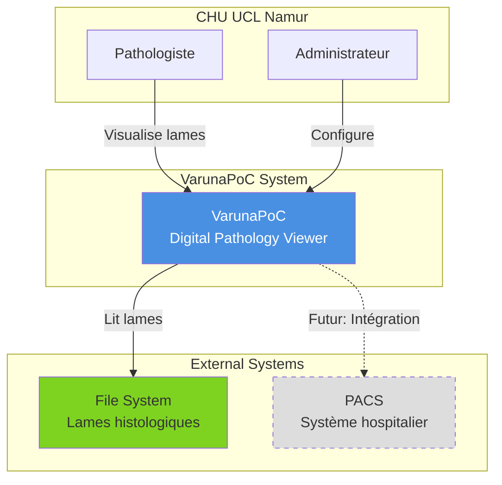
```mermaid
graph TB
    subgraph "CHU UCL Namur"
        User[Pathologiste]
        Admin[Administrateur]
    end

    subgraph "VarunaPoC System"
        VarunaPoC[VarunaPoC<br/>Digital Pathology Viewer]
    end

    subgraph "External Systems"
        FileSystem[File System<br/>Lames histologiques]
        PACS[PACS<br/>Système hospitalier]
    end

    User -->|Visualise lames| VarunaPoC
    Admin -->|Configure| VarunaPoC
    VarunaPoC -->|Lit lames| FileSystem
    VarunaPoC -.->|Futur: Intégration| PACS

    style VarunaPoC fill:#4A90E2,color:#fff
    style FileSystem fill:#7ED321
    style PACS fill:#ddd,stroke-dasharray: 5 5
```

### 1.2 Architecture C4 - Containers

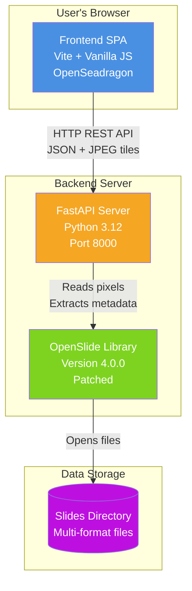
```mermaid
graph TB
    subgraph "User's Browser"
        Frontend[Frontend SPA<br/>Vite + Vanilla JS<br/>OpenSeadragon]
    end

    subgraph "Backend Server"
        API[FastAPI Server<br/>Python 3.12<br/>Port 8000]
        OpenSlide[OpenSlide Library<br/>Version 4.0.0<br/>Patched]
    end

    subgraph "Data Storage"
        Slides[(Slides Directory<br/>Multi-format files)]
    end

    Frontend -->|HTTP REST API<br/>JSON + JPEG tiles| API
    API -->|Reads pixels<br/>Extracts metadata| OpenSlide
    OpenSlide -->|Opens files| Slides

    style Frontend fill:#4A90E2,color:#fff
    style API fill:#F5A623,color:#fff
    style OpenSlide fill:#7ED321,color:#fff
    style Slides fill:#BD10E0,color:#fff
```

---

## 2. Architecture Actuelle (Phase 1)

### 2.1 Stack Technologique

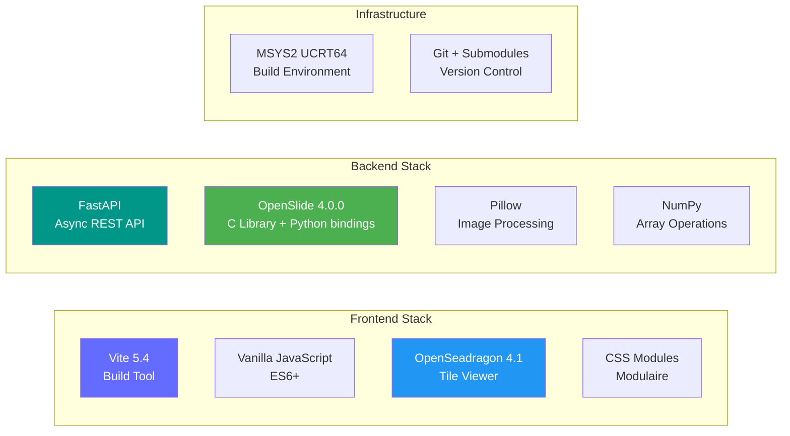
```mermaid
graph LR
    subgraph "Frontend Stack"
        Vite[Vite 5.4<br/>Build Tool]
        VanillaJS[Vanilla JavaScript<br/>ES6+]
        OSD[OpenSeadragon 4.1<br/>Tile Viewer]
        CSS[CSS Modules<br/>Modulaire]
    end

    subgraph "Backend Stack"
        FastAPI[FastAPI<br/>Async REST API]
        OpenSlideLib[OpenSlide 4.0.0<br/>C Library + Python bindings]
        Pillow[Pillow<br/>Image Processing]
        NumPy[NumPy<br/>Array Operations]
    end

    subgraph "Infrastructure"
        MSYS2[MSYS2 UCRT64<br/>Build Environment]
        Git[Git + Submodules<br/>Version Control]
    end

    style Vite fill:#646CFF,color:#fff
    style FastAPI fill:#009688,color:#fff
    style OSD fill:#2196F3,color:#fff
    style OpenSlideLib fill:#4CAF50,color:#fff
```

### 2.2 Architecture Modulaire Backend

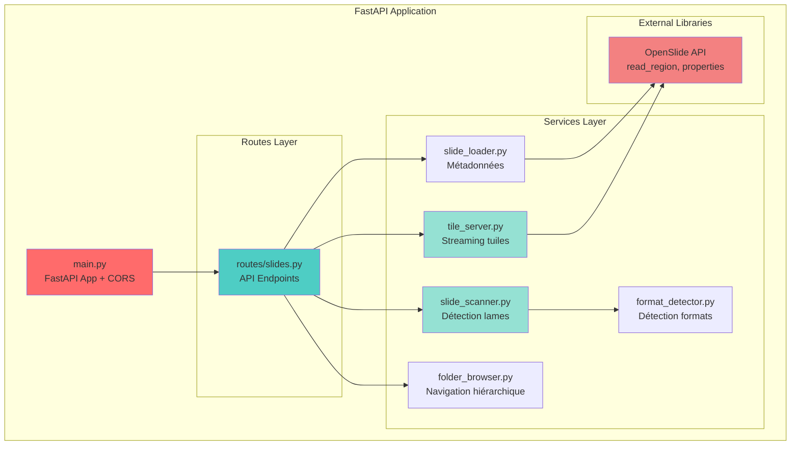
```mermaid
graph TB
    subgraph "FastAPI Application"
        Main[main.py<br/>FastAPI App + CORS]

        subgraph "Routes Layer"
            SlidesRoute[routes/slides.py<br/>API Endpoints]
        end

        subgraph "Services Layer"
            Scanner[slide_scanner.py<br/>Détection lames]
            Loader[slide_loader.py<br/>Métadonnées]
            TileServer[tile_server.py<br/>Streaming tuiles]
            Browser[folder_browser.py<br/>Navigation hiérarchique]
            Detector[format_detector.py<br/>Détection formats]
        end

        subgraph "External Libraries"
            OpenSlideAPI[OpenSlide API<br/>read_region, properties]
        end
    end

    Main --> SlidesRoute
    SlidesRoute --> Scanner
    SlidesRoute --> Loader
    SlidesRoute --> TileServer
    SlidesRoute --> Browser

    Scanner --> Detector
    Loader --> OpenSlideAPI
    TileServer --> OpenSlideAPI

    style Main fill:#FF6B6B
    style SlidesRoute fill:#4ECDC4
    style Scanner fill:#95E1D3
    style TileServer fill:#95E1D3
    style OpenSlideAPI fill:#F38181
```

### 2.3 Architecture Modulaire Frontend

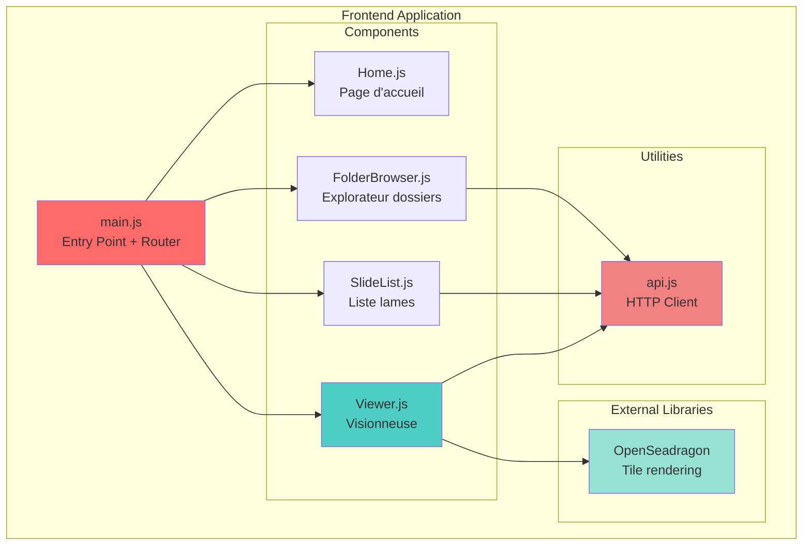
```mermaid
graph TB
    subgraph "Frontend Application"
        MainJS[main.js<br/>Entry Point + Router]

        subgraph "Components"
            Home[Home.js<br/>Page d'accueil]
            Browser[FolderBrowser.js<br/>Explorateur dossiers]
            SlideList[SlideList.js<br/>Liste lames]
            Viewer[Viewer.js<br/>Visionneuse]
        end

        subgraph "Utilities"
            API[api.js<br/>HTTP Client]
        end

        subgraph "External Libraries"
            OSD[OpenSeadragon<br/>Tile rendering]
        end
    end

    MainJS --> Home
    MainJS --> Browser
    MainJS --> SlideList
    MainJS --> Viewer

    Browser --> API
    SlideList --> API
    Viewer --> API
    Viewer --> OSD

    style MainJS fill:#FF6B6B
    style Viewer fill:#4ECDC4
    style OSD fill:#95E1D3
    style API fill:#F38181
```

---

## 3. Diagrammes de Classes

### 3.1 Backend - Services Core

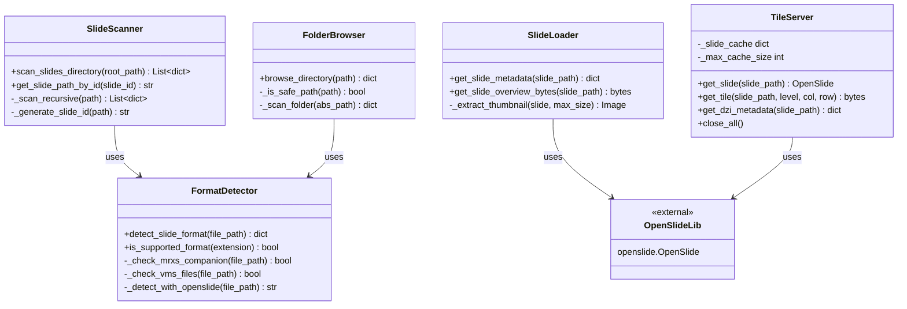
```mermaid
classDiagram
    class SlideScanner {
        +scan_slides_directory(root_path) List~dict~
        +get_slide_path_by_id(slide_id) str
        -_scan_recursive(path) List~dict~
        -_generate_slide_id(path) str
    }

    class FormatDetector {
        +detect_slide_format(file_path) dict
        +is_supported_format(extension) bool
        -_check_mrxs_companion(file_path) bool
        -_check_vms_files(file_path) bool
        -_detect_with_openslide(file_path) str
    }

    class SlideLoader {
        +get_slide_metadata(slide_path) dict
        +get_slide_overview_bytes(slide_path) bytes
        -_extract_thumbnail(slide, max_size) Image
    }

    class TileServer {
        -_slide_cache dict
        -_max_cache_size int
        +get_slide(slide_path) OpenSlide
        +get_tile(slide_path, level, col, row) bytes
        +get_dzi_metadata(slide_path) dict
        +close_all()
    }

    class FolderBrowser {
        +browse_directory(path) dict
        -_is_safe_path(path) bool
        -_scan_folder(abs_path) dict
    }

    SlideScanner --> FormatDetector : uses
    SlideLoader --> OpenSlideLib : uses
    TileServer --> OpenSlideLib : uses
    FolderBrowser --> FormatDetector : uses

    class OpenSlideLib {
        <<external>>
        openslide.OpenSlide
    }

    %% Note: TileServer cache des slides ouverts (max 5, LRU eviction)
```

### 3.2 Frontend - Components

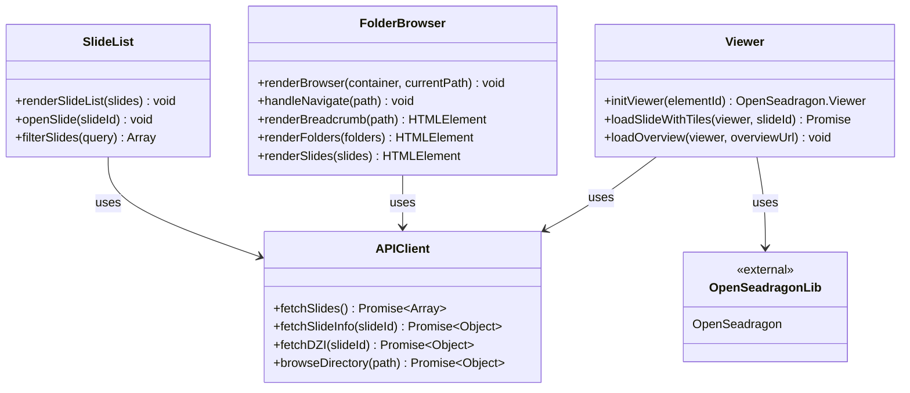
```mermaid
classDiagram
    class Viewer {
        +initViewer(elementId) OpenSeadragon.Viewer
        +loadSlideWithTiles(viewer, slideId) Promise
        +loadOverview(viewer, overviewUrl) void
    }

    class FolderBrowser {
        +renderBrowser(container, currentPath) void
        +handleNavigate(path) void
        +renderBreadcrumb(path) HTMLElement
        +renderFolders(folders) HTMLElement
        +renderSlides(slides) HTMLElement
    }

    class SlideList {
        +renderSlideList(slides) void
        +openSlide(slideId) void
        +filterSlides(query) Array
    }

    class APIClient {
        +fetchSlides() Promise~Array~
        +fetchSlideInfo(slideId) Promise~Object~
        +fetchDZI(slideId) Promise~Object~
        +browseDirectory(path) Promise~Object~
    }

    Viewer --> APIClient : uses
    FolderBrowser --> APIClient : uses
    SlideList --> APIClient : uses
    Viewer --> OpenSeadragonLib : uses

    class OpenSeadragonLib {
        <<external>>
        OpenSeadragon
    }

    %% Note: Viewer gère tile streaming, mapping coordonnées, mini-map navigation
```

---

## 4. Flux de Données

### 4.1 Séquence: Ouverture d'une Lame

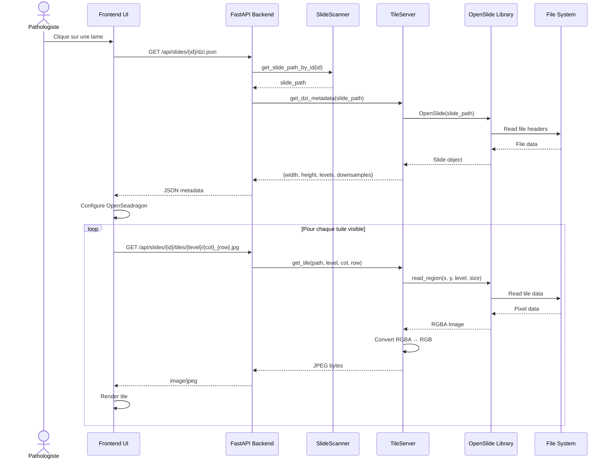
```mermaid
sequenceDiagram
    actor User as Pathologiste
    participant UI as Frontend UI
    participant API as FastAPI Backend
    participant Scanner as SlideScanner
    participant TileServer as TileServer
    participant OpenSlide as OpenSlide Library
    participant FS as File System

    User->>UI: Clique sur une lame
    UI->>API: GET /api/slides/{id}/dzi.json
    API->>Scanner: get_slide_path_by_id(id)
    Scanner-->>API: slide_path
    API->>TileServer: get_dzi_metadata(slide_path)
    TileServer->>OpenSlide: OpenSlide(slide_path)
    OpenSlide->>FS: Read file headers
    FS-->>OpenSlide: File data
    OpenSlide-->>TileServer: Slide object
    TileServer-->>API: {width, height, levels, downsamples}
    API-->>UI: JSON metadata

    UI->>UI: Configure OpenSeadragon

    loop Pour chaque tuile visible
        UI->>API: GET /api/slides/{id}/tiles/{level}/{col}_{row}.jpg
        API->>TileServer: get_tile(path, level, col, row)
        TileServer->>OpenSlide: read_region(x, y, level, size)
        OpenSlide->>FS: Read tile data
        FS-->>OpenSlide: Pixel data
        OpenSlide-->>TileServer: RGBA Image
        TileServer->>TileServer: Convert RGBA → RGB
        TileServer-->>API: JPEG bytes
        API-->>UI: image/jpeg
        UI->>UI: Render tile
    end
```

### 4.2 Flux: Navigation Hiérarchique

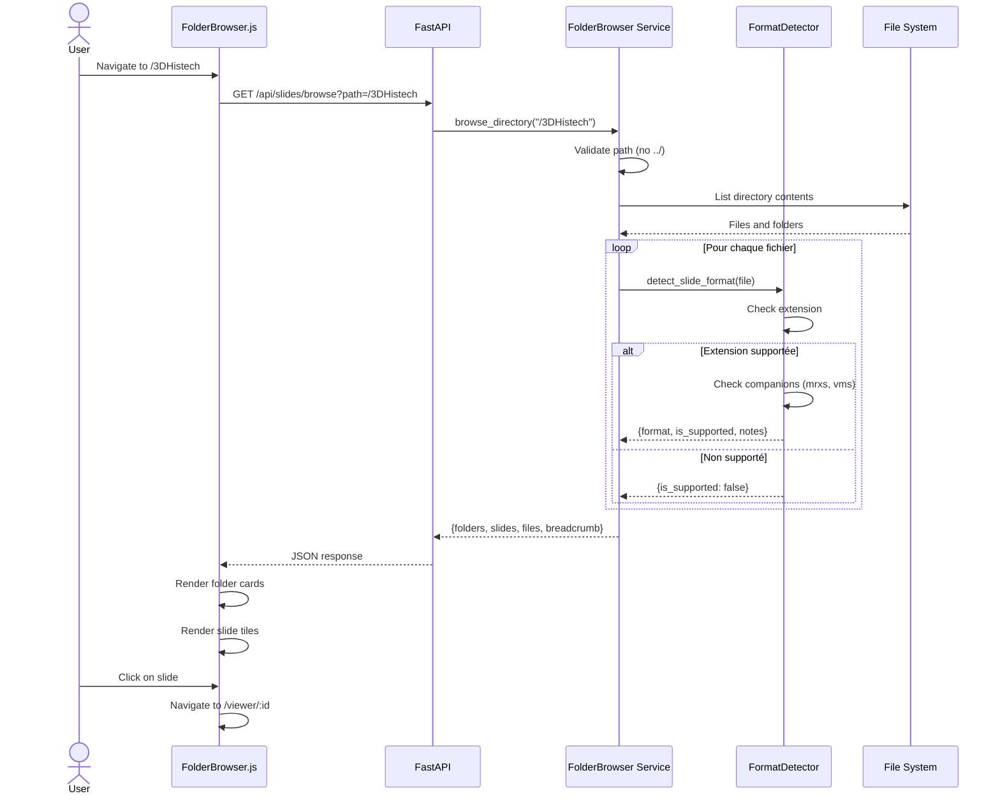
```mermaid
sequenceDiagram
    actor User
    participant UI as FolderBrowser.js
    participant API as FastAPI
    participant Browser as FolderBrowser Service
    participant Detector as FormatDetector
    participant FS as File System

    User->>UI: Navigate to /3DHistech
    UI->>API: GET /api/slides/browse?path=/3DHistech
    API->>Browser: browse_directory("/3DHistech")
    Browser->>Browser: Validate path (no ../)
    Browser->>FS: List directory contents
    FS-->>Browser: Files and folders

    loop Pour chaque fichier
        Browser->>Detector: detect_slide_format(file)
        Detector->>Detector: Check extension
        alt Extension supportée
            Detector->>Detector: Check companions (mrxs, vms)
            Detector-->>Browser: {format, is_supported, notes}
        else Non supporté
            Detector-->>Browser: {is_supported: false}
        end
    end

    Browser-->>API: {folders, slides, files, breadcrumb}
    API-->>UI: JSON response
    UI->>UI: Render folder cards
    UI->>UI: Render slide tiles
    User->>UI: Click on slide
    UI->>UI: Navigate to /viewer/:id
```

---

## 5. Capacités OpenSlide

### 5.1 Données Extraites d'une Lame

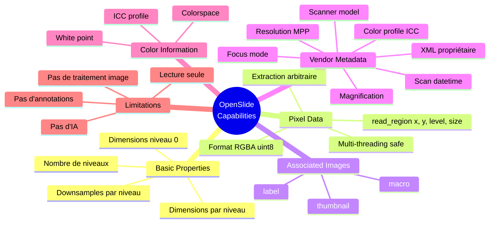
```mermaid
mindmap
    root((OpenSlide<br/>Capabilities))
        Basic Properties
            Dimensions niveau 0
            Nombre de niveaux
            Dimensions par niveau
            Downsamples par niveau
        Pixel Data
            read_region x, y, level, size
            Format RGBA uint8
            Extraction arbitraire
            Multi-threading safe
        Associated Images
            thumbnail
            macro
            label
        Vendor Metadata
            Scanner model
            Scan datetime
            Magnification
            Resolution MPP
            Focus mode
            Color profile ICC
            XML propriétaire
        Color Information
            ICC profile
            Colorspace
            White point
        Limitations
            Pas de traitement image
            Pas d'annotations
            Pas d'IA
            Lecture seule
```

### 5.2 Propriétés Disponibles par Format

| Propriété | Aperio SVS | 3DHistech MRXS | Ventana BIF | Hamamatsu NDPI | Leica SCN |
|-----------|------------|----------------|-------------|----------------|-----------|
| **openslide.mpp-x** | ✅ | ✅ | ✅ | ✅ | ✅ |
| **openslide.mpp-y** | ✅ | ✅ | ✅ | ✅ | ✅ |
| **openslide.objective-power** | ✅ | ✅ | ✅ | ✅ | ✅ |
| **tiff.DateTime** | ✅ | ✅ | ✅ | ✅ | ✅ |
| **Scanner model** | ✅ | ✅ | ✅ | ✅ | ✅ |
| **Associated: macro** | ✅ | ✅ | ✅ | ✅ | ✅ |
| **Associated: label** | ✅ | ✅ | ❌ | ✅ | ✅ |
| **Associated: thumbnail** | ✅ | ❌ | ❌ | ✅ | ❌ |
| **ICC Color Profile** | ✅ | ✅ | ✅ | ✅ | ✅ |
| **XML Metadata** | ✅ | ✅ | ✅ | ❌ | ✅ |

**Note:** Les propriétés vendor-specific varient selon le fabricant (61 propriétés pour Ventana, 40+ pour 3DHistech, etc.)

---

## 6. Capacités OpenSeadragon

### 6.1 Fonctionnalités Utilisées

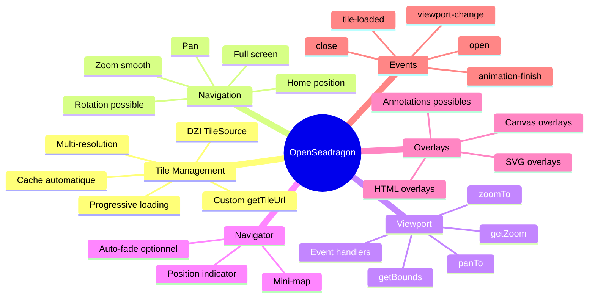
```mermaid
mindmap
    root((OpenSeadragon))
        Tile Management
            DZI TileSource
            Custom getTileUrl
            Progressive loading
            Multi-resolution
            Cache automatique
        Navigation
            Pan
            Zoom smooth
            Home position
            Full screen
            Rotation possible
        Viewport
            getBounds
            getZoom
            panTo
            zoomTo
            Event handlers
        Navigator
            Mini-map
            Position indicator
            Auto-fade optionnel
        Overlays
            HTML overlays
            Canvas overlays
            SVG overlays
            Annotations possibles
        Events
            viewport-change
            tile-loaded
            open
            close
            animation-finish
```

### 6.2 Fonctionnalités Non Utilisées (Opportunités)

| Fonctionnalité | Description | Use Case VarunaPoC |
|----------------|-------------|-------------------|
| **Overlays** | Superposition HTML/SVG/Canvas | ✨ **Annotations** (cercles, polygones, texte) |
| **Comparison Mode** | Affichage côte-à-côte | ✨ **Comparaison multi-lames** |
| **Custom Buttons** | Boutons personnalisés | ✨ **Filtres, mesures, export** |
| **Rotation** | Rotation de l'image | Orientation lames |
| **Sequence Mode** | Navigation entre images | ✨ **Z-stack, séries temporelles** |
| **Reference Strip** | Bande d'images miniatures | ✨ **Aperçu multi-lames** |
| **Mouse Tracker** | Position souris en pixels réels | ✨ **Mesures, coordonnées** |
| **Canvas Draw** | Dessin sur canvas overlay | ✨ **Annotations temps réel** |

---

## 7. Architecture Cible (Phases Futures)

### 7.1 Architecture Modulaire Étendue

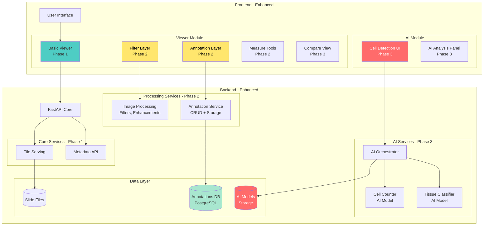
```mermaid
graph TB
    subgraph "Frontend - Enhanced"
        UI[User Interface]

        subgraph "Viewer Module"
            BasicViewer[Basic Viewer<br/>Phase 1]
            AnnotationLayer[Annotation Layer<br/>Phase 2]
            FilterLayer[Filter Layer<br/>Phase 2]
            MeasureTools[Measure Tools<br/>Phase 2]
            CompareView[Compare View<br/>Phase 3]
        end

        subgraph "AI Module"
            CellDetection[Cell Detection UI<br/>Phase 3]
            AIAnalysis[AI Analysis Panel<br/>Phase 3]
        end
    end

    subgraph "Backend - Enhanced"
        FastAPICore[FastAPI Core]

        subgraph "Core Services - Phase 1"
            TileServing[Tile Serving]
            MetadataAPI[Metadata API]
        end

        subgraph "Processing Services - Phase 2"
            ImageProcessing[Image Processing<br/>Filters, Enhancements]
            AnnotationService[Annotation Service<br/>CRUD + Storage]
        end

        subgraph "AI Services - Phase 3"
            CellCounter[Cell Counter<br/>AI Model]
            TissueClassifier[Tissue Classifier<br/>AI Model]
            AIOrchestrator[AI Orchestrator]
        end

        subgraph "Data Layer"
            SlideStorage[(Slide Files)]
            AnnotationDB[(Annotations DB<br/>PostgreSQL)]
            AIModels[(AI Models<br/>Storage)]
        end
    end

    UI --> BasicViewer
    BasicViewer --> FastAPICore
    AnnotationLayer --> AnnotationService
    FilterLayer --> ImageProcessing
    CellDetection --> AIOrchestrator

    FastAPICore --> TileServing
    FastAPICore --> MetadataAPI
    TileServing --> SlideStorage
    AnnotationService --> AnnotationDB
    AIOrchestrator --> CellCounter
    AIOrchestrator --> TissueClassifier
    AIOrchestrator --> AIModels

    style BasicViewer fill:#4ECDC4
    style AnnotationLayer fill:#FFE66D,color:#000
    style FilterLayer fill:#FFE66D,color:#000
    style CellDetection fill:#FF6B6B,color:#fff
    style AnnotationDB fill:#A8E6CF
    style AIModels fill:#FF6B6B,color:#fff
```

### 7.2 Modèle de Données - Annotations

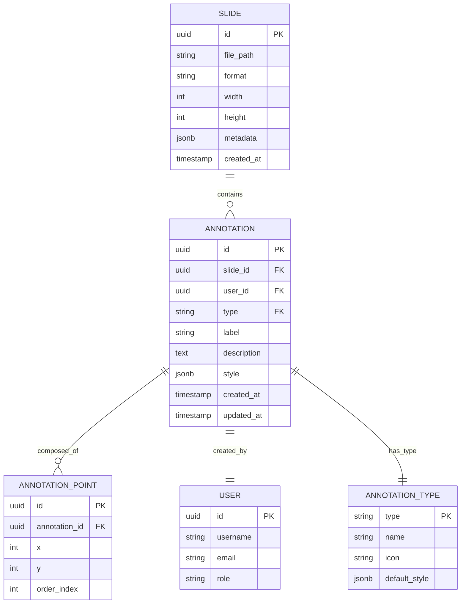
```mermaid
erDiagram
    SLIDE ||--o{ ANNOTATION : contains
    ANNOTATION ||--o{ ANNOTATION_POINT : composed_of
    ANNOTATION ||--|| USER : created_by
    ANNOTATION ||--|| ANNOTATION_TYPE : has_type

    SLIDE {
        uuid id PK
        string file_path
        string format
        int width
        int height
        jsonb metadata
        timestamp created_at
    }

    ANNOTATION {
        uuid id PK
        uuid slide_id FK
        uuid user_id FK
        string type FK
        string label
        text description
        jsonb style
        timestamp created_at
        timestamp updated_at
    }

    ANNOTATION_POINT {
        uuid id PK
        uuid annotation_id FK
        int x
        int y
        int order_index
    }

    ANNOTATION_TYPE {
        string type PK
        string name
        string icon
        jsonb default_style
    }

    USER {
        uuid id PK
        string username
        string email
        string role
    }
```

### 7.3 Modèle de Données - AI Analysis

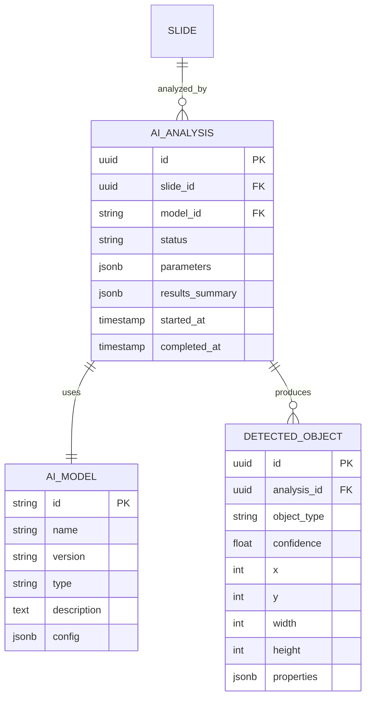
```mermaid
erDiagram
    SLIDE ||--o{ AI_ANALYSIS : analyzed_by
    AI_ANALYSIS ||--|| AI_MODEL : uses
    AI_ANALYSIS ||--o{ DETECTED_OBJECT : produces

    AI_ANALYSIS {
        uuid id PK
        uuid slide_id FK
        string model_id FK
        string status
        jsonb parameters
        jsonb results_summary
        timestamp started_at
        timestamp completed_at
    }

    AI_MODEL {
        string id PK
        string name
        string version
        string type
        text description
        jsonb config
    }

    DETECTED_OBJECT {
        uuid id PK
        uuid analysis_id FK
        string object_type
        float confidence
        int x
        int y
        int width
        int height
        jsonb properties
    }
```

---

## 8. Étude de Faisabilité

### 8.1 Fonctionnalité: Annotations

**Objectif:** Permettre au pathologiste d'annoter les lames (cercles, polygones, texte, flèches)

#### Composants Requis

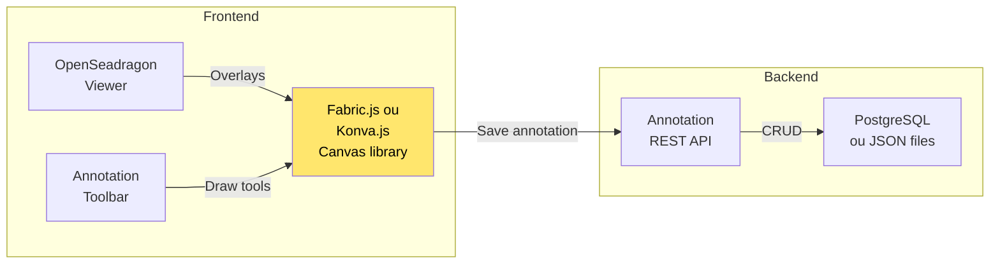
```mermaid
graph LR
    subgraph "Frontend"
        OSD[OpenSeadragon<br/>Viewer]
        Fabric[Fabric.js ou<br/>Konva.js<br/>Canvas library]
        AnnotationUI[Annotation<br/>Toolbar]
    end

    subgraph "Backend"
        AnnotationAPI[Annotation<br/>REST API]
        Storage[PostgreSQL<br/>ou JSON files]
    end

    OSD -->|Overlays| Fabric
    AnnotationUI -->|Draw tools| Fabric
    Fabric -->|Save annotation| AnnotationAPI
    AnnotationAPI -->|CRUD| Storage

    style Fabric fill:#FFE66D,color:#000
```

#### Bibliothèques Candidates

| Bibliothèque | Pros | Cons | Complexité |
|--------------|------|------|-----------|
| **Fabric.js** | Canvas 2D, formes, texte | Pas de WebGL | Faible |
| **Konva.js** | Performant, events | Plus lourd | Moyenne |
| **Paper.js** | Vector graphics, beautiful | Courbe apprentissage | Moyenne |
| **OpenSeadragon Overlays** | Intégré, coord mapping | Custom drawing requis | Faible |

**Recommandation:** OpenSeadragon Overlays + SVG pour MVP, puis Fabric.js si besoins avancés

#### Format de Stockage

```json
{
  "id": "uuid",
  "slide_id": "uuid",
  "type": "circle | polygon | arrow | text | rectangle",
  "coordinates": [
    {"x": 1000, "y": 2000},
    {"x": 1500, "y": 2500}
  ],
  "style": {
    "stroke": "#FF0000",
    "strokeWidth": 2,
    "fill": "rgba(255,0,0,0.2)"
  },
  "label": "Cellules cancéreuses",
  "description": "Zone suspecte à vérifier",
  "created_by": "user_id",
  "created_at": "2025-10-28T10:00:00Z"
}
```

**Faisabilité:** ✅ **ÉLEVÉE** - Techniquement simple, OpenSeadragon supporte les overlays nativement

---

### 8.2 Fonctionnalité: Filtres d'Image

**Objectif:** Appliquer des filtres (contraste, luminosité, saturation, filtres histologiques)

#### Architecture

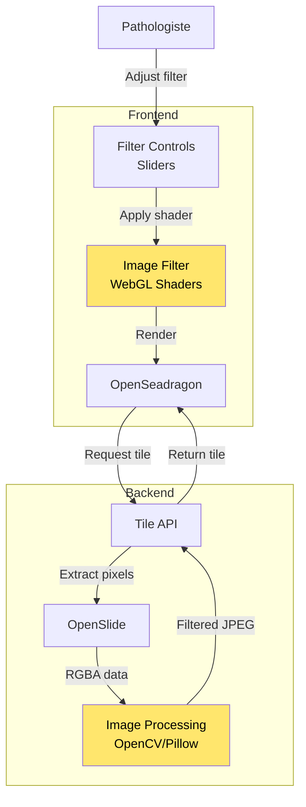
```mermaid
graph TB
    User[Pathologiste]

    subgraph "Frontend"
        FilterUI[Filter Controls<br/>Sliders]
        OSD[OpenSeadragon]
        FilterEngine[Image Filter<br/>WebGL Shaders]
    end

    subgraph "Backend"
        TileAPI[Tile API]
        OpenSlide[OpenSlide]
        ImageProc[Image Processing<br/>OpenCV/Pillow]
    end

    User -->|Adjust filter| FilterUI
    FilterUI -->|Apply shader| FilterEngine
    FilterEngine -->|Render| OSD

    OSD -->|Request tile| TileAPI
    TileAPI -->|Extract pixels| OpenSlide
    OpenSlide -->|RGBA data| ImageProc
    ImageProc -->|Filtered JPEG| TileAPI
    TileAPI -->|Return tile| OSD

    style FilterEngine fill:#FFE66D,color:#000
    style ImageProc fill:#FFE66D,color:#000
```

#### Bibliothèques Candidates

| Bibliothèque | Utilisation | Complexité |
|--------------|-------------|-----------|
| **WebGL Shaders** | Filtres temps réel (client-side) | Moyenne |
| **OpenCV (cv2)** | Filtres avancés (server-side) | Faible |
| **Pillow (PIL)** | Filtres basiques (server-side) | Très Faible |
| **NumPy** | Opérations matricielles | Faible |

#### Filtres Proposés

**Basiques:**
- Luminosité / Contraste
- Saturation
- Teinte (Hue)
- Gamma correction

**Histologiques:**
- Détection hématoxyline (bleu)
- Détection éosine (rose)
- Séparation couleurs (color deconvolution)
- Normalisation de couleur (Reinhard, Macenko)

**Avancés:**
- Edge detection (Canny, Sobel)
- Sharpening
- Noise reduction
- Morphological operations

**Faisabilité:** ✅ **ÉLEVÉE** - WebGL pour filtres simples temps réel, OpenCV pour filtres avancés server-side

---

### 8.3 Fonctionnalité: Comparaison Multi-Lames

**Objectif:** Afficher 2-4 lames côte-à-côte avec synchronisation zoom/pan

#### Architecture

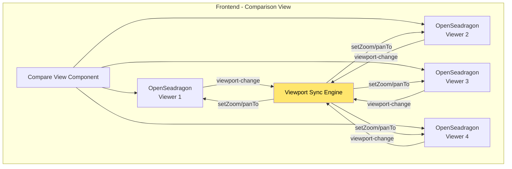
```mermaid
graph TB
    subgraph "Frontend - Comparison View"
        CompareView[Compare View Component]

        Viewer1[OpenSeadragon<br/>Viewer 1]
        Viewer2[OpenSeadragon<br/>Viewer 2]
        Viewer3[OpenSeadragon<br/>Viewer 3]
        Viewer4[OpenSeadragon<br/>Viewer 4]

        SyncEngine[Viewport Sync Engine]
    end

    CompareView --> Viewer1
    CompareView --> Viewer2
    CompareView --> Viewer3
    CompareView --> Viewer4

    Viewer1 -->|viewport-change| SyncEngine
    Viewer2 -->|viewport-change| SyncEngine
    Viewer3 -->|viewport-change| SyncEngine
    Viewer4 -->|viewport-change| SyncEngine

    SyncEngine -->|setZoom/panTo| Viewer1
    SyncEngine -->|setZoom/panTo| Viewer2
    SyncEngine -->|setZoom/panTo| Viewer3
    SyncEngine -->|setZoom/panTo| Viewer4

    style SyncEngine fill:#FFE66D,color:#000
```

#### Modes de Comparaison

1. **Side-by-side** (2 lames horizontales)
2. **Grid 2x2** (4 lames)
3. **Overlay blend** (superposition avec transparence)
4. **Swipe** (glisser entre 2 lames)

#### Synchronisation

```javascript
// Pseudo-code conceptuel
class ViewportSyncEngine {
    viewers = []

    onViewportChange(sourceViewer) {
        const zoom = sourceViewer.viewport.getZoom()
        const center = sourceViewer.viewport.getCenter()

        this.viewers.forEach(viewer => {
            if (viewer !== sourceViewer) {
                viewer.viewport.zoomTo(zoom, center, true)
            }
        })
    }
}
```

**Faisabilité:** ✅ **ÉLEVÉE** - OpenSeadragon supporte nativement, exemples disponibles

---

### 8.4 Fonctionnalité: Comptage de Cellules (IA)

**Objectif:** Détecter et compter automatiquement des cellules (noyaux, mitoses, etc.)

#### Architecture

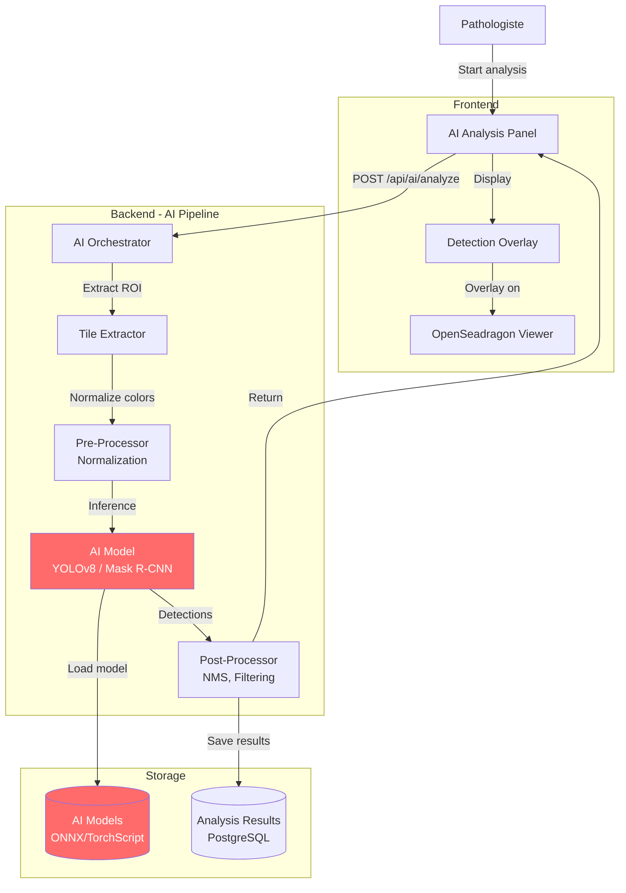
```mermaid
graph TB
    User[Pathologiste]

    subgraph "Frontend"
        AIPanel[AI Analysis Panel]
        Viewer[OpenSeadragon Viewer]
        ResultOverlay[Detection Overlay]
    end

    subgraph "Backend - AI Pipeline"
        AIOrchestrator[AI Orchestrator]
        TileExtractor[Tile Extractor]
        PreProcessor[Pre-Processor<br/>Normalization]
        AIModel[AI Model<br/>YOLOv8 / Mask R-CNN]
        PostProcessor[Post-Processor<br/>NMS, Filtering]
    end

    subgraph "Storage"
        ModelStore[(AI Models<br/>ONNX/TorchScript)]
        ResultsDB[(Analysis Results<br/>PostgreSQL)]
    end

    User -->|Start analysis| AIPanel
    AIPanel -->|POST /api/ai/analyze| AIOrchestrator
    AIOrchestrator -->|Extract ROI| TileExtractor
    TileExtractor -->|Normalize colors| PreProcessor
    PreProcessor -->|Inference| AIModel
    AIModel -->|Load model| ModelStore
    AIModel -->|Detections| PostProcessor
    PostProcessor -->|Save results| ResultsDB
    PostProcessor -->|Return| AIPanel
    AIPanel -->|Display| ResultOverlay
    ResultOverlay -->|Overlay on| Viewer

    style AIModel fill:#FF6B6B,color:#fff
    style ModelStore fill:#FF6B6B,color:#fff
```

#### Bibliothèques Candidates

| Bibliothèque | Type | Pros | Cons |
|--------------|------|------|------|
| **YOLOv8** (Ultralytics) | Object Detection | Rapide, précis, facile | Bounding boxes seulement |
| **Mask R-CNN** (Detectron2) | Instance Segmentation | Masques précis | Plus lent |
| **StarDist** | Nucleus Detection | Spécialisé noyaux | Limité à un use case |
| **CellPose** | Cell Segmentation | Généraliste, précis | Nécessite GPU |
| **QuPath** | Pathology Platform | Tout intégré | Lourd, complexe |

#### Pipeline de Traitement

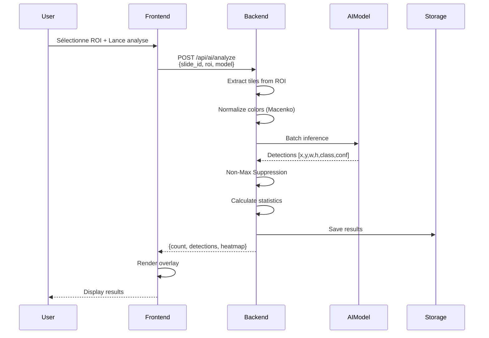
```mermaid
sequenceDiagram
    participant User
    participant Frontend
    participant Backend
    participant AIModel
    participant Storage

    User->>Frontend: Sélectionne ROI + Lance analyse
    Frontend->>Backend: POST /api/ai/analyze<br/>{slide_id, roi, model}
    Backend->>Backend: Extract tiles from ROI
    Backend->>Backend: Normalize colors (Macenko)
    Backend->>AIModel: Batch inference
    AIModel-->>Backend: Detections [x,y,w,h,class,conf]
    Backend->>Backend: Non-Max Suppression
    Backend->>Backend: Calculate statistics
    Backend->>Storage: Save results
    Backend-->>Frontend: {count, detections, heatmap}
    Frontend->>Frontend: Render overlay
    Frontend-->>User: Display results
```

#### Exemples de Modèles

1. **Nucleus Counter** - YOLOv8 custom trained
   - Input: 512x512 tiles
   - Output: Bounding boxes + class (normal, atypical, mitotic)
   - Training: TCGA dataset

2. **Mitosis Detector** - Mask R-CNN
   - Input: High-res patches (1024x1024)
   - Output: Instance masks
   - Training: ICPR MITOS dataset

3. **Tissue Classifier** - ResNet50
   - Input: Thumbnail
   - Output: Tissue type (normal, tumor, necrosis, stroma)

**Faisabilité:** ⚠️ **MOYENNE-ÉLEVÉE**
- **Facile:** Intégrer modèle pré-entraîné existant
- **Difficile:** Entraîner modèle custom sur données CHU
- **Critique:** Nécessite GPU (CUDA) pour performance acceptable
- **Réglementaire:** Validation médicale requise pour usage clinique

---

### 8.5 Fonctionnalité: Mesures et Distances

**Objectif:** Mesurer distances, surfaces, angles sur les lames

#### Architecture

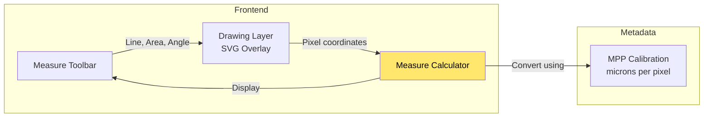
```mermaid
graph LR
    subgraph "Frontend"
        MeasureTool[Measure Toolbar]
        DrawLayer[Drawing Layer<br/>SVG Overlay]
        Calculator[Measure Calculator]
    end

    subgraph "Metadata"
        MPP[MPP Calibration<br/>microns per pixel]
    end

    MeasureTool -->|Line, Area, Angle| DrawLayer
    DrawLayer -->|Pixel coordinates| Calculator
    Calculator -->|Convert using| MPP
    Calculator -->|Display| MeasureTool

    style Calculator fill:#FFE66D,color:#000
```

#### Types de Mesures

| Mesure | Formule | Unités |
|--------|---------|--------|
| **Distance** | `sqrt((x2-x1)² + (y2-y1)²) * mpp` | µm |
| **Surface** | Polygon area * mpp² | µm² |
| **Périmètre** | Sum of edge lengths * mpp | µm |
| **Angle** | `atan2(dy, dx) * 180/π` | degrés |
| **Diamètre** | `2 * radius * mpp` | µm |

#### Calibration MPP

OpenSlide fournit `openslide.mpp-x` et `openslide.mpp-y` :
- **MPP (Microns Per Pixel)** = résolution physique
- Exemple Ventana: 0.25 µm/pixel à 40x
- Conversion: pixels → µm → mm

**Faisabilité:** ✅ **TRÈS ÉLEVÉE** - Calculs simples, OpenSlide fournit MPP

---

### 8.6 Matrice de Faisabilité Globale

| Fonctionnalité | Complexité Tech | Temps Dev | Dépendances | Risques | Faisabilité |
|----------------|-----------------|-----------|-------------|---------|-------------|
| **Annotations** | Faible | 2-3 semaines | Fabric.js, DB | Faibles | ✅ **95%** |
| **Filtres basiques** | Faible | 1-2 semaines | WebGL | Très faibles | ✅ **98%** |
| **Filtres avancés** | Moyenne | 3-4 semaines | OpenCV | Moyens | ✅ **85%** |
| **Comparaison 2-4 lames** | Moyenne | 2-3 semaines | - | Faibles | ✅ **90%** |
| **Mesures distances** | Faible | 1 semaine | - | Très faibles | ✅ **99%** |
| **Export images** | Faible | 1 semaine | Pillow | Très faibles | ✅ **95%** |
| **IA: Comptage cellules** | Élevée | 6-8 semaines | YOLOv8, GPU | Élevés | ⚠️ **70%** |
| **IA: Classification tissus** | Élevée | 8-10 semaines | CNN, GPU, data | Très élevés | ⚠️ **60%** |
| **Intégration PACS** | Élevée | 4-6 semaines | DICOM lib | Moyens | ⚠️ **75%** |

---

### 8.7 Roadmap Recommandée

```mermaid
gantt
    title VarunaPoC - Roadmap Fonctionnalités
    dateFormat YYYY-MM-DD

    section Phase 1 ✅
    Viewer de base               :done, p1, 2025-09-01, 2025-10-28
    Navigation hiérarchique      :done, p1b, 2025-10-15, 2025-10-28
    Support multi-formats        :done, p1c, 2025-10-20, 2025-10-28

    section Phase 2 (Q1 2026)
    Annotations basiques         :p2a, 2026-01-01, 3w
    Mesures distances/surfaces   :p2b, after p2a, 2w
    Export images/annotations    :p2c, after p2b, 2w
    Filtres basiques WebGL       :p2d, after p2c, 2w

    section Phase 3 (Q2 2026)
    Comparaison multi-lames      :p3a, 2026-04-01, 3w
    Filtres avancés OpenCV       :p3b, after p3a, 4w
    Annotations avancées         :p3c, after p3b, 3w
    Gestion utilisateurs         :p3d, after p3c, 2w

    section Phase 4 (Q3-Q4 2026)
    IA: Comptage cellules MVP    :p4a, 2026-07-01, 8w
    IA: Intégration modèles      :p4b, after p4a, 4w
    Validation clinique          :p4c, after p4b, 8w

    section Phase 5 (2027)
    Intégration PACS             :p5a, 2027-01-01, 6w
    Workflow pathologiste        :p5b, after p5a, 4w
    Déploiement production       :p5c, after p5b, 4w
```

---

## 9. Recommandations Architecturales

### 9.1 Principes de Conception

1. **Modularité** - Chaque fonctionnalité = module indépendant
2. **Extensibilité** - API plugin pour ajouter fonctionnalités
3. **Performance** - WebGL côté client, cache intelligent
4. **Scalabilité** - Architecture stateless, multi-instances
5. **Sécurité** - Authentification, RBAC, audit logs

### 9.2 Patterns Recommandés

```mermaid
graph TB
    subgraph "Architecture Patterns"
        direction TB

        subgraph "Frontend Patterns"
            ComponentBased[Component-Based<br/>Vanilla JS Modules]
            EventDriven[Event-Driven<br/>Custom Events]
            StateMgmt[State Management<br/>Simple Store]
        end

        subgraph "Backend Patterns"
            ServiceLayer[Service Layer<br/>Business Logic]
            Repository[Repository Pattern<br/>Data Access]
            Factory[Factory Pattern<br/>Format Detection]
        end

        subgraph "Integration Patterns"
            RestAPI[REST API<br/>JSON over HTTP]
            EventBus[Event Bus<br/>WebSocket future]
            Plugin[Plugin Architecture<br/>AI Models]
        end
    end

    style ComponentBased fill:#4ECDC4
    style ServiceLayer fill:#4ECDC4
    style Plugin fill:#FFE66D,color:#000
```

### 9.3 Technologies Complémentaires

| Technologie | Usage | Priorité |
|-------------|-------|----------|
| **PostgreSQL** | Annotations, users, analyses | Phase 2 |
| **Redis** | Cache tiles, sessions | Phase 3 |
| **Fabric.js** | Annotations canvas | Phase 2 |
| **OpenCV (cv2)** | Image processing | Phase 3 |
| **PyTorch / ONNX** | AI models | Phase 4 |
| **WebSocket** | Real-time collaboration | Phase 5 |
| **Docker** | Deployment | Phase 2 |
| **Kubernetes** | Orchestration | Phase 5 |

---

## 10. Conclusion

### État Actuel (Phase 1) ✅

**Forces:**
- Architecture modulaire claire
- Séparation frontend/backend propre
- Support multi-formats robuste
- Performance tile streaming excellente
- Fork OpenSlide maintenable

**Base Solide pour Évolution:**
- ✅ Modules backend bien séparés (services/)
- ✅ Frontend composant-based
- ✅ API REST extensible
- ✅ Coordination OpenSeadragon ↔ OpenSlide maîtrisée

### Prochaines Étapes Recommandées

1. **Court terme (Phase 2)** - Annotations + Mesures
   - Impact utilisateur immédiat
   - Complexité faible
   - Pas de nouvelles dépendances majeures

2. **Moyen terme (Phase 3)** - Comparaison + Filtres
   - Valeur ajoutée importante
   - Utilise capacités OpenSeadragon existantes
   - Complexité maîtrisable

3. **Long terme (Phase 4)** - IA
   - Différenciateur majeur
   - Requiert validation médicale
   - Infrastructure GPU nécessaire

**Architecture Actuelle = Excellente Base pour Toutes Ces Évolutions**

---

**Auteur:** Équipe VarunaPoC
**Version:** 1.0
**Date:** 2025-10-28
