# Carte de l'Écosystème VarunaPoC - Vue Exhaustive

**Version:** 1.0
**Date:** 2025-10-28
**Objectif:** Cartographier TOUS les objets, classes et fonctions (internes + externes) utilisés pour atteindre nos objectifs

---

## Table des Matières

1. [Inventaire Complet des Éléments](#1-inventaire-complet-des-éléments)
2. [Backend: Classes et Objets Python](#2-backend-classes-et-objets-python)
3. [Frontend: Classes et Objets JavaScript](#3-frontend-classes-et-objets-javascript)
4. [Diagramme de Classes Exhaustif](#4-diagramme-de-classes-exhaustif)
5. [Carte de l'Écosystème Global](#5-carte-de-lécosystème-global)
6. [Flux de Données Détaillés](#6-flux-de-données-détaillés)
7. [Interactions entre Composants](#7-interactions-entre-composants)

---

## 1. Inventaire Complet des Éléments

### 1.1 Vue d'Ensemble Quantitative

| Catégorie | Nombre | Description |
|-----------|--------|-------------|
| **Backend Python** |  |  |
| Classes personnalisées | 3 | `FormatDetector`, `TileServer`, `SlideFormat` (dataclass) |
| Fonctions personnalisées | 24 | Services, routes, utilitaires |
| Modules Python (internes) | 6 | main.py, config_openslide.py, routes/*, services/* |
| **Frontend JavaScript** |  |  |
| Fonctions composants | 7 | createFolderBrowser, createHomePage, initViewer, etc. |
| Fonctions API | 4 | fetchSlides, getSlideInfo, fetchBrowse, getOverviewUrl |
| Fonctions utilitaires | 6 | is_safe_path, generate_slide_id, etc. |
| **Dépendances Externes** |  |  |
| Bibliothèques Python | 5 | OpenSlide, FastAPI, Pillow, pathlib, hashlib |
| Bibliothèques JavaScript | 1 | OpenSeadragon |
| **Total Éléments Utilisés** | 56+ | Classes, fonctions, objets natifs inclus |

---

## 2. Backend: Classes et Objets Python

### 2.1 Classes Personnalisées (Nos Créations)

#### **FormatDetector** (services/format_detector.py)

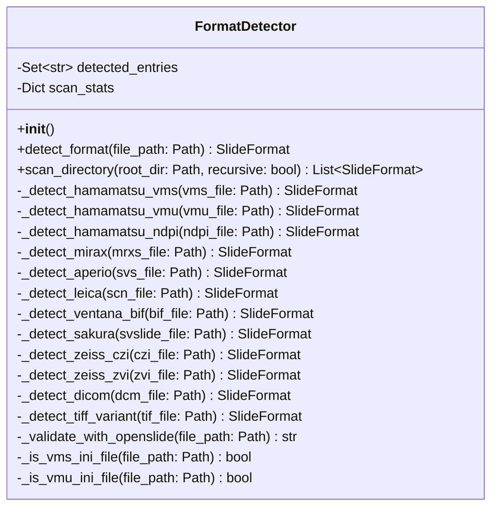

**Attributs:**
- `detected_entries`: Set[str] - Évite détection multiple des mêmes fichiers
- `scan_stats`: Dict - Statistiques scan (scanned, detected, ignored, errors)

**Méthodes publiques:**
- `detect_format(file_path)` → Détecte format d'un fichier unique
- `scan_directory(root_dir, recursive)` → Scan complet d'un dossier

**Méthodes privées de détection (12):**
- Une par format supporté (.vms, .vmu, .ndpi, .mrxs, .svs, .scn, .bif, .svslide, .czi, .zvi, .dcm, .tif/.tiff)

---

#### **TileServer** (services/tile_server.py)

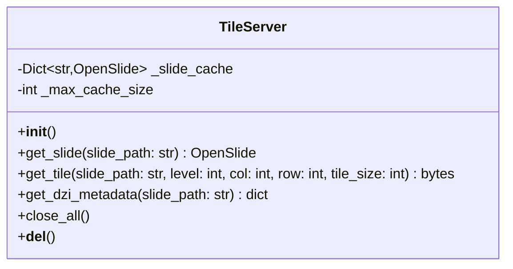

**Attributs:**
- `_slide_cache`: Dict[str, OpenSlide] - Cache des slides ouverts (max 5)
- `_max_cache_size`: int - Limite cache (5 slides)

**Méthodes:**
- `get_slide(slide_path)` → Ouvre ou récupère slide depuis cache
- `get_tile(...)` → Extrait tuile JPEG à position donnée
- `get_dzi_metadata(slide_path)` → Métadonnées pour OpenSeadragon
- `close_all()` → Ferme tous les slides en cache
- `__del__()` → Cleanup automatique

**Instance singleton:**
- `tile_server` (objet global partagé)

---

#### **SlideFormat** (dataclass - services/format_detector.py)

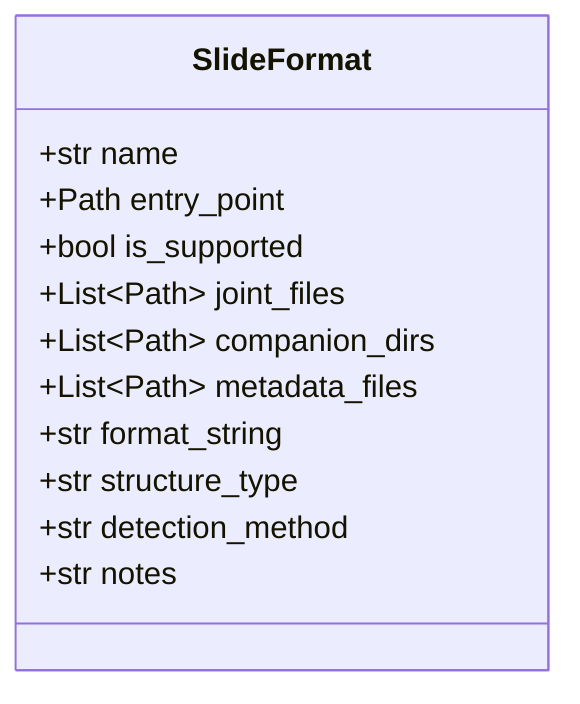

**Dataclass Python** (décorateur @dataclass)

**Attributs:**
- `name`: Nom lisible (ex: "Hamamatsu VMS", "MIRAX")
- `entry_point`: Fichier à passer à OpenSlide()
- `is_supported`: True si OpenSlide peut l'ouvrir
- `joint_files`: Fichiers joints requis
- `companion_dirs`: Dossiers compagnons
- `metadata_files`: Fichiers métadonnées
- `format_string`: Retour de detect_format() ("hamamatsu", "mirax", etc.)
- `structure_type`: "single-file", "multi-file", "with-companion-dir"
- `detection_method`: Méthode utilisée (debug)
- `notes`: Informations additionnelles

---

### 2.2 Objets Externes Utilisés (Bibliothèques Python)

#### **OpenSlide (bibliothèque C, binding Python)**

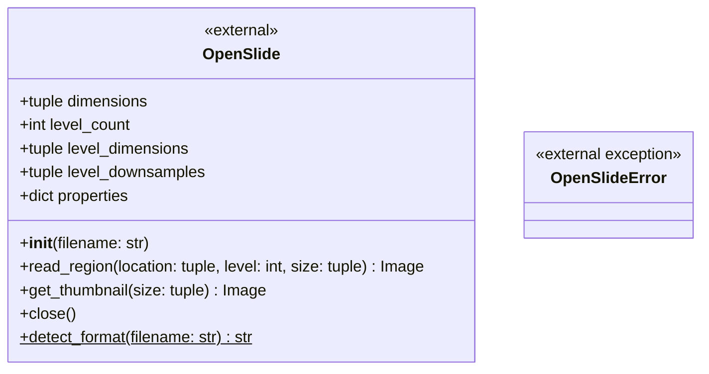

**Attributs (propriétés en lecture):**
- `dimensions`: (width, height) niveau 0
- `level_count`: Nombre de niveaux pyramidaux
- `level_dimensions`: [(w,h), ...] pour chaque niveau
- `level_downsamples`: [1.0, 4.0, 16.0, ...] facteurs de réduction
- `properties`: Dict avec métadonnées vendor-specific (61+ clés)

**Méthodes:**
- `__init__(filename)` → Ouvre une lame
- `read_region(location, level, size)` → Extrait région RGBA
- `get_thumbnail(size)` → Génère thumbnail optimisé
- `close()` → Ferme la lame
- **Static:** `detect_format(filename)` → Détecte format sans ouvrir

**Constantes utilisées:**
- `PROPERTY_NAME_VENDOR` → Clé propriété vendor
- `PROPERTY_NAME_MPP_X` → Microns par pixel X
- `PROPERTY_NAME_MPP_Y` → Microns par pixel Y

---

#### **FastAPI (framework web)**

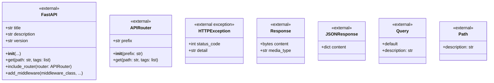

**Classes utilisées:**
- `FastAPI` → Application principale
- `APIRouter` → Routage modulaire (slides.py)
- `HTTPException` → Erreurs HTTP (404, 500, etc.)
- `Response` → Réponses custom (JPEG bytes)
- `JSONResponse` → Réponses JSON
- `Query` → Paramètres query string
- `Path` → Paramètres path
- `CORSMiddleware` → Gestion CORS

---

#### **Pillow (PIL - traitement d'images)**

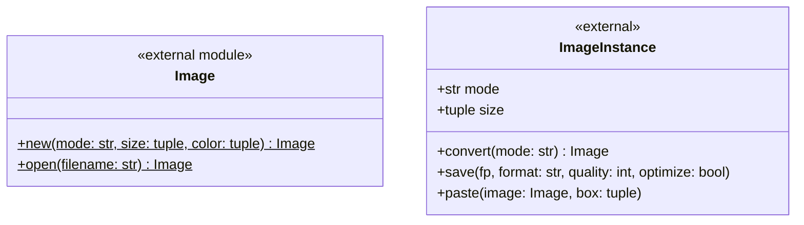

**Module PIL.Image:**
- `Image.new(mode, size, color)` → Crée image vide
- `Image.open(filename)` → Ouvre image

**Instance PIL.Image:**
- `convert(mode)` → Convertit format (RGBA → RGB)
- `save(fp, format, quality, optimize)` → Sauvegarde
- `paste(image, box)` → Colle image dans autre

**Utilisations dans VarunaPoC:**
- Conversion RGBA (OpenSlide) → RGB (JPEG)
- Création tuiles avec fond noir si incomplètes
- Encodage JPEG avec qualité 85

---

#### **Python Standard Library**

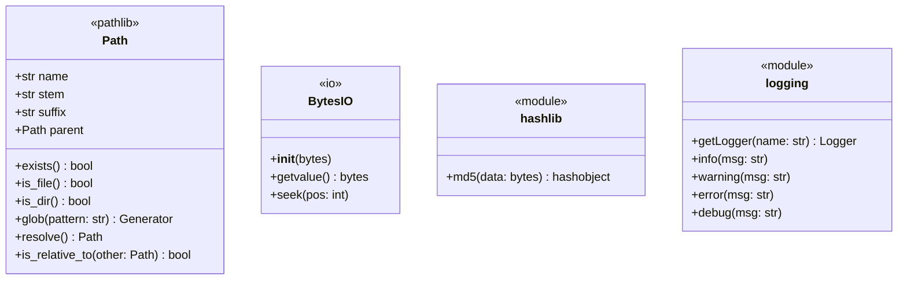

**pathlib.Path:**
- Navigation système fichiers
- Manipulation chemins
- Glob patterns
- Validation chemins (security)

**io.BytesIO:**
- Conversion PIL.Image → bytes
- Buffer mémoire pour JPEG

**hashlib:**
- `md5()` → Génération IDs uniques slides

**logging:**
- Logs structurés (info, warning, error, debug)

---

### 2.3 Fonctions Globales Backend

#### **Routes (routes/slides.py)**

```python
# Endpoints API
async def list_slides() -> Dict
async def browse_slides_directory(path: str) -> Dict
async def get_slide_info(slide_id: str) -> Dict
async def get_overview(slide_id: str) -> Response
async def get_dzi_metadata(slide_id: str) -> JSONResponse
async def get_tile(slide_id: str, level: int, col: int, row: int) -> Response
```

**6 endpoints REST:**
1. `GET /api/slides/` → Liste toutes lames (récursif)
2. `GET /api/slides/browse?path=` → Navigation hiérarchique
3. `GET /api/slides/{id}/info` → Métadonnées lame
4. `GET /api/slides/{id}/overview` → Image overview (JPEG)
5. `GET /api/slides/{id}/dzi.json` → Métadonnées DZI
6. `GET /api/slides/{id}/tiles/{level}/{col}_{row}.jpg` → Tuile JPEG

---

#### **Services**

**slide_scanner.py:**
```python
def scan_slides_directory(slides_dir: str) -> List[Dict]
def get_slide_path_by_id(slide_id: str) -> Optional[str]
```

**slide_loader.py:**
```python
def get_slide_metadata(slide_path: str) -> Dict
def get_slide_overview_bytes(slide_path: str, max_size: int, quality: int) -> bytes
def _detect_format(slide_path: str, slide: OpenSlide) -> str
```

**folder_browser.py:**
```python
def browse_directory(relative_path: str) -> Dict
def is_safe_path(requested_path: str) -> bool
def get_breadcrumb(path: str) -> List[str]
def count_items_in_folder(folder_path: Path) -> int
def generate_slide_id(file_path: Path) -> str
def _get_dependency_paths(entry_point: Path, slide_format) -> List[str]
```

**config_openslide.py:**
```python
def configure_openslide_path() -> bool
```

**main.py:**
```python
async def root() -> Dict
async def health() -> Dict
```

---

## 3. Frontend: Classes et Objets JavaScript

### 3.1 Fonctions Composants (Vanilla JS)

#### **main.js (Entry Point)**

```javascript
// Variables globales
let currentPage: string  // 'home' | 'viewer'
let selectedSlide: Object
let viewer: OpenSeadragon.Viewer
let folderBrowser: HTMLElement

// Fonctions
async function init(): void
function showHomePage(): void
async function showViewerPage(slide: Object): void
function handleSlideSelect(slide: Object): void
async function loadSlide(slide: Object): void
```

**État global:**
- `currentPage` → Page actuelle (navigation SPA)
- `selectedSlide` → Lame sélectionnée
- `viewer` → Instance OpenSeadragon
- `folderBrowser` → Composant explorateur

---

#### **FolderBrowser.js**

```javascript
function createFolderBrowser(onSlideSelect: Function): HTMLElement

// Fonctions internes (closures)
async function loadDirectory(path: string): void
function renderBreadcrumb(segments: Array, parentPath: string): void
function renderContent(folders: Array, slides: Array, files: Array): void
function createFoldersSection(folders: Array): HTMLElement
function createSlidesSection(slides: Array): HTMLElement
function createFilesSection(files: Array): HTMLElement
function handleLocalFiles(files: Array): void
```

**Pattern:** Fonction factory retournant HTMLElement avec état encapsulé (closures)

---

#### **Viewer.js**

```javascript
function initViewer(elementId: string): OpenSeadragon.Viewer
async function loadSlideWithTiles(viewer: Viewer, slideId: string): void
function loadOverview(viewer: Viewer, overviewUrl: string): void  // legacy
```

**Configuration OpenSeadragon:**
- Navigator (mini-map) activé
- Contraintes navigation (visibilityRatio, constrainDuringPan)
- Tile source custom avec getLevelScale() et getNumTiles()

---

#### **SlideList.js**

```javascript
function createSlideList(slides: Array, onClick: Function): HTMLElement
function getStructureIcon(structureType: string): string
function getStructureLabel(structureType: string): string
```

---

#### **Home.js (Legacy - non utilisé Phase 1.8)**

```javascript
function createHomePage(slides: Array, onSlideSelect: Function): HTMLElement
function handleLocalFiles(files: Array): void
function updateHomeStats(filtered: Array, total: Array): void
```

---

### 3.2 API Client (utils/api.js)

```javascript
const API_BASE: string = 'http://localhost:8000'

async function fetchSlides(): Promise<Object>
async function getSlideInfo(slideId: string): Promise<Object>
function getOverviewUrl(slideId: string): string
async function fetchBrowse(path: string): Promise<Object>
```

**Toutes requêtes utilisent Fetch API:**
- GET uniquement (read-only PoC)
- Retourne JSON ou URL
- Gestion erreurs avec try/catch

---

### 3.3 Objets Externes JavaScript

#### **OpenSeadragon (bibliothèque)**

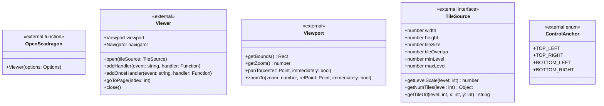

**OpenSeadragon() fonction:**
- Factory pour créer Viewer
- Prend Options object

**Viewer (instance):**
- `viewport` → Gestion zoom/pan
- `navigator` → Mini-map
- `open(tileSource)` → Charge source tuiles
- `addHandler(event, handler)` → Events (zoom, pan, etc.)
- `addOnceHandler(event, handler)` → Event une fois

**TileSource (interface custom):**
- `width`, `height` → Dimensions niveau 0
- `tileSize` → 256 pixels
- `getLevelScale(level)` → Facteur échelle (1/downsample)
- `getNumTiles(level)` → {x: cols, y: rows}
- `getTileUrl(level, x, y)` → URL backend

**Events OpenSeadragon utilisables:**
- `'open'` → Source ouverte
- `'viewport-change'` → Zoom/pan
- `'tile-loaded'` → Tuile chargée
- `'animation-finish'` → Animation terminée

---

#### **Web APIs (JavaScript natif)**

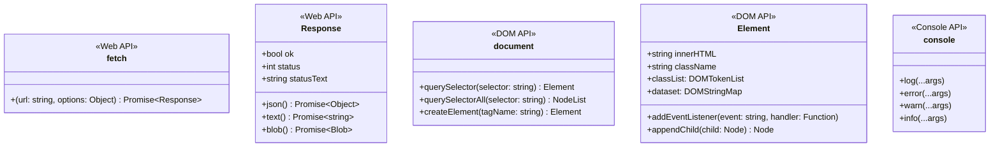

**Fetch API:**
- `fetch(url, options)` → Requête HTTP
- `Response.json()` → Parse JSON
- `Response.ok` → Status 200-299

**DOM API:**
- `document.querySelector()` → Sélection élément
- `document.createElement()` → Création élément
- `Element.addEventListener()` → Gestion events
- `Element.classList` → Manipulation classes CSS

**Console API:**
- `console.log()`, `console.error()`, etc.

---

## 4. Diagramme de Classes Exhaustif

### 4.1 Backend Complet avec Dépendances

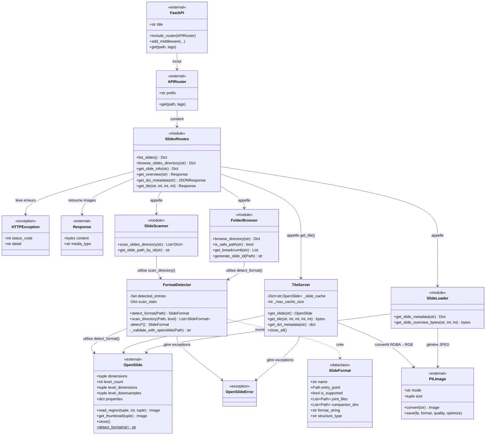

### 4.2 Frontend Complet avec Dépendances

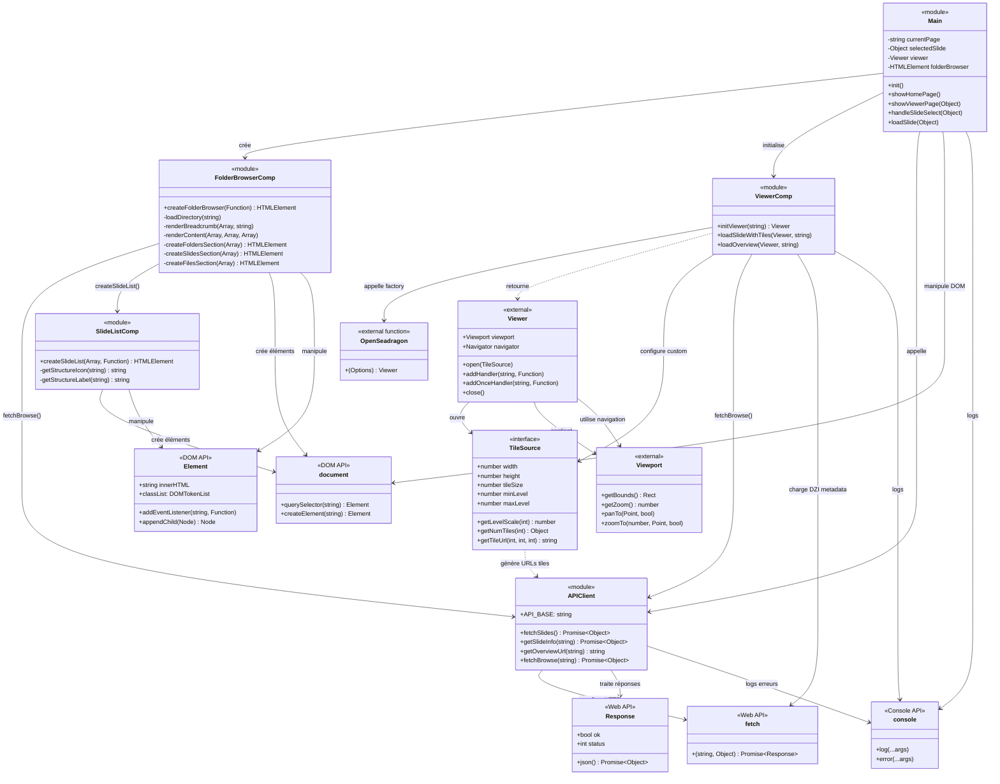

---

## 5. Carte de l'Écosystème Global

### 5.1 Vue Intégrée Backend + Frontend

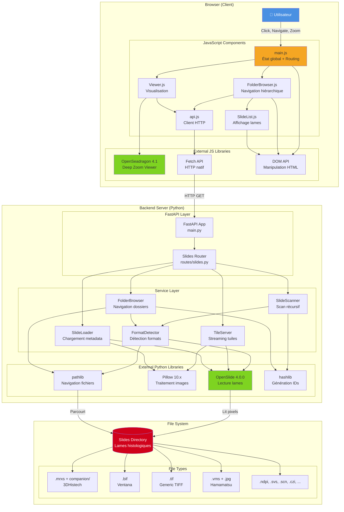

---

## 6. Flux de Données Détaillés

### 6.1 Flux: Ouverture d'une Lame (Streaming de Tuiles)

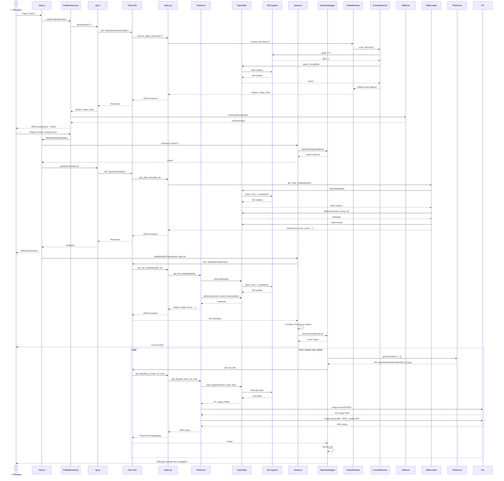

---

### 6.2 Flux: Navigation Hiérarchique

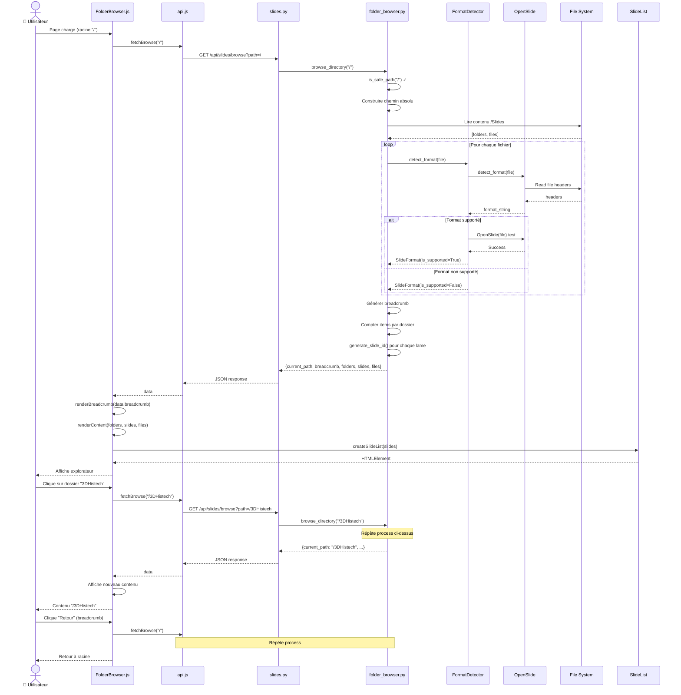

---

## 7. Interactions entre Composants

### 7.1 Matrice d'Interactions

| De ↓ / Vers → | FormatDetector | TileServer | OpenSlide | PIL | FastAPI | OpenSeadragon | DOM API |
|---------------|----------------|------------|-----------|-----|---------|---------------|---------|
| **routes/slides.py** | ❌ | ✅ get_tile() | ❌ | ❌ | ❌ (est utilisé par) | ❌ | ❌ |
| **slide_scanner.py** | ✅ scan_directory() | ❌ | ❌ | ❌ | ❌ | ❌ | ❌ |
| **slide_loader.py** | ❌ | ❌ | ✅ OpenSlide() | ✅ Image | ❌ | ❌ | ❌ |
| **folder_browser.py** | ✅ detect_format() | ❌ | ❌ | ❌ | ❌ | ❌ | ❌ |
| **FormatDetector** | - | ❌ | ✅ detect_format(), OpenSlide() | ❌ | ❌ | ❌ | ❌ |
| **TileServer** | ❌ | - | ✅ read_region() | ✅ convert(), save() | ❌ | ❌ | ❌ |
| **main.js** | ❌ | ❌ | ❌ | ❌ | ❌ | ❌ | ✅ querySelector() |
| **Viewer.js** | ❌ | ❌ | ❌ | ❌ | ❌ | ✅ OpenSeadragon() | ❌ |
| **FolderBrowser.js** | ❌ | ❌ | ❌ | ❌ | ❌ | ❌ | ✅ createElement() |
| **api.js** | ❌ | ❌ | ❌ | ❌ | ✅ fetch() | ❌ | ❌ |

### 7.2 Graphe de Dépendances

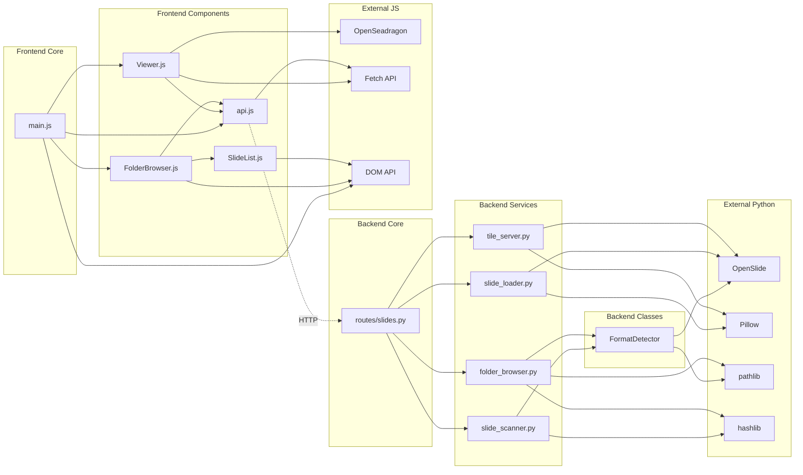

---

## Résumé Quantitatif Final

### Éléments de l'Écosystème

| Catégorie | Count | Détails |
|-----------|-------|---------|
| **Classes Python personnalisées** | 3 | FormatDetector, TileServer, SlideFormat |
| **Fonctions Python personnalisées** | 24 | Routes (6) + Services (18) |
| **Modules Python internes** | 6 | main, config_openslide, routes/slides, services/* |
| **Fonctions JavaScript personnalisées** | 13 | Components (7) + API (4) + Utils (2) |
| **Modules JavaScript internes** | 5 | main, Viewer, FolderBrowser, SlideList, api |
| **Classes externes Python** | 8 | OpenSlide, FastAPI, APIRouter, HTTPException, Response, Image, Path, BytesIO |
| **Objets externes JavaScript** | 6 | OpenSeadragon, Viewer, TileSource, fetch, document, console |
| **Bibliothèques externes** | 6 | OpenSlide, FastAPI, Pillow, OpenSeadragon, pathlib, hashlib |
| **APIs Web natives** | 3 | Fetch API, DOM API, Console API |
| **Formats fichiers supportés** | 12+ | .mrxs, .bif, .tif, .vms, .vmu, .ndpi, .svs, .scn, .czi, .zvi, .dcm, .svslide |
| **Endpoints HTTP** | 6 | list, browse, info, overview, dzi.json, tiles |
| **Events OpenSeadragon** | 4+ | open, viewport-change, tile-loaded, animation-finish |

### Lignes de Code (approximatif)

| Fichier | LOC | Commentaires |
|---------|-----|--------------|
| **Backend** | ~2000 | |
| - format_detector.py | 783 | Détection 12 formats |
| - tile_server.py | 235 | Streaming tuiles |
| - folder_browser.py | 318 | Navigation hiérarchique |
| - slide_scanner.py | 125 | Scan récursif |
| - slide_loader.py | 127 | Chargement metadata |
| - routes/slides.py | 276 | 6 endpoints |
| - main.py | 120 | FastAPI setup |
| **Frontend** | ~900 | |
| - Viewer.js | 203 | OpenSeadragon integration |
| - FolderBrowser.js | 348 | Explorateur dossiers |
| - SlideList.js | 163 | Affichage lames |
| - main.js | 191 | Entry point |
| - api.js | 84 | HTTP client |
| **Total** | ~2900 | Code production |

---

**Prochaine étape:** Utiliser cette cartographie pour planifier l'architecture modulaire des Phases futures (annotations, filtres, IA, etc.)
