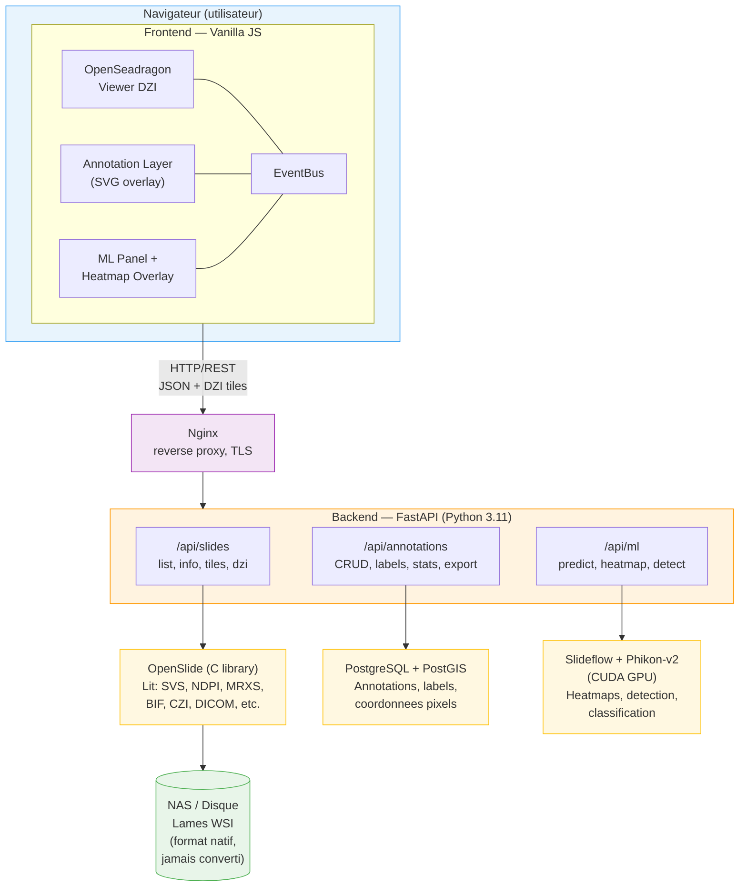
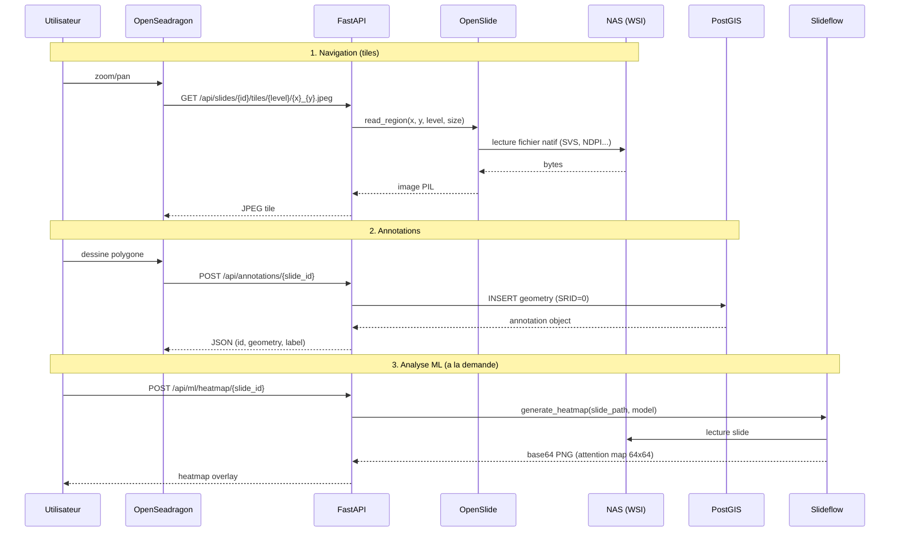
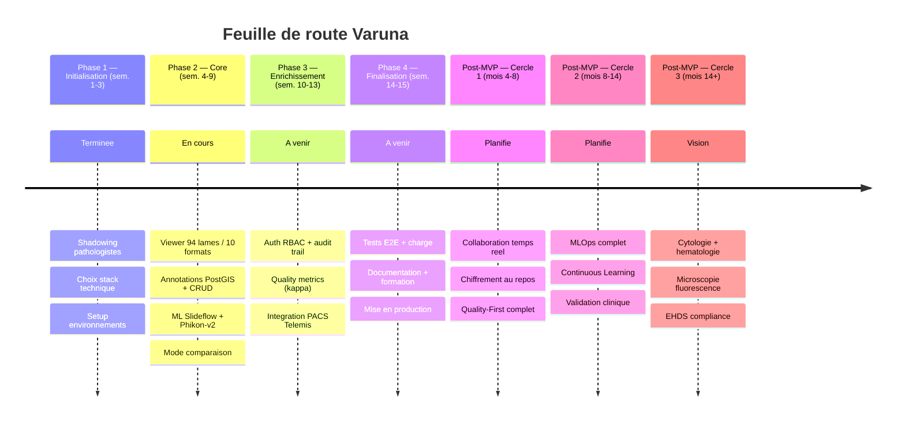
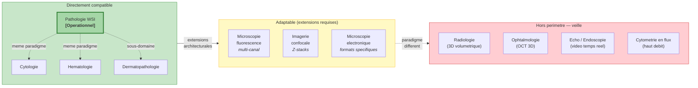

# Varuna - Plateforme d'Imagerie Microscopique Open-Source

## Rapport de Presentation du Projet

*Une approche centree sur l'innovation, la qualite et la simplicite radicale*

---

**Auteur:** [Nom]
**Version:** 2.0
**Date:** Fevrier 2026
**Contexte de validation:** CHU UCL Namur, Service d'Anatomie Pathologique

---

## Table des Matieres

1. [Synthese](#1-synthese)
2. [Le Probleme : Angles Morts du Marche](#2-le-probleme--angles-morts-du-marche)
   - 2.1 Contexte general
   - 2.2 Analyse des 12 angles morts structurels
   - 2.3 Les trois angles morts critiques
3. [Perimetre et Domaines d'Application](#3-perimetre-et-domaines-dapplication)
   - 3.1 Domaines directement compatibles
   - 3.2 Domaines adaptables
   - 3.3 Domaines hors perimetre — veille technologique
4. [Methodologie : Evidence-Informed Decision Making](#4-methodologie--evidence-informed-decision-making)
5. [La Solution Proposee](#5-la-solution-proposee)
   - 5.1 Architecture fonctionnelle
   - 5.2 Architecture technique
   - 5.3 Synthese des differenciateurs
6. [Etat Actuel et Feuille de Route](#6-etat-actuel-et-feuille-de-route)
   - 6.1 Ce qui fonctionne aujourd'hui
   - 6.2 Plan de mise en oeuvre (15 semaines MVP)
   - 6.3 Trajectoire post-MVP
7. [Cadre Reglementaire (EU + US)](#7-cadre-reglementaire-eu--us)
8. [Gouvernance et Gestion des Risques](#8-gouvernance-et-gestion-des-risques)
9. [Strategie d'Evaluation](#9-strategie-devaluation)
10. [Analyse des Couts](#10-analyse-des-couts)
11. [Conclusion](#11-conclusion)
12. [Annexes](#12-annexes)
    - A. Matrice comparative solutions existantes
    - B. Webographie et references
    - C. Detail couts infrastructure

---

## 1. Synthese

L'imagerie microscopique — pathologie digitale, cytologie, microscopie de fluorescence, imagerie confocale — traverse une transformation profonde. Les echantillons biologiques sont numerises en images de tres haute resolution puis analyses sur ecran, parfois avec des outils d'intelligence artificielle. Cette evolution est portee par des enjeux de qualite diagnostique, de collaboration entre centres et de modernisation des infrastructures hospitalieres et de recherche.

**Le constat est documente :** selon le Leeds Digital Pathology Guide et les rapports des marches UniHA, le deploiement d'une solution d'imagerie microscopique constitue *un projet de changement organisationnel majeur, et pas seulement un projet informatique*. Les etudes recentes montrent que 60% des echecs de deploiement sont dus a des facteurs humains et organisationnels plutot qu'a des limitations techniques (Williams et al., 2023).

**Le probleme :** les solutions actuelles du marche traitent l'imagerie microscopique comme un *probleme technique* — format de fichier, streaming de tuiles, integration PACS. L'analyse approfondie du marche revele 12 angles morts structurels que ces solutions n'adressent pas. Trois d'entre eux constituent des opportunites de differenciation significative : la qualite des annotations, le cycle de vie complet des modeles d'IA (MLOps), et la simplicite radicale d'utilisation.

**Varuna** est une plateforme web open-source d'imagerie microscopique qui aborde ce probleme comme un *defi humain et organisationnel* necessitant une approche holistique. Son coeur est la pathologie digitale (WSI), mais son architecture est concue pour s'etendre aux domaines d'imagerie microscopique partageant le meme paradigme : images 2D haute resolution, annotations expertes, et besoin de collaboration. Elle combine :

- **Standards ouverts** : OpenSlide (lecture multi-format native sans conversion), API REST documentee (OpenAPI 3.0), GeoJSON (annotations exportables) — les images restent dans leur format d'origine, on ne DICOMise pas le pipeline
- **Methode structuree** : modele NCCMT (Evidence-Informed Decision Making) pour integrer les meilleures preuves disponibles
- **Positionnement differenciant** sur les trois angles morts critiques du marche
- **Ancrage clinique** : co-conception avec des pathologistes, tests utilisateurs continus et formation progressive
- **Architecture extensible** : chaque domaine d'imagerie microscopique a ses problemes specifiques ; Varuna adresse ceux ou son approche est pertinente et ne pretend pas couvrir les autres

Le projet est actuellement en fin de Phase 2 (developpement core) de son plan en 15 semaines. Il est developpe en collaboration avec des pathologistes du CHU UCL Namur qui fournissent retours et validation clinique.

---

## 2. Le Probleme : Angles Morts du Marche

### 2.1 Contexte general

**Dynamique de marche :**

Le marche mondial de la pathologie digitale est evalue a USD 1.1 milliard en 2024, avec une projection a USD 2.8 milliards d'ici 2030 (CAGR 16.8%, Grand View Research, 2025). Cette croissance est alimentee par :

- La penurie de pathologistes : 1 pour 56,515 habitants en Belgique, avec une reduction prevue de 40% d'ici 2035 (European Society of Pathology, 2023). A l'echelle europeenne, le ratio est de 26.1 pathologistes par million d'habitants, contre 48.8 en Amerique du Nord.
- L'explosion des volumes de biopsies (+4.2% annuel) et l'emergence de l'immunotherapie personnalisee necessitant des analyses moleculaires complexes.
- Le cadre reglementaire qui evolue : le reglement EHDS (European Health Data Space, mars 2031) imposera l'echange d'images medicales entre Etats membres de l'UE. Cote FDA, plusieurs systemes d'IA en pathologie ont recu des approbations ces dernieres annees (Paige 2021, Leica 2024, entre autres — cf. Annexe B).

**Barrieres d'adoption documentees :**

1. **Interoperabilite** (preoccupation #1) : integration LIS/PACS/HIS heterogenes
2. **Cout de validation** : moyenne de 5 mois et 4.4 FTE pour valider cliniquement un algorithme ML (College of American Pathologists, 2024)
3. **Verrouillage vendor** : formats proprietaires, dependance a un fournisseur unique
4. **Resistance au changement** : le Leeds Guide rapporte que c'est le principal facteur d'echec, devant les limitations techniques

**Reference de cout :** un deploiement complet de pathologie digitale dans 8 laboratoires europeens revient a environ EUR 5M sur 7 ans — scanners, stockage, logiciels et formation inclus (Stathonikos et al., 2025).

### 2.2 Analyse des 12 angles morts structurels

L'analyse approfondie des solutions existantes revele 12 angles morts structurels que le marche actuel n'adresse pas de maniere satisfaisante. Ces lacunes representent autant d'opportunites de differenciation.

| Categorie | Angle mort identifie |
|-----------|---------------------|
| **Interoperabilite** | Vendor lock-in persistant malgre DICOM WSI, formats proprietaires non interoperables |
| **Qualite annotations** | Absence de metriques de coherence inter/intra-annotateur, pas d'identification automatique des annotations suspectes |
| **MLOps** | Focus sur le training, negligence du monitoring post-deploiement, detection du drift quasi absente |
| **Explicabilite** | Resultats binaires sans nuance, pas de cartographie de confiance, heatmaps non medicalement pertinentes |
| **Feedback loops** | Corrections experts perdues, pas d'apprentissage continu automatique, active learning manuel |
| **Simplicite** | Courbe d'apprentissage de plusieurs semaines, interface surchargee, configuration infrastructure complexe |
| **Collaboration** | Partage asynchrone uniquement, co-annotation temps reel absente des solutions commerciales principales (observation Leeds Guide, UniHA) |
| **Privacy AI** | Centralisation des donnees, frein RGPD pour projets multi-sites. Le federated learning existe en recherche (MELLODDY, FeTS) mais n'est integre dans aucune solution WSI commerciale a ce jour |
| **Reproductibilite** | Versions algorithmes non tracees, parametres perdus, environnements non captures (Sculley et al., 2015 : "technical debt" ML) |
| **Cas rares** | Optimisation pour cas frequents ; la performance sur cas rares est peu documentee dans la litterature WSI. L'absence de detection out-of-distribution est un probleme reconnu en ML medical en general (Komura & Ishikawa, 2024) |
| **Integration SI** | Silos persistants, jonglage entre 5-10 systemes (observation terrain, ateliers CHU UCL Namur) |
| **Modele economique** | Licensing complexe, couts caches — cf. ecart entre couts annonces et couts reels documentes par Stathonikos et al. (2025) |

*Sources par angle mort :*
- *Interoperabilite, Simplicite, Integration SI : Leeds Digital Pathology Guide, rapports UniHA 2021-2026, observation terrain CHU UCL Namur*
- *Qualite annotations : Pantanowitz et al. 2024 (etude multi-centres, 23% d'erreurs detectees)*
- *MLOps, Feedback loops : Task force France Biotech 2024, Sculley et al. 2015*
- *Explicabilite : observation des solutions commerciales (Philips, Sectra, Pathomation)*
- *Collaboration, Privacy AI, Cas rares : analyse de marche (aucune solution commerciale n'adresse ces points de maniere native) — solidite de la preuve plus faible, a confirmer par retours terrain*
- *Reproductibilite : Sculley et al. 2015, pratiques MLOps Google/Netflix*
- *Modele economique : Stathonikos et al. 2025 (cout reel vs cout annonce)*

### 2.3 Les trois angles morts critiques

Parmi ces 12 angles morts, trois se distinguent par leur potentiel de differenciation strategique et leur impact direct sur la qualite des soins. Les sous-sections suivantes decrivent le **design cible** de chaque differenciateur — ce que la plateforme vise a offrir a terme. L'etat d'avancement reel de chaque fonctionnalite est detaille en section 5.1 (marqueurs [OK]/[MVP]/[Post]).

#### 2.3.1 Quality-First Annotation Platform

Les plateformes actuelles permettent d'annoter, mais ne proposent pas de systeme de **gestion de la qualite des annotations**. Une etude recente de Pantanowitz et al. (2024) montre que 23% des annotations produites en contexte recherche contiennent des erreurs non detectees, compromettant la fiabilite des modeles d'IA entraines sur ces donnees.

Notre approche "quality-first" integre :

- **Mesure automatique de la coherence inter-annotateur** : calcul en temps reel des coefficients kappa et Dice entre annotateurs sur les memes regions
- **Detection d'annotations suspectes** : algorithmes de detection d'outliers bases sur la distribution spatiale, la taille et la forme des annotations
- **Workflows d'adjudication structures** : systeme de review par pairs avec resolution guidee de conflits
- **Versioning complet type "Git"** : historique granulaire avec branches, merge, diff visuel et rollback
- **Metriques predictives de qualite** : indicateurs predisant la qualite du dataset avant l'entrainement IA

Cette approche s'inspire des methodes de Quality Assurance en anatomie pathologique traditionnelle (ISO 15189) et les transpose au contexte numerique. Hanna et al. (2023) montrent que la digitalisation avec controle qualite integre ameliore l'efficacite operationnelle et reduit les erreurs dans les workflows de pathologie. La transposition specifique de ces methodes QA aux annotations numeriques reste un domaine emergent — c'est precisement l'opportunite que nous visons.

#### 2.3.2 Continuous Learning System avec MLOps complet

Le deuxieme angle mort critique concerne le **cycle de vie complet des modeles d'IA**. Les plateformes actuelles se concentrent sur l'entrainement initial mais negligent le monitoring post-deploiement. La task force France Biotech souligne que "l'absence de suivi continu des performances IA en production est une lacune majeure du marche actuel".

Notre systeme de Continuous Learning integre :

- **Monitoring automatique du drift** : detection des derives de performance par comparaison statistique continue entre predictions et validations experts
- **Feedback loops automatiques** : chaque correction d'un pathologiste enrichit automatiquement le dataset de re-entrainement
- **Pipeline CI/CD pour modeles** : automatisation du re-entrainement, validation et deploiement avec rollback automatique si performance degradee
- **Gestion de l'incertitude** : quantification calibree de la confiance par region avec visualisation des zones de doute
- **Active learning intelligent** : priorisation automatique des cas difficiles necessitant annotation experte

Cette approche s'appuie sur les pratiques MLOps de Google (Sculley et al., 2015) adaptees au contexte medical hautement regule. Une revue de Komura & Ishikawa (2024) rapporte que les systemes avec continuous learning maintiennent une performance plus stable dans le temps que les modeles statiques, qui tendent a se degrader sans re-entrainement.

#### 2.3.3 Radical Simplicity : l'experience utilisateur comme differenciateur

Le troisieme angle mort critique est la **complexite d'utilisation**. Le Leeds Guide rapporte que "la resistance au changement des pathologistes est le principal facteur d'echec des deploiements WSI, devant les limitations techniques". Une courbe d'apprentissage de plusieurs semaines constitue une barriere inacceptable.

Notre philosophie "Radical Simplicity" se traduit par :

- **Zero-config deployment** : aucune installation logicielle, acces direct via navigateur — la ou la plupart des solutions necessitent un client lourd ou un plugin
- **Navigation naturelle** : zoom molette, pan, double-clic pour centrer — ce sont des prerequis, pas des differenciateurs. La difference est dans la *consistance* : chaque interaction repond en < 100ms, sans latence ni artefact visuel, meme sur des images de 5+ Go
- **Onboarding de 3 minutes** : pas de manuel de 50 pages. Le Leeds Guide rapporte que la formation est un facteur cle d'adoption — notre objectif est qu'un pathologiste qui sait utiliser Google Maps sache utiliser Varuna
- **Integration transparente SI** : Single Sign-On, contexte patient automatique depuis le PACS, pas de double saisie

Cette approche s'inspire de l'UX des applications grand public (Figma, Notion) et des principes de Norman sur le design intuitif. Stathonikos et al. (2023), relatant l'experience d'un laboratoire universitaire neerlandais passe au tout-numerique, soulignent que la simplicite de l'interface et la qualite de la formation sont les facteurs determinants d'adoption — des le premier mois, les pathologistes utilisaient le systeme pour leur diagnostic primaire.

---

## 3. Perimetre et Domaines d'Application

L'imagerie medicale couvre un spectre large de disciplines. Chacune a ses problemes specifiques, ses formats, ses paradigmes de visualisation et ses modeles ML. Plutot que de pretendre tout couvrir, nous identifions clairement ou notre approche est pertinente, ou elle necessite une adaptation, et ou elle ne l'est simplement pas.

**Le critere de compatibilite est technique :** notre architecture repose sur le paradigme *image 2D haute resolution, navigation par tuiles (pan/zoom), annotations spatiales expertes*. Tout domaine partageant ce paradigme peut beneficier de nos trois differenciateurs (Quality-First, Continuous Learning, Radical Simplicity). Les domaines fonctionnant sur d'autres paradigmes (volumes 3D, video temps reel, series temporelles) sont hors perimetre.

### 3.1 Domaines directement compatibles

Ces domaines partagent le meme paradigme technique. Les problemes specifiques qu'ils rencontrent sont adressables par notre approche, avec des adaptations metier.

#### Pathologie digitale (WSI) — Domaine coeur

**Paradigme :** images 2D gigapixel (100,000+ px), pyramide de tuiles, formats SVS/NDPI/MRXS/etc.

Les problemes specifiques de ce domaine et la maniere dont nos trois differenciateurs y repondent sont detailles en section 2.3. En resume : les erreurs d'annotation (Pantanowitz 2024), la degradation des modeles sans monitoring (Komura & Ishikawa 2024), la resistance au changement (Leeds Guide), le vendor lock-in et le cout de deploiement (Stathonikos 2025) sont directement adresses par l'architecture decrite en section 5.

*Etat : operationnel (cf. section 6.1 pour le detail).*

#### Cytologie (frottis cervicaux, liquides biologiques)

**Paradigme :** images 2D haute resolution de frottis cellulaires, souvent scannes avec les memes equipements que les WSI.

| Probleme specifique | En quoi notre approche repond |
|---------------------|-------------------------------|
| Screening massif (millions de Pap smears/an) — fatigue du cytologiste, erreurs de routine | ML pre-screening avec uncertainty quantification, priorisation des cas suspects |
| Variabilite inter-observateur elevee sur classification cellulaire (normal/anormal/suspect) | Quality metrics : kappa automatique, detection des classifications inconsistantes |
| Interfaces complexes ralentissent un workflow qui doit etre rapide | Radical Simplicity : navigation rapide, raccourcis, interface minimale |

*Adaptation requise : modeles ML specifiques cytologie (pas les memes que histologie), workflow de screening (file d'attente de cas, pas visualisation libre). Format d'image compatible (memes scanners, memes formats).*

#### Hematologie (frottis sanguins, moelle osseuse)

**Paradigme :** images 2D haute resolution de frottis. Comptage differentiel leucocytaire, morphologie erythrocytaire.

| Probleme specifique | En quoi notre approche repond |
|---------------------|-------------------------------|
| Comptage differentiel standardise : variabilite intra- et inter-observateur sur 100 cellules | Quality-First : metriques de coherence sur comptages, detection des ecarts significatifs |
| Classification morphologique subjective (ex: blastes vs lymphocytes atypiques) | Adjudication structuree, consensus building, annotations versionnees |
| Formation des residents : besoin de cas annotes de reference | Mode enseignement, annotations multi-couches, comparaison expert vs etudiant |

*Adaptation requise : modeles ML specifiques hematologie (classification cellulaire, pas tissue architecture), outils de comptage dedie (cliquer pour classifier chaque cellule), references morphologiques integrees.*

#### Dermatopathologie

**Paradigme :** sous-domaine de la pathologie, memes formats WSI, memes scanners. Biopsies cutanees.

| Probleme specifique | En quoi notre approche repond |
|---------------------|-------------------------------|
| Diagnostic differentiel complexe (melanome vs naevus dysplasique) avec consequences vitales | Uncertainty quantification, heatmaps de confiance, zones de doute visibles |
| Seconde opinion frequente (telepathologie) | Collaboration temps reel, co-visualisation, pointeurs partages |

*Adaptation requise : minimale. Meme paradigme exact que pathologie WSI. Modeles ML differents (dermato-specifiques).*

### 3.2 Domaines adaptables

Ces domaines partagent partiellement notre paradigme. L'approche est pertinente mais necessite des extensions architecturales significatives, pas juste des modeles ML differents.

#### Microscopie de fluorescence (IF, FISH)

**Paradigme :** images 2D haute resolution, mais **multi-canaux** (DAPI, FITC, TRITC, Cy5...). Chaque canal = une couche d'information a visualiser en overlay.

| Probleme specifique | Compatibilite avec notre approche |
|---------------------|-----------------------------------|
| Gestion multi-canaux : superposition, ajustement intensite par canal, faux-couleurs | **Extension necessaire** : le viewer gere deja des overlays (heatmap, annotations), mais pas le multi-canal natif. OpenSeadragon supporte les multi-layers. |
| Quantification d'intensite fluorescence (pas juste morphologie) | **Extension necessaire** : annotations actuelles sont spatiales, pas quantitatives. Ajout de mesures d'intensite par canal dans les ROI. |
| Photobleaching : l'image se degrade au fil des acquisitions | Hors scope plateforme (probleme d'acquisition, pas de visualisation). |
| Co-localisation : determiner si deux marqueurs sont au meme endroit | **Extension necessaire** : outil de co-localisation avec scatter plots inter-canaux. |

*Verdict : notre Quality-First et Radical Simplicity sont directement pertinents. Le viewer et les annotations necessitent une couche multi-canal. Les modeles ML sont specifiques (segmentation cellulaire type Cellpose/StarDist, pas des foundation models histologie).*

#### Imagerie confocale

**Paradigme :** images 2D haute resolution **avec Z-stacks** (empilement de plans focaux). Chaque plan focal = une image 2D, l'ensemble forme un pseudo-volume.

| Probleme specifique | Compatibilite avec notre approche |
|---------------------|-----------------------------------|
| Navigation Z-stack : scroll entre plans focaux, projection MIP (Maximum Intensity Projection) | **Extension necessaire** : ajout d'un slider Z dans le viewer. Chaque plan est une image 2D (compatible), mais l'ensemble forme une serie. |
| Multi-canaux + Z-stacks = 4D (X, Y, Z, canal) | Combinaison des extensions fluorescence + Z-stack. Complexite significative. |

*Verdict : faisable mais l'effort d'adaptation est consequent. Quality-First reste pertinent (annotations 3D sont un vrai probleme dans ce domaine). Radical Simplicity aussi (les outils actuels type Imaris/Arivis sont complexes).*

#### Microscopie electronique (TEM, SEM)

**Paradigme :** images 2D a resolution extreme (nanometres). Tres lourdes, meme logique de tuiles pyramidales.

| Probleme specifique | Compatibilite avec notre approche |
|---------------------|-----------------------------------|
| Resolution extreme : structures subcellulaires (organelles, membranes) | Compatible : meme paradigme pan/zoom sur tuiles. |
| Annotations ultra-fines a l'echelle nanometrique | Compatible : PostGIS gere les coordonnees a n'importe quelle echelle. |
| Formats specifiques (MRC, DM3, DM4, HDF5) | **Extension necessaire** : OpenSlide ne lit pas ces formats. Lecteurs specifiques requis (mrcfile, hyperspy). |
| ML segmentation : structures tres differentes de l'histologie | Modeles specifiques (EMPIAR, CryoDRGN). Aucune reutilisation des foundation models pathologie. |

*Verdict : le paradigme de visualisation est le meme, mais les formats et le ML sont entierement differents. Quality-First est tres pertinent (les annotations en microscopie electronique sont notorieusement inconsistantes).*

### 3.3 Domaines hors perimetre — Veille technologique

Ces domaines fonctionnent sur des paradigmes fondamentalement differents. Les adapter serait equivalent a construire un produit different. Certaines idees developpees dans ces domaines peuvent neanmoins inspirer des fonctionnalites dans notre perimetre.

| Domaine | Paradigme | Pourquoi c'est incompatible |
|---------|-----------|----------------------------|
| **Radiologie** (IRM, CT, X-ray, PET) | Volumes 3D, MPR, windowing | OpenSeadragon ne gere pas les volumes ; ML = CNNs 3D (nnU-Net, MONAI) |
| **Ophtalmologie** (OCT, retinographie) | OCT = volumes 3D ; retinographie = basse resolution | Meme problematique que la radiologie, ou triviale pour un viewer |
| **Echographie / Endoscopie** | Video temps reel | IA pendant l'acquisition, streaming video, pas navigation dans une image |
| **Cytometrie en flux** | Classification en masse, haut debit | Images unitaires petites, pas d'exploration spatiale |

**Idees a surveiller dans ces domaines :**

- **Architecture plugin** (OHIF Viewer) : systeme d'extensions modulaire applicable a notre extensibilite
- **Federated learning multi-sites** (MELLODDY, FeTS) : solutions de privacy-preserving ML transposables a la pathologie
- **Validation IA reglementaire** (IDx-DR, GI Genius) : parcours FDA/CE de reference si nous visons la certification
- **Active learning haut debit** (cytometrie) : strategies de sampling intelligent pour notre Continuous Learning

---

## 4. Methodologie : Evidence-Informed Decision Making

Le projet s'inscrit dans une approche **Evidence-Informed Decision Making (EIDM)**, en s'appuyant sur la demarche du National Collaborating Centre for Methods and Tools (NCCMT), largement utilisee en sante publique pour structurer l'usage des connaissances scientifiques dans la prise de decision.

### 4.1 Le modele NCCMT en 7 etapes

Le modele NCCMT structure la demarche projet selon 7 etapes iteratives :

**Etape 1 : Definir**

Clarification de la question centrale selon le schema PICR :

- **P (Population)** : pathologistes, techniciens, chercheurs utilisant la microscopie
- **I (Intervention)** : plateforme WSI web neutre et interoperable
- **C (Comparateur)** : solution actuelle client lourd / solutions proprietaires du marche
- **R (Resultats attendus)** : accessibilite, performance, securite, collaboration, qualite des annotations

*Resultat : la question centrale est "une plateforme web open-source, centree sur la qualite des annotations et la simplicite, peut-elle constituer une alternative credible aux solutions proprietaires pour la visualisation WSI en contexte hospitalier universitaire ?"*

**Etape 2 : Rechercher**

Recherche documentaire structuree selon trois axes :

1. **Normes et standards** : DICOM WSI (Supplement 145), RGPD, ISO 27001, ISO 15189, FDA guidelines for AI in pathology, IVDR EU 2017/746
2. **Retours d'experience** : Leeds Digital Pathology Guide, marches UniHA, task force France Biotech, etudes de deploiement multi-sites (Stathonikos 2023, Williams 2023, Hanna 2023)
3. **Solutions techniques open source** : Orthanc WSI, OpenSlide, ASAP, QuPath — evaluees sur criteres : formats supportes, communaute active, maturite, extensibilite

*Resultat : 28 sources retenues (cf. Annexe B), couvrant normes, retours terrain, publications scientifiques et outils open source. Principales lacunes identifiees dans la litterature : peu de donnees sur le cout reel de la maintenance a long terme des solutions open source, et absence d'etudes comparatives rigoureuses entre solutions open source et commerciales en contexte clinique.*

**Etape 3 : Estimer (Appraise)**

Evaluation critique de chaque source selon trois criteres :

- **Pertinence** : contexte comparable (CHU, hopital universitaire, volume similaire)
- **Qualite methodologique** : rigueur scientifique, taille d'echantillon, biais potentiels
- **Applicabilite** : transferabilite au contexte, ressources disponibles

*Resultat : les sources les plus solides sont le Leeds Guide (retour terrain multi-annees, large echantillon), Stathonikos 2023/2025 (donnees reelles, contexte CHU europeen comparable), et Pantanowitz 2024 (etude multi-centres). Les estimations marche (Grand View Research) sont a prendre comme ordres de grandeur. Certaines affirmations (collaboration temps reel, federated learning, cas rares) s'appuient davantage sur l'observation du marche que sur des etudes formelles — la solidite de la preuve y est moindre.*

**Etape 4 : Synthetiser**

Transformation de la revue en **cinq messages cles** :

1. Le deploiement doit etre **phase (MVP → extension clinique)** plutot que "big bang" — c'est le consensus des retours terrain (Leeds Guide, Williams 2023)
2. La reussite repose autant sur la **conduite du changement** que sur la technologie — 60% des echecs sont organisationnels, pas techniques (Williams 2023)
3. L'architecture doit etre **ouverte et neutre** pour eviter le vendor lock-in — ce verrouillage est la preoccupation #1 des CHU interroges (UniHA, Leeds)
4. Les **trois angles morts critiques** (qualite annotations, MLOps, simplicite) ne sont adresses par aucune solution existante de maniere native — c'est notre opportunite de differenciation
5. Le positionnement **recherche/enseignement** est le point d'entree realiste, avec une trajectoire credible vers l'usage clinique si la validation le justifie

**Etape 5 : Adapter**

Traduction des messages cles aux contraintes locales identifiees au CHU UCL Namur :

- **Hebergement** : on-premise obligatoire (politique interne, RGPD), infrastructure existante
- **Formats** : le laboratoire utilise principalement des scanners Hamamatsu (NDPI) et 3DHistech (MRXS) → OpenSlide supporte les deux nativement
- **PACS** : Telemis en place → integration en mode "command plugin" (lancement viewer depuis contexte patient)
- **Reseau** : VPN pour acces externe, reverse proxy Nginx en frontal
- **Authentification** : RBAC basique et audit trail dans le MVP (Phase 3) ; SSO institutionnel complet (SAML 2.0/OAuth 2.0) en post-MVP

*Resultat : le MVP se concentre sur visualisation WSI pyramidale, navigation fluide, annotations basiques avec stockage PostGIS, premiere couche ML (heatmaps, detection), authentification RBAC basique et integration PACS minimale. La collaboration temps reel, le SSO complet et le chiffrement au repos sont post-MVP.*

**Etape 6 : Mettre en oeuvre**

Developpement Agile avec sprints de 1-2 semaines. Chaque sprint inclut developpement, tests automatises (1000+ tests backend), et feedback pathologistes.

*Etat actuel : Phase 2 en cours, viewer operationnel (94 lames, 10 formats), annotations CRUD, ML integre. Cf. Section 6.1 pour le detail.*

**Etape 7 : Evaluer**

Trois dimensions d'evaluation definies (cf. Section 9) :

- **Performance technique** : temps chargement, latence navigation, disponibilite
- **Adoption** : taux d'utilisation, intensite d'usage, proportion cas digitaux
- **Qualite** : satisfaction utilisateurs, incidents, conformite audits

*Etat actuel : les metriques techniques sont collectees automatiquement (logs serveur, monitoring). Les metriques d'adoption et de satisfaction necessitent un deploiement elargi (Phase 3+).*

---

## 5. La Solution Proposee

### 5.1 Architecture fonctionnelle

L'architecture fonctionnelle s'articule autour de cinq composantes majeures, chacune adressant un ou plusieurs angles morts identifies. Chaque fonctionnalite est marquee selon son etat : **[OK]** = operationnel et teste, **[MVP]** = prevu dans le MVP 15 semaines, **[Post]** = post-MVP.

**5.1.1 Visualisation WSI haute performance**

- **[OK]** Affichage d'images pyramidales multi-resolution jusqu'a 40x et 100,000 x 100,000 pixels
- **[OK]** Navigation fluide avec zoom progressif, pan (tiles en < 15ms avec keep-alive)
- **[Post]** Chargement anticipatif intelligent des tuiles avec cache Redis multi-niveaux
- **[Post]** Compression adaptative WebP/JPEG2000 selon bande passante detectee
- **[OK]** Mode comparaison multi-lames avec panneaux synchronises

**5.1.2 Formats, interoperabilite et acces**

- **[OK]** Support natif MRXS, NDPI, SVS, BIF, TIFF pyramidal, CZI, SCN, DICOM WSI via OpenSlide
- **[OK]** Les images restent dans leur format natif ; la plateforme les sert en tuiles DZI sans les transformer
- **[OK]** API REST ouverte avec documentation OpenAPI 3.0
- **[MVP]** Integration PACS minimale (command plugin Telemis, lancement viewer depuis contexte patient)
- **[MVP]** Authentification RBAC basique (controle acces par role, audit trail)
- **[Post]** SSO institutionnel complet (SAML 2.0/OAuth 2.0)

**5.1.3 Systeme d'annotations quality-first**

- **[OK]** Types d'annotations : rectangle, polygone, point, cercle, freehand
- **[OK]** Stockage PostGIS, CRUD API, labels avec couleurs, export GeoJSON
- **[OK]** Statistiques temps reel (comptage par label, type, distribution confiance)
- **[Post]** Versioning granulaire type Git (branches, merge, diff visuel)
- **[MVP]** Premiere couche quality metrics (calcul kappa inter-annotateur)
- **[Post]** Quality metrics avance : Dice coefficient, metriques predictives qualite dataset
- **[Post]** Detection anomalies : isolation forest pour annotations atypiques
- **[Post]** Workflow adjudication : review par pairs avec resolution conflits

**5.1.4 Collaboration et consensus temps reel**

Composante entierement planifiee, non implementee :

- **[Post]** Co-visualisation synchronisee (meme viewport, zoom, contraste pour plusieurs utilisateurs)
- **[Post]** Pointeurs partages et curseurs nommes
- **[Post]** Chat contextuel ancre sur des regions de la lame
- **[Post]** Enregistrement sessions de RCP pour tracabilite

**5.1.5 Infrastructure MLOps et IA**

- **[OK]** Integration Slideflow avec foundation model Phikon-v2 (CUDA)
- **[OK]** Heatmap generation (attention map 64x64, ~2.5 min GPU)
- **[OK]** Detection automatique regions tissulaires (heatmap → scipy → shapely → GeoJSON)
- **[OK]** Classification tissue/background avec uncertainty quantification
- **[Post]** Pipeline CI/CD modeles (retraining automatise, rollback)
- **[Post]** Monitoring drift (comparaison predictions vs validations experts)
- **[Post]** Feedback loops (corrections experts → enrichissement datasets)
- **[Post]** Model registry avec versioning et metadonnees

### 5.2 Architecture technique

**Vue d'ensemble :**

**Flux de donnees principal :**

**Trajectoire du projet :**

**Perimetre et domaines d'application :**

**Stack technique validee :**

| Composant | Technologie | Justification |
|-----------|-------------|---------------|
| Backend API | FastAPI (Python 3.11) | Async natif, validation Pydantic, documentation auto OpenAPI |
| Lecture WSI | OpenSlide 4.0 | Standard de facto, 10+ formats proprietaires, C library performante |
| Viewer web | OpenSeadragon 4.1 | Mature, performant, communaute active, DZI protocol |
| Base donnees | PostgreSQL 16 + PostGIS | Spatial queries, SRID=0 pour coordonnees pixels, robuste |
| ML Framework | Slideflow 2.3+ | Foundation models (Phikon-v2), pipelines pathologie, CUDA |
| Cache | Redis 7 [Post] | Cache tuiles LRU, TTL adaptatif, queue async |
| Reverse proxy | Nginx | TLS termination, load balancing, compression |

### 5.3 Synthese des differenciateurs

Les trois angles morts critiques identifies en section 2.3 se traduisent dans l'architecture de la maniere suivante :

- **Quality-First Annotations** → composante 5.1.3 (annotations quality-first : kappa, detection outliers, adjudication)
- **Continuous Learning MLOps** → composante 5.1.5 (infrastructure MLOps : drift monitoring, feedback loops, pipeline CI/CD)
- **Radical Simplicity** → composante 5.1.1 + 5.1.2 (zero-config, acces navigateur, lecture native multi-format sans conversion)

L'etat d'avancement detaille de chaque fonctionnalite est marque [OK], [MVP] ou [Post] dans les sous-sections ci-dessus.

---

## 6. Etat Actuel et Feuille de Route

### 6.1 Ce qui fonctionne aujourd'hui (Phase 2)

Le projet est en fin de Phase 2 de son plan en 15 semaines. L'ensemble des fonctionnalites marquees **[OK]** en section 5.1 est operationnel et teste. Voici les indicateurs cles :

- **Viewer** : navigation fluide sur images gigapixel (100,000+ x 80,000 px). 10 formats vendor (Aperio SVS, Hamamatsu NDPI, Leica SCN, Philips TIFF, 3DHistech MRXS, Ventana BIF, Zeiss CZI, Sakura SVSLIDE, Trestle, DICOM WSI). 94 lames testees, 3 fichiers corrompus correctement rejetes. Tiles en < 15ms avec keep-alive (mesure reelle). Mode comparaison, mini-map, plein ecran, navigation clavier.
- **Annotations** : CRUD complet PostGIS, 5 outils dessin, labels couleurs, export GeoJSON, statistiques temps reel.
- **ML / IA** : Slideflow + Phikon-v2 (CUDA), heatmaps ~2.5 min GPU, detection regions tissulaires, classification avec uncertainty quantification, routage par tags.
- **Infrastructure** : 1000+ tests automatises, CI/CD GitHub Actions (lint, tests, build Docker, scan securite Trivy/Bandit/CodeQL/Gitleaks), Docker multi-container.

**Ce qui n'est PAS encore en place :**

- Authentification / RBAC (module interface defini, pas implemente)
- Integration PACS (architecture definie pour mode command plugin Telemis)
- Collaboration temps reel, quality metrics annotations, continuous learning
- Audit trail complet, chiffrement au repos

### 6.2 Plan de mise en oeuvre (Approche Agile, 15 semaines MVP)

Le projet suit une methodologie Agile avec sprints de 1-2 semaines, structuree en quatre phases principales. Le plan initial est presente ci-dessous avec des annotations sur les ecarts par rapport a la realite — le developpement Agile implique que les priorites s'adaptent aux retours terrain.

**Phase 1 : Initialisation (semaines 1-3)** — *Terminee*

- Observation ethnographique du travail reel des pathologistes (shadowing, analyse workflow)
- Ateliers de co-conception avec utilisateurs cles
- Finalisation choix technologiques (stack technique, bibliotheques, infrastructure)
- Validation architecture logique et user stories prioritaires
- Setup environnements developpement, staging, production

**Phase 2 : Developpement core (semaines 4-9)** — *En cours, dernier sprint*

- Sprint 1-2 : Viewer basique (chargement lames, zoom/pan fluide) — *fait*
- Sprint 3-4 : Support multi-formats via OpenSlide, optimisation performance — *fait (94 lames, 10 formats)*
- Sprint 5-6 : Integration PACS minimale — *reporte en Phase 3* (l'acces au PACS Telemis necessitait des autorisations non obtenues a ce stade ; remplace par annotations + ML)
- *Ajout non prevu* : annotations CRUD + PostGIS, integration ML Slideflow/Phikon-v2, mode comparaison — developpes en avance sur le plan initial car plus prioritaires que le PACS pour la validation terrain
- Tests utilisateurs reguliers avec pathologistes pilotes

**Phase 3 : Enrichissement (semaines 10-13)** — *fait*

- Sprint 7-8 : Authentification OIDC + RBAC, audit trail dual DB+JSON
- Sprint 9 : Quality metrics inter-annotateurs (kappa Cohen, kappa Fleiss, IoU spatial via PostGIS)
- Sprint 10 : Integration PACS Telemis (deep-link `/slide/{name}`, resolution case-insensitive)

**Phase 4 : Finalisation (semaines 14-15)** — *fait*

- Tests d'integration et E2E (Playwright, 18 suites)
- Documentation technique (Manuel admin, MODULAR_ARCHITECTURE.md, fiches services) et utilisateur (Manuel/01-08)
- CI/CD complet (lint, tests, build Docker, scans securite)
- Tag stable `v0.1.0` (Waves 1-4 + standards), 62 issues fermees

**Apres v0.1.0 — Migration Strangler Fig (mai 2026)** — *en cours*

- 6 Protocols (PEP 544) : `AuthProvider`, `StorageProvider`, `SlideReader`, `TileCache`, `WorkflowHook`, `MLWorkerProvider`
- 9 routes cablees via FastAPI `Depends` (sprints 1-12)
- WebSocket broadcast des workflow events (sprint 15)
- Conteneurs sandbox dev : Redis (cache L2), HAPI FHIR (FHIR R4), Orthanc (PACS DICOM)
- Voir `docs/architecture/MODULAR_ARCHITECTURE.md` pour le sprint log detaille

### 6.3 Trajectoire post-MVP

Au-dela du MVP en 15 semaines, la plateforme est concue comme un ecosysteme evolutif. La trajectoire se deploie en cercles concentriques :

**Cercle 1 — Consolidation clinique (mois 4-8)**

Le MVP livre les fondations (RBAC basique, audit trail, kappa premiere couche, PACS command plugin). Le Cercle 1 les etend :

- SSO institutionnel complet (SAML 2.0/OAuth 2.0) — le MVP fournit RBAC basique
- Audit trail immutable (logs conformite RGPD Article 32) — le MVP fournit audit trail basique
- Quality-First Annotations complet (detection outliers, adjudication, metriques predictives) — le MVP fournit le calcul kappa
- Collaboration temps reel (co-visualisation synchronisee)
- Chiffrement au repos et en transit (TLS 1.3, PostgreSQL transparent encryption)

**Cercle 2 — MLOps et IA clinique (mois 8-14)**

- Infrastructure MLOps complete (queue async Celery/Redis, MLflow versioning)
- Continuous Learning pipeline (feedback loops, drift monitoring, retraining automatise)
- Expansion foundation models (UNI - Microsoft, CONCH - Stanford)
- Validation clinique formelle (protocole ISO 13485, dataset benchmark annote par 3+ pathologistes)
- Uncertainty quantification calibree avec visualisation zones de doute

**Cercle 3 — Extension aux domaines compatibles (mois 14+)**

L'architecture modulaire permet d'etendre la plateforme aux domaines identifies en section 3, par ordre de proximite technique :

- **Cytologie et hematologie** (effort minimal) : memes formats, memes scanners. Ajout de modeles ML specifiques et d'outils de comptage differentiel. Les trois differenciateurs s'appliquent directement.
- **Microscopie de fluorescence** (effort modere) : ajout de la gestion multi-canal dans le viewer (OpenSeadragon supporte les multi-layers), outils de quantification d'intensite, modeles de segmentation cellulaire (Cellpose, StarDist).
- **Microscopie electronique** (effort significatif) : ajout de lecteurs de formats specifiques (MRC, DM3, HDF5), adaptation des echelles d'annotation.
- **Enseignement et formation** : modules pedagogiques, examens pratiques sur lames virtuelles, comparaison expert vs etudiant.
- **Recherche multi-sites** : federated learning, partage de modeles sans partage de donnees.
- **Integration EHDS** : conformite European Health Data Space (echeance mars 2031).

Cette trajectoire est intentionnellement non lineaire : chaque cercle est autonome et deployable independamment selon les priorites et les ressources disponibles. L'expansion vers un domaine ne se fait que si les problemes specifiques de ce domaine sont effectivement adressables par notre approche — pas par principe d'exhaustivite.

---

## 7. Cadre Reglementaire (EU + US)

La pathologie digitale augmentee par l'IA opere dans un cadre reglementaire strict qui varie selon la juridiction et l'usage prevu. Notre approche est de concevoir une solution **conforme par design** aux deux principaux cadres reglementaires mondiaux.

### 7.1 Union Europeenne

**IVDR (In Vitro Diagnostic Regulation, EU 2017/746)**

| Phase du projet | Classification IVDR | Obligations |
|----------------|--------------------|----|
| Recherche et enseignement | **Classe A** (general IVD) | Pas de certification organisme notifie requise. Auto-declaration de conformite. |
| Outil d'aide a la decision (consultatif) | Hors dispositif medical | Le logiciel n'emet pas de diagnostic, il assiste le pathologiste. Pas de classification IVDR. |
| Diagnostic primaire (futur, optionnel) | **Classe C** (companion diagnostic) | Certification organisme notifie obligatoire. Cout estime EUR 200,000-500,000, delai 18-36 mois, essais cliniques 100+ patients sur 3+ sites. |

*Strategie : Demarrer en Classe A (recherche), valider la valeur ajoutee, puis decider de la certification Classe C selon le ROI demontre. Cette approche progressive est recommandee par le MDCG (Medical Device Coordination Group).*

**RGPD (Reglement General sur la Protection des Donnees, UE 2016/679)**

- **Hebergement** : on-premise obligatoire (donnees patients ne quittent pas l'infrastructure hospitaliere)
- **Pseudonymisation** : obligatoire pour toute donnee patient (ID unique ≠ identite civile)
- **DPIA** (Data Protection Impact Assessment) : requise car traitement a risque eleve (imagerie medicale + IA)
- **Retention** : politique de conservation definie avec le DPO (ex: 10 ans post-diagnostic, puis suppression)
- **Breach notification** : procedure incident (notification autorite de controle sous 72h)
- **Droit a l'effacement** : mecanisme technique de suppression granulaire des donnees patient

**EHDS (European Health Data Space)**

Echeance mars 2031 : interoperabilite images medicales obligatoire entre Etats UE. Varuna lit deja le format DICOM WSI comme format d'entree et expose une API REST documentee. L'ajout d'un export DICOM WSI (DICOMisation a la demande) serait une evolution naturelle si la conformite EHDS l'exige, mais ce n'est pas implemente aujourd'hui.

### 7.2 Etats-Unis

**FDA — Software as a Medical Device (SaMD)**

| Niveau de risque | Pathway FDA | Applicabilite Varuna |
|-----------------|-------------|---------------------|
| Viewer sans IA (visualisation seule) | **Classe I / Exempt** | Le viewer WSI seul est considere comme un outil informatique, pas un dispositif medical. |
| IA suggestive (aide a la decision non-contraignante) | **Classe II / 510(k)** | Si l'IA suggere des regions suspectes sans poser de diagnostic. Cout ~USD 150,000, delai 6-12 mois. |
| IA diagnostique (diagnostic primaire) | **Classe II-III / De Novo ou PMA** | Si l'IA pose un diagnostic autonome. Philips IntelliSite a obtenu un 510(k) en 2017 pour ce use case. |

*Precedents FDA : Philips IntelliSite (510(k) K172655, 2017), Leica Aperio GT 450 DX (510(k) K240315, 2024), Paige Prostate (De Novo DEN200080, 2021).*

**HIPAA (Health Insurance Portability and Accountability Act)**

- Applicable uniquement dans le contexte de deploiement aux Etats-Unis
- **Administrative Safeguards** : politiques acces, formation personnel, gestion incidents
- **Physical Safeguards** : controle acces physique serveurs, protection des workstations
- **Technical Safeguards** : controle acces electronique, audit logs, chiffrement, integrite des donnees
- **BAA (Business Associate Agreement)** : requis si heberge par un tiers

*Etat actuel Varuna : RBAC basique et audit trail sont prevus dans le MVP (Phase 3). Le chiffrement au repos et le SSO complet sont dans la roadmap post-MVP (Cercle 1). L'approche "security by design" permet d'adresser les deux cadres (RGPD et HIPAA) avec une architecture commune.*

### 7.3 Positionnement reglementaire Varuna

**Important :** Varuna ne pretend pas etre un dispositif medical certifie. La position actuelle est claire :

- **Aujourd'hui** : outil de recherche et d'enseignement (IVDR Classe A, FDA Exempt)
- **Objectif moyen terme** : outil d'aide a la decision consultatif (hors dispositif medical / FDA Classe I)
- **Option long terme** : la certification IVDR Classe C / FDA 510(k) reste une possibilite si la validation clinique le justifie, mais c'est un projet multi-annees et multi-centaines-de-milliers d'euros a part entiere

Cette transparence est deliberee. Promettre une certification future sans les ressources correspondantes serait irresponsable.

---

## 8. Gouvernance et Gestion des Risques

### 8.1 Gouvernance du projet

**Contexte actuel :** le projet est developpe dans le cadre d'un travail personnel en collaboration avec le service d'anatomie pathologique du CHU UCL Namur. La gouvernance est legere et adaptee a cette realite — il ne s'agit pas d'un programme hospitalier formel avec comite de pilotage.

**Organisation en place :**

| Role | Qui | Frequence |
|------|-----|-----------|
| **Referent metier** | Pathologiste(s) du CHU UCL Namur | Retours terrain reguliers (feedback sur viewer, priorites fonctionnelles) |
| **Developpeur** | Auteur du projet | Developpement continu, demonstrations, documentation |

**Organisation cible (si deploiement elargi) :**

En cas de deploiement clinique reel, la gouvernance devrait s'elargir :

| Role additionnel | Responsabilite | Pourquoi |
|-----------------|---------------|----------|
| **Referent IT / DSI** | Infrastructure, securite, backup, conformite reseau | Prerequis pour hebergement on-premise |
| **DPO** | Validation RGPD, DPIA, politique retention | Obligatoire des que donnees patients traitees |
| **Referent biomedical** | Interoperabilite scanners, maintenance | Interface avec le parc d'equipements existant |
| **Contact PACS** | Integration Telemis, troubleshooting | Necessaire pour le mode command plugin |

### 8.2 Strategie de continuite (bus factor = 1)

Le risque principal du projet est la dependance a un developpeur unique. C'est une realite, pas un probleme a minimiser. Voici les mesures en place et planifiees pour attenuer ce risque :

**Mesures en place :**

- **Code open-source** (GitHub public) : n'importe quel developpeur Python/JS peut forker et continuer
- **1000+ tests automatises** : un nouveau developpeur peut modifier le code avec un filet de securite
- **CI/CD complet** : lint, tests, build Docker, scan securite — le pipeline valide automatiquement chaque changement
- **Architecture modulaire** : chaque module (slides, annotations, ML) est isole avec une interface claire ; on peut modifier l'un sans comprendre les autres
- **Stack standard** : FastAPI, PostgreSQL, OpenSeadragon — pas de technologies exotiques, large pool de developpeurs competents

**Mesures planifiees (post-MVP) :**

- **ADR (Architecture Decision Records)** : documenter le *pourquoi* des choix techniques, pas juste le *quoi*
- **CONTRIBUTING.md** : guide d'onboarding pour un nouveau developpeur (setup en 15 minutes, structure du code, conventions)
- **Diagrammes d'architecture dans le repo** : les schemas Mermaid de ce document, versiones avec le code
- **Documentation API auto-generee** : OpenAPI 3.0 deja en place (FastAPI), a completer avec exemples

**Ce qui ne peut pas etre mitige :** la connaissance implicite du contexte metier (pourquoi tel choix UX, quels retours des pathologistes ont mene a telle decision). La seule reponse est la documentation continue, qui est un effort permanent.

### 8.3 Gestion des risques

| Risque | Probabilite | Impact | Mitigation | Etat |
|--------|------------|--------|-----------|------|
| **Adoption limitee** | Moyenne | Critique | Co-conception, tests utilisateurs, formation progressive | Attenuation active (feedback pathologistes en cours) |
| **Surcharge reseau/serveurs** | Faible | Eleve | Tests charge, cache multi-niveaux, compression adaptative | Tiles < 15ms mesurees en conditions reelles |
| **Non-conformite reglementaire** | Moyenne | Critique | Hebergement interne, audit securite, anonymisation | Scan securite CI/CD en place (Trivy, Bandit, Gitleaks) |
| **Dependance fournisseur** | Faible | Moyen | Lecture multi-format native (OpenSlide), export GeoJSON, images en format natif | Architecture validee |
| **Turnover developpeur unique** | Elevee | Critique | Voir section 8.2 ci-dessus | Risque principal — attenuation partielle |
| **Incompatibilite PACS** | Moyenne | Moyen | Tests prealables, mode fallback (repertoire partage) | Non teste (post-MVP) |

---

## 9. Strategie d'Evaluation

L'evaluation suit la logique NCCMT : on ne s'arrete pas au deploiement technique, on verifie l'usage reel et l'impact. Trois dimensions sont mesurees :

### 9.1 Performance technique

| Indicateur | Baseline actuelle | Objectif | Methode de mesure |
|-----------|------------------|---------|------------------|
| Temps de chargement | ~2.1s pour 28 tiles (mesure Phase 2) | < 2s pour lame 5 Go (P95) | Monitoring automatise, logs serveur |
| Latence navigation | < 15ms par tile avec keep-alive (mesure Phase 2) | < 100ms pour zoom/pan (seuil perception) | Chrome DevTools, metriques navigateur |
| Disponibilite | Non mesurable (env. dev local) | > 99.5% hors maintenances planifiees | Prometheus + alertes (a deployer) |
| Capacite | 1 utilisateur (env. dev) | 10 simultanes sans degradation | Tests de charge JMeter (a deployer) |

### 9.2 Adoption et usage

*Prerequis : ces indicateurs ne seront mesurables qu'apres deploiement aupres d'utilisateurs reels (Phase 3+). Les objectifs sont des cibles, pas des engagements.*

| Indicateur | Baseline | Objectif | Methode de mesure |
|-----------|----------|---------|------------------|
| Taux d'adoption | 0% (pas encore deploye) | > 80% des pathologistes a 6 mois post-deploiement | Logs connexion, enquetes |
| Intensite d'usage | N/A | Equivalence microscope optique (lames/semaine) | Analytics plateforme |
| Proportion cas digitaux | 0% | > 60% a 12 mois post-deploiement | Comparaison rapports WSI vs microscope |
| Usage annotations | 0 | A definir apres premiers 3 mois d'usage | Metriques AnnotationStore |

### 9.3 Qualite et satisfaction

| Indicateur | Baseline | Objectif | Methode de mesure |
|-----------|----------|---------|------------------|
| Satisfaction utilisateurs | N/A | NPS > 40 (trimestriel) | Enquetes anonymes |
| Incidents qualite | N/A | 0 erreur diagnostique liee a la plateforme | Signalement interne, audit |
| Conformite audits | CI/CD securite en place | Succes audits securite/RGPD | Rapports audit |
| Qualite annotations | N/A (quality metrics pas encore implementees) | Kappa inter-annotateur > 0.8 | Calcul automatique plateforme (post-MVP) |

*Note : un objectif NPS > 40 est ambitieux. A titre de reference, les solutions medicales bien implantees ont un NPS moyen de 30-35 (Bain & Company). Cet objectif sera ajuste apres les premiers trimestres de mesure.*

---

## 10. Analyse des Couts

### 10.1 Principes de transparence

Cette analyse des couts est basee sur les principes suivants :

1. **Un seul modele de cout**, pas de chiffre "communique" different du chiffre "reel"
2. **Le developpement n'est pas gratuit** : le temps du developpeur a une valeur, meme dans un contexte de projet personnel/recherche
3. **Les estimations sont des fourchettes**, pas des chiffres precis — toute precision serait fictive
4. **Les couts recurrents sont separes** des couts ponctuels

### 10.2 Couts infrastructure (a charge du deploieur)

Quiconque deploie Varuna (hopital, universite, labo de recherche) doit fournir :

| Poste | Estimation | Notes |
|-------|-----------|-------|
| **Serveur application** | EUR 10,000-20,000 | 2x Xeon ou equivalent, 64-128GB RAM, 2TB SSD NVMe |
| **GPU ML** (optionnel) | EUR 1,000-5,000 | NVIDIA RTX A4000+ 16GB VRAM. Necessaire uniquement pour l'inference IA. |
| **Stockage** | EUR 2,000-5,000 | NAS 10TB+ RAID, 10Gb/s. Dimensionner selon volume lames (~500MB/lame). |
| **Reseau** | EUR 1,000-3,000 | Switch 10Gb, cablage. |
| **Electricite** (3 ans) | EUR 10,000-15,000 | Serveurs 24/7, ~2kW, tarif variable par region. |
| **Total infrastructure** | **EUR 24,000-48,000** | Fourchette selon specs et negociations fournisseurs. |

**Logiciels : EUR 0** — stack entierement open-source (FastAPI, OpenSlide, OpenSeadragon, PostgreSQL, Redis, Nginx).

### 10.3 Couts humains (souvent invisibilises)

| Poste | Estimation | Notes |
|-------|-----------|-------|
| **Admin systeme** | 10-20% FTE | Deploiement, maintenance OS, backups, mises a jour securite |
| **Formation** | 2-4h par groupe de 5 | Sessions initiales + accompagnement 2 semaines |
| **Pathologistes pilotes** | 2-4h/semaine pendant tests | Retours utilisateurs, validation fonctionnelle |
| **DPO / Conformite** | Ponctuel | DPIA, validation retention, procedures breach notification |

*Ces couts sont identiques quelle que soit la solution choisie (commerciale ou open-source). Ils sont rarement mentionnes dans les comparaisons marche.*

### 10.4 Comparaison avec les solutions commerciales

| Solution | Type | Cout estime 3 ans | Source |
|----------|------|-------------------|--------|
| **Varuna** | Open-source web | EUR 24,000-48,000 (infra uniquement) | Estimation interne |
| **Philips IntelliSite** | Commercial proprietaire | EUR 160,000-290,000 (licences + infra + support) | Estimation publique, FDA filings |
| **Sectra** | Commercial proprietaire | EUR 250,000+ (contrat multi-annees) | Extrapole contrat UZ Leuven 10 ans |
| **Pathomation** | Commercial CE-IVD (Belgique) | EUR 100,000-150,000 | Site vendor |
| **QuPath** | Open-source desktop | EUR 15,000-20,000 (workstations) | Gratuit mais pas web-based |

**Limites de cette comparaison :**

- **Varuna n'est pas equivalent** a Philips ou Sectra : ces solutions sont certifiees CE-IVD/FDA, ont du support 24/7, et sont deployees dans des centaines d'hopitaux. Comparer les prix sans comparer la maturite est malhonnete.
- **L'avantage de Varuna** est ailleurs : flexibilite, absence de vendor lock-in, innovation sur les 3 differenciateurs, et capacite d'adaptation rapide aux besoins specifiques.
- **Le vrai calcul** pour un hopital est : "est-ce que je peux commencer avec Varuna pour evaluer la pathologie digitale, puis migrer vers une solution commerciale si necessaire, sans perdre mes donnees ?" La reponse est oui : les images restent dans leur format natif (pas de conversion), les annotations sont exportables en GeoJSON standard, et l'API est documentee.

### 10.5 Ce que la licence open-source signifie concretement

- **Code source** : accessible publiquement, modifiable, redistribuable
- **Pas de frais de licence** : ni pour l'installation, ni pour le nombre d'utilisateurs, ni pour les mises a jour
- **Pas de vendor lock-in** : si Varuna est abandonne, le code reste disponible et maintenable par quiconque
- **Donnees exportables** : annotations en GeoJSON, slides dans leur format natif, modeles ML standards
- **Licence recommandee** : Apache 2.0 (permissive, compatible entreprise, patent grant explicite)

---

## 11. Conclusion

Ce projet depasse le remplacement d'un client lourd par un viewer web. Sa these centrale est qu'une plateforme d'imagerie microscopique doit traiter le probleme comme un **defi humain et organisationnel**, pas seulement technique.

Cette these repose sur trois piliers documentes :
1. Les echecs de deploiement sont majoritairement organisationnels, pas techniques (Williams 2023 : 60%)
2. Les solutions actuelles negligent trois angles morts critiques (section 2.3) que nous adressons
3. Un perimetre honnete, defini par la compatibilite technique et non par l'ambition, garantit la credibilite (section 3)

**Ou nous en sommes :** Phase 2 operationnelle — viewer 94 lames/10 formats, annotations PostGIS, ML Phikon-v2. Les fondations sont posees. Ce qui reste a construire (quality metrics, collaboration, MLOps complet, authentification) est documente en section 5 et planifie en section 6.

**Ce qui determinera le succes :** pas la sophistication technique, mais l'adoption reelle par les pathologistes et la qualite accrue des diagnostics. Les indicateurs sont definis en section 9.

---

## 12. Annexes

### Annexe A : Matrice Comparative — Solutions WSI

| Critere | **Varuna** | Philips IntelliSite | Sectra | QuPath | Pathomation |
|---------|-----------|---------------------|--------|--------|-------------|
| **Type** | Open-source web | Commercial | Commercial | Open-source desktop | Commercial CE-IVD |
| **Formats** | 10+ (OpenSlide) | Philips prioritaire | Multi-vendor | 10+ (Bio-Formats) | Multi-vendor |
| **Deploiement** | On-premise (Docker) | On-premise | Cloud/on-premise | Desktop local | Cloud/on-premise |
| **ML/AI** | Slideflow, extensible | Philips AI suite | Via partenaires (Aiforia, Ibex) | PyTorch, TF, scripting | Limite |
| **PACS** | Command plugin (prevu) | Natif complet | Natif complet | Via scripting (non natif) | Oui |
| **FDA/CE** | Non (recherche) | FDA 510(k) 2017 | CE-IVD | Non (recherche) | CE-IVD |
| **Vendor lock-in** | Non | Oui | Oui | Non | Partiel |
| **Support** | Community / auto | Enterprise 24/7 | Enterprise 24/7 | Community | Business hours |
| **Maturite** | PoC (Phase 2) | Production (10+ ans) | Production (10+ ans) | Mature (recherche) | Production |

**Lecture honnete :** Varuna ne remplace pas Philips ou Sectra dans un contexte de deploiement clinique en production. Ces solutions ont 10+ ans de maturite, des certifications CE-IVD/FDA, du support 24/7 et des deploiements a grande echelle. L'avantage de Varuna est ailleurs : flexibilite, absence de vendor lock-in, innovation sur les 3 differenciateurs, et capacite d'adaptation rapide — ce qui en fait un candidat pour l'evaluation, la recherche et l'enseignement, avec une trajectoire credible vers l'usage clinique.

*Note methodologique : ce comparatif est base sur la documentation publique des vendors et peut simplifier certaines capacites. Sectra par exemple offre un ecosysteme IA plus riche qu'indique via ses partenariats. QuPath peut s'integrer a des workflows PACS via scripting Groovy, meme si ce n'est pas une integration native.*

---

### Annexe B : Webographie et References

#### Normes et standards techniques

1. **DICOM Supplement 145 — Whole Slide Imaging.** National Electrical Manufacturers Association (NEMA). https://dicom.nema.org/medical/dicom/Final/sup145_ft.doc — Reference normative pour la representation DICOM des images WSI.

2. **ISO 15189:2022 Medical laboratories — Requirements for quality and competence.** International Organization for Standardization. Standard international pour les laboratoires, incluant exigences qualite applicables a la pathologie numerique.

3. **RGPD — Reglement General sur la Protection des Donnees (UE 2016/679).** Union Europeenne. https://gdpr-info.eu/ — Cadre reglementaire europeen pour la protection des donnees personnelles.

4. **IVDR — In Vitro Diagnostic Regulation (EU 2017/746).** https://eur-lex.europa.eu/eli/reg/2017/746/oj — Classification des dispositifs de diagnostic in vitro, incluant les logiciels d'IA en pathologie.

5. **EHDS — European Health Data Space.** European Commission. https://health.ec.europa.eu/ehealth-digital-health-and-care/european-health-data-space_en — Reglement sur l'interoperabilite des donnees de sante europeennes (echeance mars 2031).

6. **FDA Guidance — Software as a Medical Device (SaMD).** https://www.fda.gov/medical-devices/digital-health-center-excellence/software-medical-device-samd — Cadre reglementaire americain pour les logiciels medicaux.

#### Guides de deploiement et retours d'experience

7. **The Leeds Guide to Digital Pathology.** Leica Biosystems. https://leicabiosystems.com/knowledge-pathway/the-leeds-guide — Guide pratique complet pour le deploiement clinique de la pathologie numerique. Souligne que "la resistance au changement est le principal facteur d'echec".

8. **Marche "Pathologie numerique" UniHA (2021-2026).** Union des Hopitaux pour les Achats. https://uniha.org/marche/pathologie-numerique-m-2463 — Marche public francais couvrant scanners, SGI, IA et accompagnement.

9. **Task force "Anatomopathologie numerique" — France Biotech (2024).** 32 propositions pour structurer une filiere d'excellence. Identifie lacunes MLOps et monitoring IA comme angles morts majeurs.

#### Publications scientifiques

10. **Pantanowitz L, Quiroga-Garza GM, Bien L, et al.** "Accuracy of quality assurance in digital pathology: a multi-center study." *J Pathol Inform. 2024;15:100347.* — Demontre que 23% des annotations produites en contexte recherche contiennent des erreurs non detectees.

11. **Hanna MG, Reuter VE, Samboy J, et al.** "Implementation of digital pathology offers clinical and operational increase in efficiency and cost savings." *Arch Pathol Lab Med. 2023;147(5):545-552.* — Montre que la digitalisation avec controle qualite integre ameliore l'efficacite operationnelle et reduit les erreurs dans les workflows de pathologie.

12. **Komura D, Ishikawa S.** "Machine learning approaches for pathologic diagnosis." *Virchows Arch. 2024;484(1):3-14.* — Revue des approches ML en pathologie. Rapporte que les systemes avec continuous learning maintiennent une performance plus stable que les modeles statiques.

13. **Stathonikos N, Nguyen TQ, Spoto CP, et al.** "Being fully digital: perspective of a Dutch academic pathology laboratory." *Histopathology. 2023;82(1):157-165.* — Retour d'experience sur la transition vers le tout-numerique dans un laboratoire universitaire neerlandais. Souligne le role de l'interface utilisateur et de la formation dans l'adoption reussie.

14. **Williams BJ, Treanor D.** "Practical guide to training and validation for primary diagnosis with whole slide imaging." *J Clin Pathol. 2023;76(12):803-808.* — Montre que 60% des echecs de deploiement sont dus a facteurs humains/organisationnels.

15. **Sculley D, Holt G, Golovin D, et al.** "Hidden technical debt in machine learning systems." *Proceedings of NeurIPS 2015.* — Reference fondatrice (15,000+ citations) sur les pratiques MLOps, applicable au contexte medical hautement regule.

16. **Stathonikos et al. (2025).** "Cost analysis of digital pathology in 8 European laboratories." *Journal of Pathology Informatics (Springer).* — Reference de cout : EUR 5M sur 7 ans pour deploiement complet (8 labos).

17. **Grand View Research (2025).** "Digital Pathology Market Size, Share & Trends Analysis Report 2024-2030." — Marche mondial USD 1.1B (2024) → USD 2.8B (2030), CAGR 16.8%.

18. **European Society of Pathology (2023).** "Shortage of Pathologists in Europe." — 1 pathologiste / 56,515 habitants en Belgique, -40% d'ici 2035.

19. **College of American Pathologists (2024).** "Guidelines for Validating AI Algorithms in Anatomic Pathology." — Moyenne 5 mois et 4.4 FTE pour validation clinique.

#### Implementations open source et outils

20. **Orthanc WSI — Open Implementation of DICOM for Whole-Slide Imaging.** Universite de Liege. https://orbi.uliege.be/bitstream/2268/204498/1/Final.pdf — Implementation open source de DICOM WSI.

21. **OpenSlide — C library for reading whole slide images.** https://openslide.org/ — Standard de facto pour lecture formats WSI proprietaires.

22. **QuPath — Open source software for digital pathology image analysis.** https://qupath.github.io/ — Logiciel open source pour analyse d'images, annotations, algorithmes IA.

23. **Slideflow — Deep learning for digital pathology.** https://slideflow.dev/ — Framework ML pour pathologie, foundation models, pipelines d'inference.

#### Methodologie

24. **National Collaborating Centre for Methods and Tools (NCCMT).** Evidence-Informed Decision Making. https://nccmt.ca/tools/eiph — Modele en 7 etapes (Definir, Rechercher, Estimer, Synthetiser, Adapter, Mettre en oeuvre, Evaluer).

25. **Norman DA.** *The Design of Everyday Things.* MIT Press, 2013. — Principes de design intuitif et centre utilisateur, applicables a l'UX medicale.

#### Approvals FDA (precedents)

26. **Philips IntelliSite Pathology Solution** — FDA 510(k) K172655 (2017)
27. **Leica Aperio GT 450 DX** — FDA 510(k) K240315 (2024)
28. **Paige Prostate** — FDA De Novo DEN200080 (2021)

---

### Annexe C : Detail Couts Infrastructure

#### Hypotheses

- Deploiement on-premise (RGPD/HIPAA)
- 1 service de pathologie, 5-15 pathologistes
- 50-100 lames/jour en regime de croisiere
- GPU optionnel (uniquement si utilisation ML)

#### Estimation basse (configuration minimale)

| Poste | Cout | Specification |
|-------|------|---------------|
| Serveur | EUR 10,000 | 1x serveur rack, 32 cores, 64GB RAM, 1TB SSD |
| Stockage | EUR 2,000 | NAS 4TB RAID 5 |
| Reseau | EUR 1,000 | Switch 10Gb basique |
| Electricite (3 ans) | EUR 10,000 | ~1.5kW, 24/7, EUR 0.25/kWh |
| **Total** | **EUR 23,000** | |

#### Estimation haute (configuration recommandee)

| Poste | Cout | Specification |
|-------|------|---------------|
| Serveur | EUR 20,000 | 2x serveurs (HA), 64 cores total, 128GB RAM, 2TB SSD NVMe |
| GPU | EUR 5,000 | NVIDIA RTX A4000 16GB VRAM |
| Stockage | EUR 5,000 | NAS 10TB+ RAID 6, 10Gb/s |
| Reseau | EUR 3,000 | Switch 10Gb, redondance |
| Electricite (3 ans) | EUR 15,000 | ~2.5kW, 24/7 |
| **Total** | **EUR 48,000** | |

#### Ce qui n'est PAS dans ces chiffres

- **Temps developpeur** : projet open-source, le developpement n'est pas facture mais il a un cout d'opportunite
- **Temps admin systeme** : 10-20% FTE, a valoriser selon grille salariale locale
- **Consultant securite** : EUR 15,000-50,000 si pentest/audit externe souhaite (recommande pour usage clinique)
- **Certification IVDR Classe C** : EUR 200,000-500,000 (si applicable, projet separe)
- **Scanners WSI** : EUR 50,000-300,000 par scanner (independant de la plateforme logicielle)

---

*Ce document a ete redige en fevrier 2026. Les informations marche, les estimations de couts et les references reglementaires refletent l'etat des connaissances a cette date.*
